# Manual do Usuário — Cálculos Trabalhistas e Tributários

Guia completo para utilizar **Cálculos Trabalhistas e Tributários**: simulação de IRRF, INSS e FGTS, salário líquido, holerite do mês, jornada pelas marcações de ponto, férias, 13º salário, horas extras, insalubridade e periculosidade, salário-família, PLR, rescisão, seguro-desemprego, custo do funcionário, comparação CLT x PJ, pró-labore, IRPF anual, dividendos, pensão alimentícia, débitos judiciais, indenização de estabilidade, empregado doméstico, estágio, trabalho intermitente, afastamentos e licenças, saque-aniversário do FGTS, abono salarial, carnê-leão, ganho de capital, tributos em atraso, correção de valores, histórico de cálculos, planilhas do Excel e manutenção das tabelas tributárias.

> **Atenção:** os resultados têm caráter de **simulação**. Confira sempre os valores com a legislação vigente e com os dados reais do vínculo antes de utilizá-los em folha de pagamento, rescisões ou decisões legais.

## Sumário

1. [Apresentação](#1-apresentação)
2. [Antes de começar](#2-antes-de-começar)
3. [Conhecendo a tela principal](#3-conhecendo-a-tela-principal)
4. [Regras de preenchimento](#4-regras-de-preenchimento)
5. [Simulação tributária](#5-simulação-tributária)
6. [Pensão alimentícia e débitos judiciais](#6-pensão-alimentícia-e-débitos-judiciais)
7. [Cálculo de estabilidade](#7-cálculo-de-estabilidade)
8. [Calculadoras trabalhistas](#8-calculadoras-trabalhistas)
9. [Tabelas e parâmetros](#9-tabelas-e-parâmetros)
10. [Relatórios, planilhas e histórico](#10-relatórios-planilhas-e-histórico)
11. [Tema e configurações](#11-tema-e-configurações)
12. [Mensagens e solução de problemas](#12-mensagens-e-solução-de-problemas)
13. [Perguntas frequentes](#13-perguntas-frequentes)
14. [Atalhos de teclado](#14-atalhos-de-teclado)

## 1. Apresentação

O aplicativo Cálculos Trabalhistas e Tributários reúne, em um único lugar para Windows, os cálculos trabalhistas e tributários mais comuns do dia a dia:

- **Simulação tributária:** IRRF pelas modalidades normal e simplificada, INSS por faixas, salário líquido e FGTS de 8% e de 2% (Jovem Aprendiz), com indicação da modalidade de IRRF mais vantajosa.
- **Calculadoras trabalhistas:** holerite do mês, comissões e DSR, diferenças de reajuste retroativo, média de verbas variáveis, banco de horas, INSS em múltiplos vínculos, jornada pelas marcações de ponto, salário bruto a partir do líquido, horas extras com adicional noturno e DSR, insalubridade e periculosidade, salário-família, 13º salário, férias com abono, PLR, rescisão por motivo de desligamento, seguro-desemprego, custo do funcionário para a empresa, comparação entre CLT e PJ, pró-labore ou pagamento a autônomo (RPA), empregado doméstico com o DAE, estágio e trabalho intermitente.
- **FGTS, afastamentos e benefícios:** afastamento por doença ou acidente e licenças-maternidade e paternidade, saque-aniversário do FGTS e abono salarial do PIS/Pasep.
- **Imposto de renda anual:** a declaração do ano com a redução anual da Lei 15.270/2025, a comparação entre os modelos completo e simplificado e a tributação mínima das altas rendas; a retenção de 10% sobre dividendos acima de R$ 50 mil no mês; o carnê-leão de honorários e aluguéis; o ganho de capital na venda de imóveis e outros bens; e a multa e os juros de tributos pagos em atraso.
- **Pensão alimentícia:** pensão de um ou mais beneficiários sobre os rendimentos líquidos, os brutos, o salário mínimo ou em valor fixo, com o IRRF nas duas modalidades; revisão, que compara a pensão atual com a proposta; e pensão em atraso, com correção monetária, juros, a separação entre o rito da prisão e o da penhora e a multa e os honorários do cumprimento de sentença. O 13º salário, as férias, a rescisão e a PLR também descontam a pensão.
- **Débitos judiciais:** atualização de débitos trabalhistas e cíveis com a correção e os juros de cada fase definida pelo STF, pelo TST, pelo STJ e pela Lei 14.905/2024, e a correção de qualquer valor por um índice, com juros e multa opcionais.
- **Estabilidade:** indenização do período de estabilidade restante, com 13º salário, férias, adicional de 1/3, FGTS e multa de 40%.
- **Tabelas e parâmetros:** consulta e manutenção das faixas de INSS e IRRF, dos valores usados nos cálculos e dos índices INPC, IPCA, IPCA-E, taxa legal, Selic e TR, com atualização pela internet a partir das fontes oficiais e de fontes alternativas.
- **Histórico e planilhas:** cada cálculo pode ser salvo com um nome, como o do empregado ou o número do processo, para reabrir, refazer ou duplicar depois, e todos os resultados podem ir para uma planilha do Excel, além do PDF.

Todos os cálculos são feitos **no seu computador**. Os dados digitados não são enviados para nenhum servidor; a internet só é usada quando você pede a atualização das tabelas e, ao abrir o aplicativo, para verificar se há uma versão nova, o que pode ser desligado (seção [11](#11-tema-e-configurações)).

Na primeira abertura, o aplicativo lembra que os resultados são simulações: antes de usá-los num pagamento, numa rescisão ou num processo, confira a competência, as tabelas e a convenção coletiva da categoria.

## 2. Antes de começar

### Requisitos

- Windows 10 ou superior, 64 bits.

Não é preciso instalar o .NET nem outro componente: o instalador já inclui tudo o que o aplicativo usa.

### Instalando

1. Na página de [versões do projeto](https://github.com/mayconwisley/CalculosTrabalhistasTributarios/releases/latest), baixe o arquivo **CalculosTrabalhistasTributarios-X.Y.Z-setup.exe**, em *Assets*.
2. Execute o instalador e siga as etapas. Se quiser, marque a opção de criar um atalho na área de trabalho.
3. Ao final, deixe marcada a opção de abrir Cálculos Trabalhistas e Tributários.

A instalação é feita apenas para o seu usuário, na pasta `%LOCALAPPDATA%\Programs\Cálculos Trabalhistas e Tributários`, e não pede permissão de administrador.

Ao atualizar uma instalação anterior, o instalador usa a pasta já instalada (geralmente `%LOCALAPPDATA%\Programs\Calculadora de Imposto`) para preservar as tabelas locais.

> **Aviso do Windows:** como o instalador não é assinado digitalmente, o Windows pode exibir a tela "O Windows protegeu o computador" (SmartScreen). Selecione **Mais informações** e depois **Executar assim mesmo**.

### Abrindo o aplicativo

Abra **Cálculos Trabalhistas e Tributários** pelo Menu Iniciar ou pelo atalho da área de trabalho. A janela principal, **Central de cálculos**, mostra um cartão para cada calculadora e para cada tabela. A versão instalada aparece no rodapé da janela.

Na primeira execução, o aplicativo prepara o banco de dados local com as tabelas históricas de INSS e IRRF. Esse processo é automático e acontece uma única vez.

### Atualizando e desinstalando

Para atualizar, baixe e execute o instalador da nova versão: ele substitui a versão anterior, fechando o aplicativo se estiver aberto. As tabelas que você incluiu ou alterou são **preservadas**.

Para remover, use **Configurações do Windows > Aplicativos > Aplicativos instalados > Cálculos Trabalhistas e Tributários > Desinstalar**. O banco com as suas tabelas (`BancoDados\calculoIrrf.db`, na pasta de instalação) é mantido, para que uma reinstalação recupere os dados. Se não quiser mantê-lo, apague a pasta de instalação depois de desinstalar.

## 3. Conhecendo a tela principal

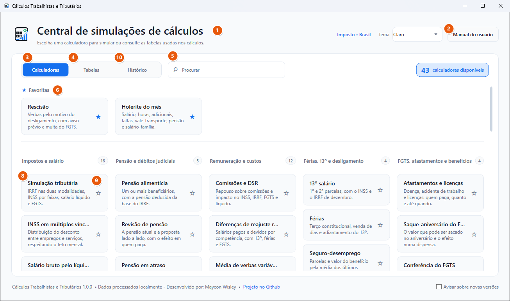

| Nº | Área | Para que serve |
| --- | --- | --- |
| 1 | Cabeçalho | Identifica a Central de cálculos. Ao lado ficam o seletor de **Tema** e o botão do manual. |
| 2 | Manual do usuário | Abre este manual. Também pode ser aberto com a tecla **F1** em qualquer janela. |
| 3 | Calculadoras | Aba com as calculadoras, em cinco grupos: **Impostos e salário**, **Pensão e débitos judiciais**, **Remuneração e custos**, **Férias, 13º e desligamento** e **FGTS, afastamentos e benefícios**. |
| 4 | Tabelas | Aba com as tabelas de INSS, IRRF, PLR, salário-família, salário mínimo, seguro-desemprego, os parâmetros usados nos cálculos e os índices INPC, IPCA, IPCA-E, taxa legal, Selic e TR. Veja a seção [Tabelas e parâmetros](#9-tabelas-e-parâmetros). |
| 5 | Grupo | Título do grupo, que reúne as calculadoras de um mesmo assunto. |
| 6 | Cartão | Abre a calculadora em uma janela própria. Clique no cartão ou selecione-o com **Tab** e pressione **Enter**. |
| 7 | Histórico | Aba com os cálculos salvos, para abrir, duplicar, renomear ou excluir. Veja a seção [Histórico de cálculos](#103-histórico-de-cálculos). |

A tela principal só reúne os atalhos: cada cálculo, inclusive a simulação tributária, é feito na sua própria janela. Ao fechar a janela, você volta para a tela principal.

**Avisos ao abrir:** logo abaixo do cabeçalho, uma faixa avisa quando há uma versão nova publicada, com o botão **Baixar a nova versão**, e quando as tabelas do ano ainda não foram cadastradas (a do INSS mais recente é de um ano anterior), com o botão **Abrir a tabela do INSS**. **Dispensar** esconde o aviso até a próxima abertura.

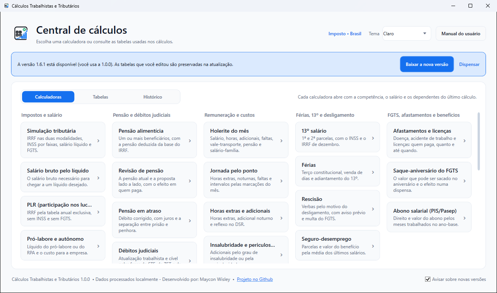

**Rolagem nas calculadoras:** cada calculadora mostra o formulário no alto e o resultado logo abaixo. Quando o resultado não cabe na janela, a tela inteira rola, pela roda do mouse ou pela barra à direita, e o resultado aparece no seu tamanho, sem ficar espremido abaixo do formulário. Listas com barra própria, como a de beneficiários da pensão, rolam primeiro e, ao chegar ao fim, passam a rolagem para a tela.

**Dados do último cálculo:** cada calculadora abre preenchida com a competência, o salário (ou valor bruto) e os dependentes do último cálculo feito em qualquer janela. Assim, depois de uma simulação tributária, a pensão alimentícia, as férias e as demais calculadoras já abrem com os mesmos valores. Cada calculadora aproveita só os dados que usa: o 13º salário, por exemplo, mantém a competência de dezembro, e a PLR aproveita apenas a competência. Esses dados ficam guardados enquanto o aplicativo estiver aberto.

## 4. Regras de preenchimento

Estas regras valem para todas as telas do aplicativo:

- **Competência:** informe mês e ano no formato **MM/AAAA**, por exemplo `10/2026`.
- **Datas:** informe no formato **dd/MM/aaaa**, por exemplo `02/10/2026`.
- **Valores em reais:** use vírgula para os centavos, como em `8500,00` ou `8.500,00`. O ponto de milhar é opcional.
- **Ponto no lugar da vírgula:** sem vírgula, o ponto só é lido como separador de milhar quando separa grupos de três dígitos, como em `3.500`. Nos demais casos, ele vale como vírgula decimal: `1.5` é 1,5 hora, `62.5` é 62,5% e `2200.50` é R$ 2.200,50.
- **Formatação automática:** ao entrar em um campo numérico que está zerado, ele é limpo para você digitar. Ao sair do campo vazio, ele volta a zero: `0,00` nos valores em reais, `0` nos campos inteiros e nos percentuais, como **Dependentes** e **Faltas**, e `0:00` nas horas. Os valores em reais também são formatados com duas casas decimais ao sair do campo (`8.500,00`).
- **Navegação:** use a tecla **Tab** para avançar entre os campos e **Shift + Tab** para voltar.

Se algum dado estiver em formato inválido, o aplicativo exibe um aviso e não faz o cálculo. Veja exemplos na seção [Mensagens e solução de problemas](#12-mensagens-e-solução-de-problemas).

## 5. Simulação tributária

Abra pelo cartão **Simulação tributária**, no grupo **Impostos e salário** da aba **Calculadoras**. Os dados ficam no topo da janela e o resultado logo abaixo.

### 5.1 Preenchendo os dados

1. Em **Competência**, confirme ou altere o mês de referência. As tabelas usadas no cálculo são as vigentes nessa competência.
2. Em **Valor bruto**, informe o total de rendimentos tributáveis do mês.
3. **Base de INSS** é preenchida automaticamente com o valor bruto. Altere somente se a base de contribuição for diferente do valor bruto.
4. Em **Dependentes**, informe a quantidade de dependentes para fins de IRRF (número inteiro, zero ou maior).
5. Clique em **Calcular** ou pressione **Enter**.

Na primeira simulação, a competência vem com o mês atual. Depois, os campos já abrem com os dados do último cálculo (veja a seção [Conhecendo a tela principal](#3-conhecendo-a-tela-principal)).

### 5.2 Lendo o resultado

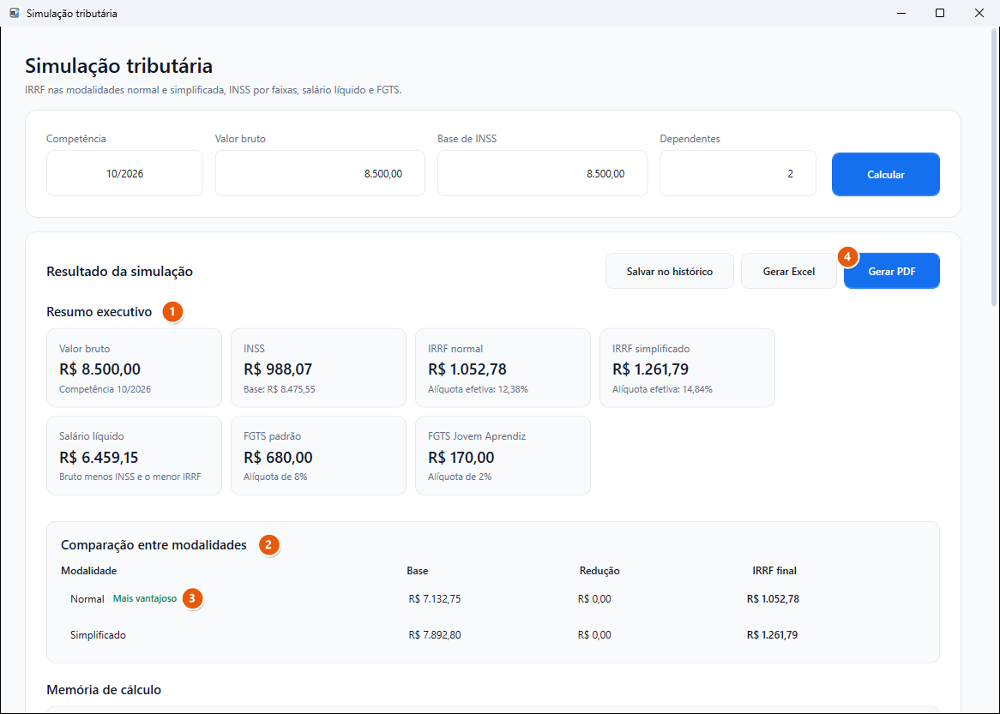

1. **Resumo executivo:** cartões com os principais valores. São eles o valor bruto, o INSS com a base considerada, o IRRF nas duas modalidades com a alíquota efetiva de cada uma, o **salário líquido** (valor bruto menos o INSS e o menor IRRF) e o FGTS de 8% e de 2%. Antes de 05/2023, o cartão do IRRF simplificado mostra **Não se aplica**, e o comparativo e a memória de cálculo trazem só a modalidade normal.
2. **Comparação entre modalidades:** base de cálculo, redução mensal e IRRF final da modalidade normal e da simplificada.
3. **Mais vantajoso:** destaca a modalidade com o menor IRRF. Quando as duas resultam no mesmo valor, nenhuma é destacada.
4. **Gerar PDF:** salva o resultado completo em um relatório. Ao lado, **Gerar Excel** salva o mesmo conteúdo em uma planilha e **Salvar no histórico** guarda o formulário com um nome (seção [10](#10-relatórios-planilhas-e-histórico)).

Role a área de resultado para ver a **memória de cálculo**, que mostra passo a passo como cada valor foi obtido:

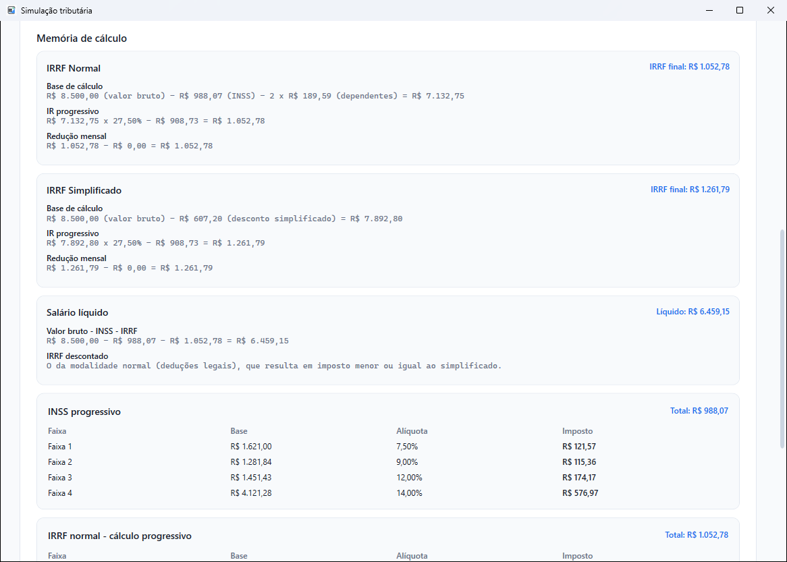

Para cada modalidade de IRRF são exibidos:

- **Base de cálculo:** o valor sobre o qual o imposto incide, com cada dedução identificada. Na modalidade normal, o valor bruto menos o INSS e a dedução por dependente multiplicada pela quantidade de dependentes; na simplificada, o valor bruto menos o desconto simplificado. A base nunca fica negativa: quando as deduções superam o valor bruto, ela é zero.
- **IR progressivo:** base × alíquota da faixa − parcela a deduzir.
- **Redução mensal:** desconto aplicado ao imposto, quando previsto para a competência.

No final da área de resultado aparece o detalhamento **faixa a faixa** do INSS e do IRRF. No IRRF, o total do quadro é o imposto pela tabela progressiva, antes da redução mensal:

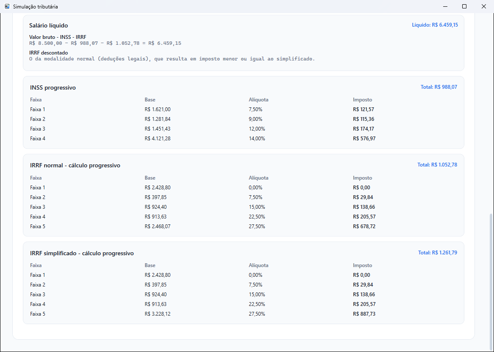

### 5.3 Como os valores são calculados

| Item | Regra aplicada pelo aplicativo |
| --- | --- |
| INSS | A partir de 03/2020, cálculo progressivo: cada parte da base é tributada pela alíquota da sua faixa. Antes de 03/2020, alíquota única conforme a faixa em que a base se encontra. A base é limitada ao teto da tabela (último limite cadastrado). O valor de cada faixa é **truncado** nos centavos, sem arredondar, como o eSocial calcula a contribuição (Manual de Orientação do eSocial, evento S-5001): em 2026, o INSS do teto é R$ 988,07. |
| IRRF normal | Base = valor bruto − INSS − (dependentes × dedução por dependente). |
| IRRF simplificado | Base = valor bruto − desconto simplificado. Disponível a partir de 05/2023. |
| Redução mensal | Quando cadastrada para a competência, reduz o imposto apurado conforme a faixa de rendimentos (por exemplo, as regras vigentes a partir de 01/2026). |
| Alíquota efetiva | IRRF final ÷ valor bruto. |
| Dispensa de retenção | O IRRF calculado de até R$ 10,00 (tabela **Desconto mínimo**) não é retido nem passa para o mês seguinte (Lei 9.430/1996, art. 67). O desconto fica em R$ 0,00, e a memória de cálculo mostra o valor calculado. Não vale para o 13º nem para a PLR, que têm tributação exclusiva. |
| Salário líquido | Valor bruto − INSS − IRRF da modalidade mais vantajosa, que é a aplicada pela fonte pagadora, ou zero quando a retenção é dispensada. |
| FGTS | 8% (padrão) e 2% (Jovem Aprendiz) sobre toda a base de INSS informada. O FGTS não tem teto: diferentemente do INSS, ele não é limitado ao último limite da tabela. |

> **Importante:** o aplicativo utiliza, para cada tabela, o registro mais recente cuja competência seja **igual ou anterior** à competência informada. Por exemplo, uma simulação de 10/2026 usa as faixas de INSS de 01/2026, se essa for a tabela mais recente até essa data.

## 6. Pensão alimentícia e débitos judiciais

Abra pelo cartão **Pensão alimentícia**, no grupo **Pensão e débitos judiciais** da aba **Calculadoras**. No mesmo grupo estão a [revisão de pensão](#64-revisão-de-pensão), a [pensão em atraso](#65-pensão-em-atraso) e os [débitos judiciais](#66-débitos-judiciais). A janela tem os próprios dados dos rendimentos, e não depende de uma simulação tributária feita antes. Se você acabou de fazer uma simulação, a competência, o valor bruto e os dependentes já vêm preenchidos com os dela.

### 6.1 Calculando

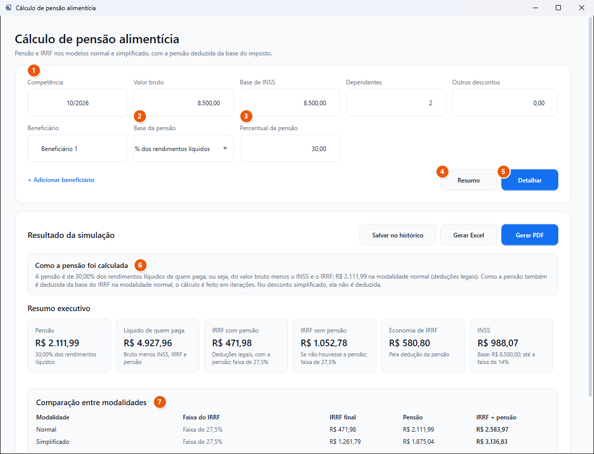

1. **Dados dos rendimentos** (1ª linha): informe a **Competência**, o **Valor bruto**, a **Base de INSS** e os **Dependentes** de quem paga a pensão, como na simulação tributária, e os **Outros descontos**, se houver. A base de INSS acompanha o valor bruto; altere somente se a base de contribuição for diferente. Esses dados definem o INSS e o IRRF em todas as bases da pensão.
2. Na linha do beneficiário, informe o nome dele em **Beneficiário**, usado no resultado e no relatório. Em **Base da pensão**, escolha como a decisão ou o acordo define a pensão:
   - **% dos rendimentos líquidos:** percentual sobre os rendimentos menos o INSS e o IRRF. É a forma mais comum para quem tem vínculo de emprego.
   - **% dos rendimentos brutos:** percentual sobre os rendimentos, sem descontos.
   - **% do salário mínimo:** percentual sobre o salário mínimo da competência. Ao lado do percentual aparece o campo **Salário mínimo de MM/AAAA**, preenchido automaticamente com o valor da tabela **Salário mínimo** e atualizado quando você muda a competência. Ele é só para leitura: para corrigir o valor, edite a tabela.
   - **Valor fixo:** o valor mensal definido na decisão. Nesta opção, o campo do percentual dá lugar a **Valor da pensão**.
3. Em **Percentual da pensão**, informe o percentual definido em decisão ou acordo, por exemplo `30,00`: de 0 a 100 sobre os rendimentos e até 1.000 sobre o salário mínimo, como `150` para uma pensão de 1,5 salário mínimo. Com mais de um beneficiário na mesma base, os percentuais somados não podem passar de 100%.
4. **Resumo** calcula e mostra a explicação, o resumo executivo e o comparativo entre as modalidades.
5. **Detalhar** faz o mesmo cálculo e inclui a memória de cálculo de cada iteração. A tecla **Enter** também detalha.
6. **Como a pensão foi calculada:** explica em uma frase de onde vem o valor da pensão e para que servem o valor bruto, o INSS e o IRRF de quem paga.
7. **Comparação entre modalidades:** IRRF final, pensão e IRRF + pensão nas modalidades normal e simplificada.

O **resumo executivo** mostra o resultado na modalidade de menor IRRF, a que a fonte pagadora aplica:

| Cartão | O que mostra |
| --- | --- |
| Pensão | O valor da pensão e a regra usada, como "30,00% do salário mínimo de R$ 1.621,00". |
| Líquido de quem paga | Valor bruto menos outros descontos, INSS, IRRF e pensão. Sem valor bruto informado, mostra "—". |
| IRRF com pensão | O IRRF de quem paga, já com a pensão deduzida da base na modalidade normal. |
| IRRF sem pensão | O IRRF que quem paga teria se não houvesse a pensão. |
| Economia de IRRF | A diferença entre os dois: quanto a dedução da pensão reduz o imposto de quem paga. |
| INSS | A contribuição de quem paga, sobre a base de INSS. |

Na base do salário mínimo, a tela fica assim:

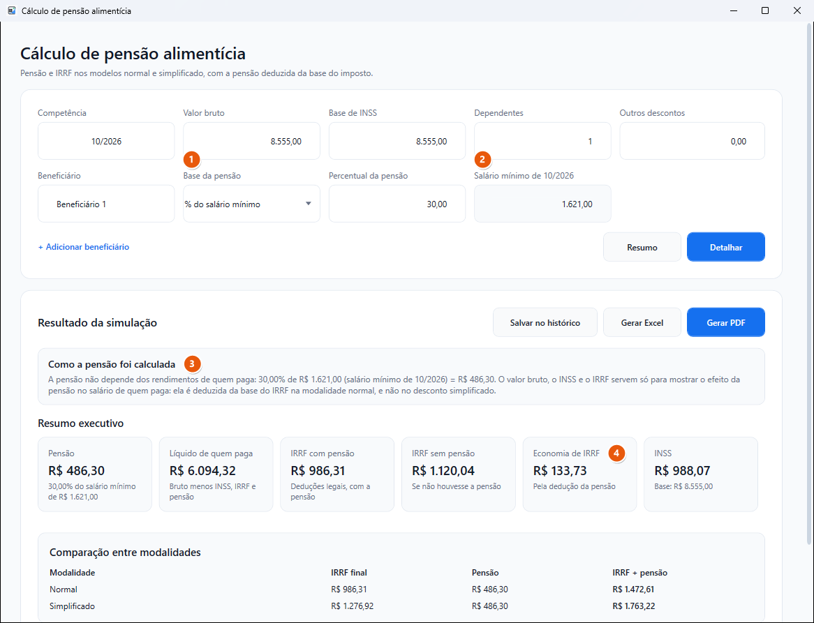

1. **Base da pensão** com a opção **% do salário mínimo**.
2. **Salário mínimo de MM/AAAA:** o valor vigente na competência, preenchido automaticamente.
3. **Como a pensão foi calculada:** 30% de R$ 1.621,00 = R$ 486,30, sem relação com os rendimentos de quem paga.
4. **Economia de IRRF:** com a pensão deduzida, o IRRF de quem paga cai de R$ 1.120,04 para R$ 986,31.

Se você só precisa do valor da pensão, por exemplo quando quem paga não tem emprego formal, deixe o **Valor bruto** em `0,00`: o INSS e o IRRF ficam zerados e a pensão continua sendo calculada.

**Outros descontos** são valores que não são rendimento tributável, como faltas e atrasos: eles saem dos rendimentos, da base do IRRF (inclusive da redução mensal) e da base da pensão, e não podem ser maiores que o valor bruto. Não informe aqui consignados nem plano de saúde, que não reduzem o IRRF.

> **Por que o valor bruto não vira o salário mínimo?** Na pensão sobre o salário mínimo, só o valor da pensão depende do salário mínimo. O INSS e o IRRF continuam sendo os de quem paga, calculados sobre o valor bruto que ele recebe, e a pensão é deduzida da base desse IRRF na modalidade normal.

### 6.2 Como a pensão entra no IRRF

**Na modalidade normal (deduções legais),** a pensão é deduzida da base do IRRF. Quando ela é calculada sobre os rendimentos líquidos, há uma dependência circular: a pensão reduz o IRRF, e o IRRF reduz o valor sobre o qual a pensão é calculada. Por isso o aplicativo repete o cálculo até que o valor da pensão não mude mais: no resultado, o IRRF é exatamente o calculado com a pensão final deduzida. Em cada iteração:

1. A base do IRRF é recalculada descontando a pensão encontrada na iteração anterior.
2. O IRRF é apurado pela tabela progressiva e pela redução mensal, quando houver.
3. A base da pensão é calculada como rendimentos − INSS − IRRF.
4. A nova pensão é calculada aplicando o percentual sobre essa base.

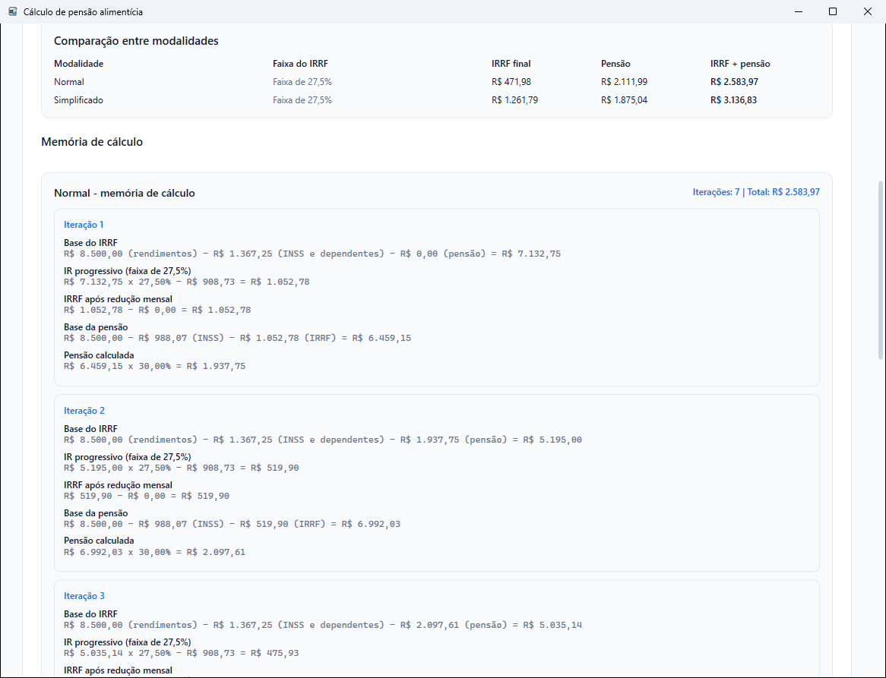

Nas bases que não dependem do IRRF (rendimentos brutos, salário mínimo e valor fixo), a pensão é conhecida desde o início, e o cálculo termina na primeira iteração.

**Na modalidade simplificada,** a pensão **não** é deduzida da base do IRRF: o desconto simplificado substitui todas as deduções legais, inclusive a pensão alimentícia (Lei 9.250/1995, art. 4º). A base é rendimentos − desconto simplificado, o IRRF não muda com a pensão, e o cálculo é feito uma única vez:

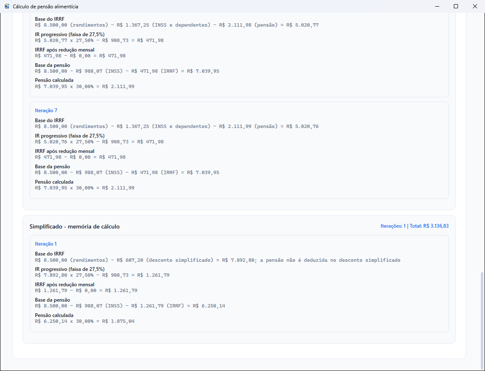

A modalidade aplicada é a de **menor IRRF**, como faz a fonte pagadora. Como só a modalidade normal deduz a pensão, ela costuma ser a mais vantajosa quando há pensão. O IRRF calculado de até R$ 10,00 não é retido, como na simulação tributária.

> **Atenção:** nas versões até a 1.2.0, a modalidade simplificada também deduzia a pensão da base do IRRF, o que resultava em um imposto menor que o devido. Refaça os cálculos de pensão feitos nessas versões em que a modalidade simplificada foi a indicada como mais vantajosa.

### 6.3 Mais de um beneficiário

Quando quem paga deve pensão a mais de uma pessoa, por exemplo a filhos de relacionamentos diferentes, clique em **+ Adicionar beneficiário** para incluir uma linha por pensão, cada uma com a sua base e o seu percentual ou valor. **Remover beneficiário** exclui a linha.

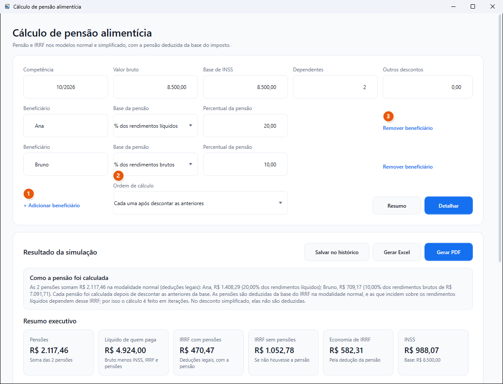

1. **+ Adicionar beneficiário:** inclui outra pensão, até 10. A partir do terceiro beneficiário, a lista mostra duas linhas por vez e ganha uma barra de rolagem própria; a linha incluída aparece no fim da lista. A roda do mouse sobre a lista rola a lista e, ao chegar ao fim dela, a tela (veja [Rolagem nas calculadoras](#3-conhecendo-a-tela-principal)).
2. **Ordem de cálculo:** aparece com mais de um beneficiário e define como as pensões percentuais sobre os rendimentos são calculadas:
   - **Todas sobre a mesma base:** cada pensão incide sobre os rendimentos inteiros, como se fosse a única.
   - **Cada uma após descontar as anteriores:** a base de cada pensão é reduzida pelas pensões que vêm antes dela na lista. Use quando a decisão mandar calcular uma pensão sobre o que sobra depois de outra.
3. **Remover beneficiário:** exclui a linha.

As pensões sobre o salário mínimo e as de valor fixo não dependem da ordem. Todas as pensões são somadas e deduzidas juntas da base do IRRF na modalidade normal; com pensões sobre os rendimentos líquidos, o cálculo continua sendo feito em iterações. O resultado mostra o total nos cartões e a tabela **Pensão por beneficiário**:

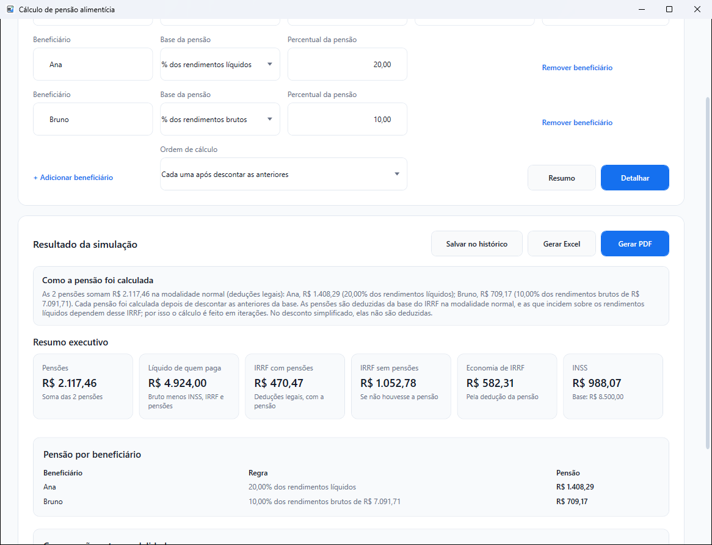

Na memória de cálculo, cada iteração mostra a base e a pensão de cada beneficiário e o total das pensões.

### 6.4 Revisão de pensão

Abra pelo cartão **Revisão de pensão**, no grupo **Pensão e débitos judiciais**. Ela compara a pensão em vigor com a pedida ou oferecida em uma ação revisional, com o efeito de cada uma no IRRF e no líquido de quem paga.

| Campo | O que informar |
| --- | --- |
| Competência, Valor bruto e Dependentes | Os rendimentos de quem paga. O valor bruto também é a base do INSS. |
| Pensão atual e Pensão proposta | A forma de cada pensão: **% do líquido**, **% do bruto**, **% do salário mínimo** ou **Valor fixo**. |
| Percentual ou Valor | O percentual ou o valor mensal de cada pensão, conforme a forma escolhida. |

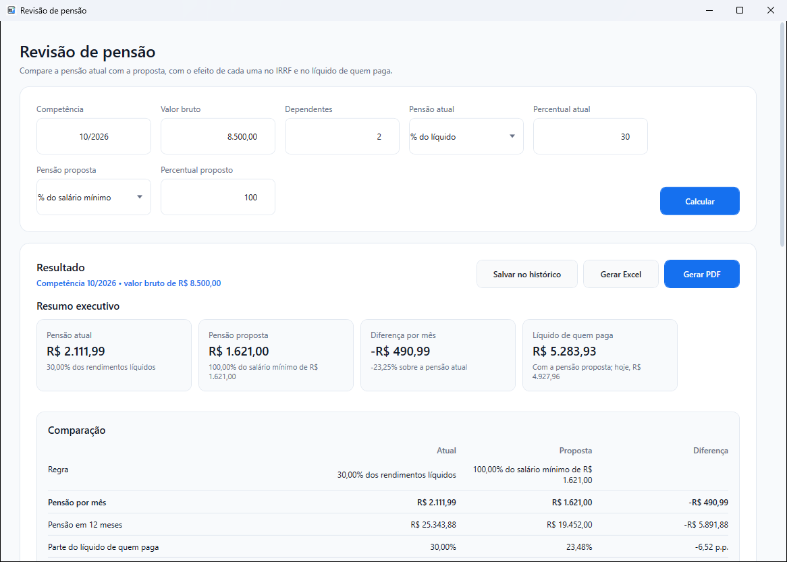

O resumo mostra as duas pensões, a diferença por mês e o líquido de quem paga com a pensão proposta. A tabela **Comparação** coloca lado a lado, com a diferença:

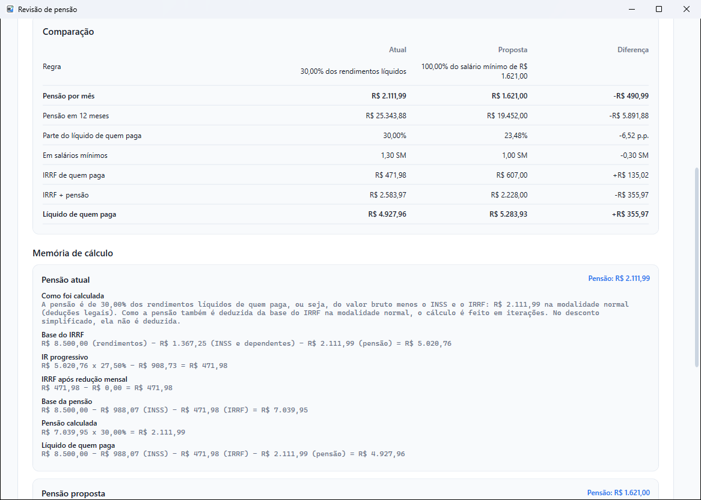

| Linha | O que mostra |
| --- | --- |
| Pensão por mês e em 12 meses | O valor mensal e o de um ano. A pensão sobre o 13º e as férias depende da decisão e não está no total. |
| Parte do líquido de quem paga | Pensão ÷ (valor bruto − INSS − IRRF), útil para comparar uma pensão em valor fixo ou em salários mínimos com um percentual. |
| Em salários mínimos | Quantos salários mínimos da competência a pensão representa. |
| IRRF de quem paga e IRRF + pensão | O imposto de quem paga em cada cenário e quanto sai do salário dele somando imposto e pensão. |
| Líquido de quem paga | O que sobra para quem paga em cada cenário. |

Cada cenário é calculado como na calculadora de pensão: o IRRF é o da modalidade de menor imposto. A memória de cálculo explica cada um.

### 6.5 Pensão em atraso

Abra pelo cartão **Pensão em atraso**, no grupo **Pensão e débitos judiciais**. Ela atualiza o débito de pensões não pagas, com correção monetária e juros de mora, e separa as parcelas cobradas pelo rito da prisão das cobradas pelo rito da penhora.

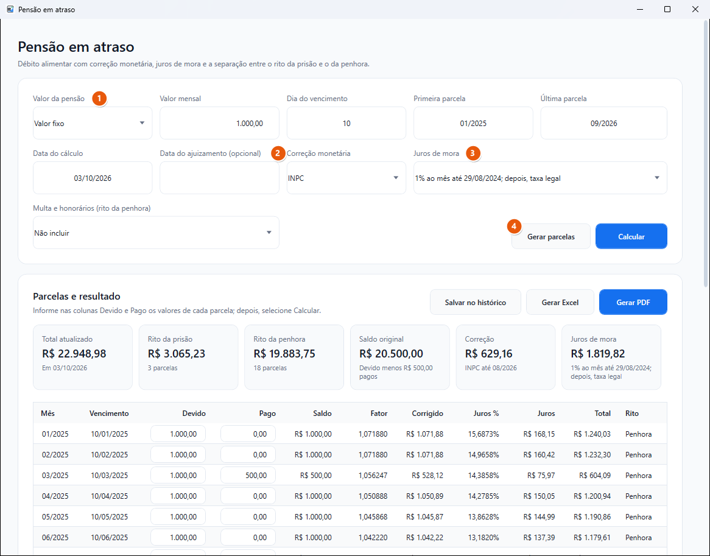

| Nº | Campo | O que informar |
| --- | --- | --- |
| 1 | Valor da pensão | **Valor fixo**, com o **Valor mensal**, ou **% do salário mínimo**, com o percentual. Na segunda opção, cada parcela usa o salário mínimo do seu mês, que acompanha os reajustes. |
| — | Dia do vencimento, Primeira parcela e Última parcela | O dia do mês em que a pensão vence e o período em atraso (MM/AAAA). Nos meses mais curtos, vale o último dia do mês. |
| — | Data do cálculo | Até quando o débito é atualizado. Todas as parcelas precisam vencer até essa data. |
| 2 | Data do ajuizamento | Data em que a execução foi proposta, se já foi. Vazia, o cálculo considera a data do cálculo. |
| — | Correção monetária | **INPC**, **IPCA** ou **Sem correção**, conforme a decisão. Quando a decisão não fixa o índice, o Código Civil adota o IPCA (art. 389). |
| 3 | Juros de mora | **1% ao mês até 29/08/2024; depois, taxa legal** (padrão), **1% ao mês**, **Taxa legal (desde 30/08/2024)** ou **Sem juros**. |
| — | Multa e honorários (rito da penhora) | **Não incluir** (padrão), **Multa de 10% e honorários de 10%** ou **Só a multa de 10%**, quando o débito do rito da penhora não foi pago em 15 dias úteis da intimação (CPC, art. 523, § 1º). |
| 4 | Gerar parcelas | Monta a lista de parcelas do período. **Calcular** também a monta, se ela ainda não existir ou se o valor, o percentual, o dia ou o período mudaram depois de gerada; os pagamentos parciais já informados continuam nos mesmos meses. |

Na lista de parcelas, as colunas **Devido** e **Pago** podem ser editadas: corrija o valor de uma parcela, se a decisão mudou no período, e informe os **pagamentos parciais**, que são abatidos do valor da parcela no vencimento. Ao mudar um valor, uma data ou um critério, o resultado anterior é apagado até você calcular de novo.

Depois de **Calcular**, os cartões mostram o **total atualizado**, a parte cobrada pelo **rito da prisão** e pelo **rito da penhora**, o saldo original, a correção e os juros. Cada linha da lista mostra o saldo, o fator de correção, o valor corrigido, os juros e o total da parcela, com o rito em que ela é cobrada. No final aparecem os critérios usados e as observações:

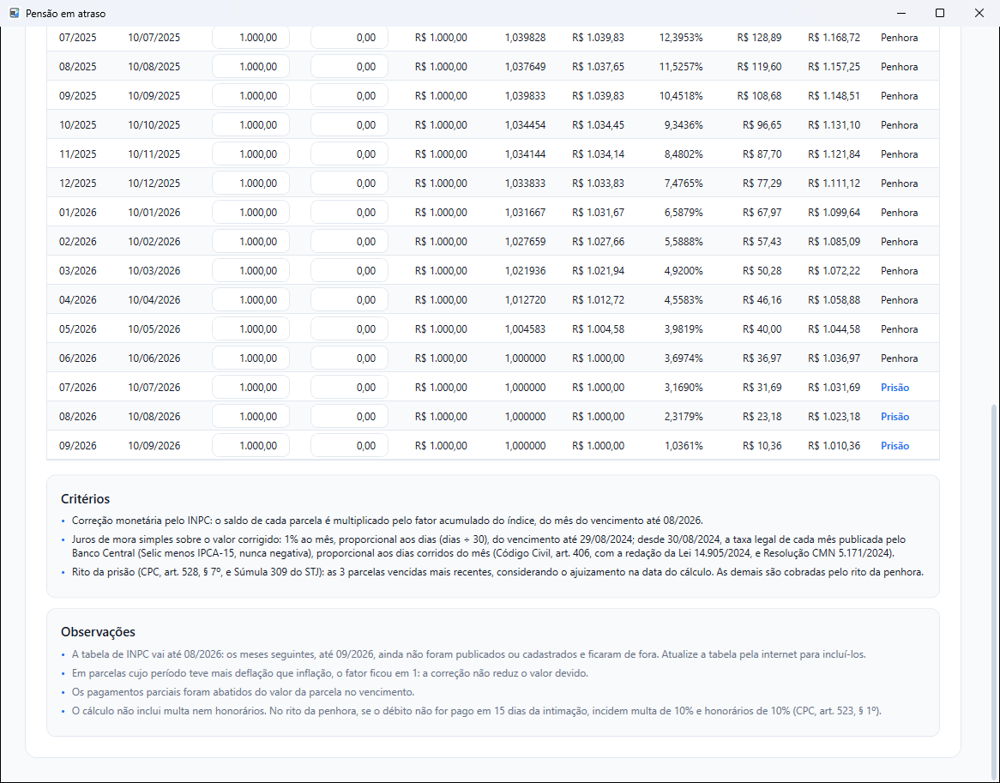

| Item | Regra aplicada |
| --- | --- |
| Saldo | Valor devido − valor pago. |
| Correção monetária | Saldo × fator acumulado do índice, do mês do vencimento até o mês anterior ao cálculo. Se o índice dos últimos meses ainda não foi publicado, a correção vai até o último mês da tabela, com um aviso. Em períodos de deflação, o fator não fica abaixo de 1: a correção não reduz o valor devido. |
| 1% ao mês | Juros simples sobre o valor corrigido, proporcionais aos dias corridos entre o vencimento e o cálculo (dias ÷ 30). |
| Taxa legal | A taxa de cada mês publicada pelo Banco Central (tabela **Taxa legal**), em juros simples sobre o valor corrigido. No mês incompleto, ela é dividida pelos dias corridos do mês e multiplicada pelos dias do período (Código Civil, art. 406, com a redação da Lei 14.905/2024, e Resolução CMN 5.171/2024). Só existe desde 30/08/2024: nas parcelas vencidas antes, os juros começam nessa data. |
| 1% ao mês até 29/08/2024; depois, taxa legal | 1% ao mês, proporcional aos dias, do vencimento até 29/08/2024, e a taxa legal a partir de 30/08/2024, com a taxa de agosto de 2024 para os dias 30 e 31. É o padrão, por acompanhar a mudança da lei para débitos que atravessam 2024. |
| Rito da prisão | As 3 parcelas vencidas antes do ajuizamento e as que venceram depois dele, no curso do processo (CPC, art. 528, § 7º, e Súmula 309 do STJ). Sem data de ajuizamento, as 3 mais recentes. |
| Rito da penhora | As demais parcelas (CPC, art. 528, § 8º). |
| Multa e honorários | 10% de multa e 10% de honorários sobre o total atualizado das parcelas do rito da penhora. Os honorários são calculados sobre o débito, sem a multa (STJ, REsp 1.757.033/DF). O rito da prisão não tem esses acréscimos. |

> **Atenção:** a multa e os honorários só entram quando escolhidos no campo próprio. Com pagamento parcial no prazo, eles incidem só sobre o restante (CPC, art. 523, § 2º): nesse caso, informe o pagamento nas parcelas. Confira sempre o índice, os juros e as datas definidos na decisão; os índices usados estão nas tabelas **INPC**, **IPCA** e **Taxa legal** (seção [9.4](#94-as-tabelas-disponíveis)). Se a taxa legal de um mês do período ainda não estiver na tabela, o cálculo repete a do último mês cadastrado e avisa nas observações.

### 6.6 Débitos judiciais

Abra pelo cartão **Débitos judiciais**, no grupo **Pensão e débitos judiciais**. Ele atualiza um ou mais valores devidos em um processo, trabalhista ou cível, com a correção monetária e os juros de cada fase, até a data do cálculo.

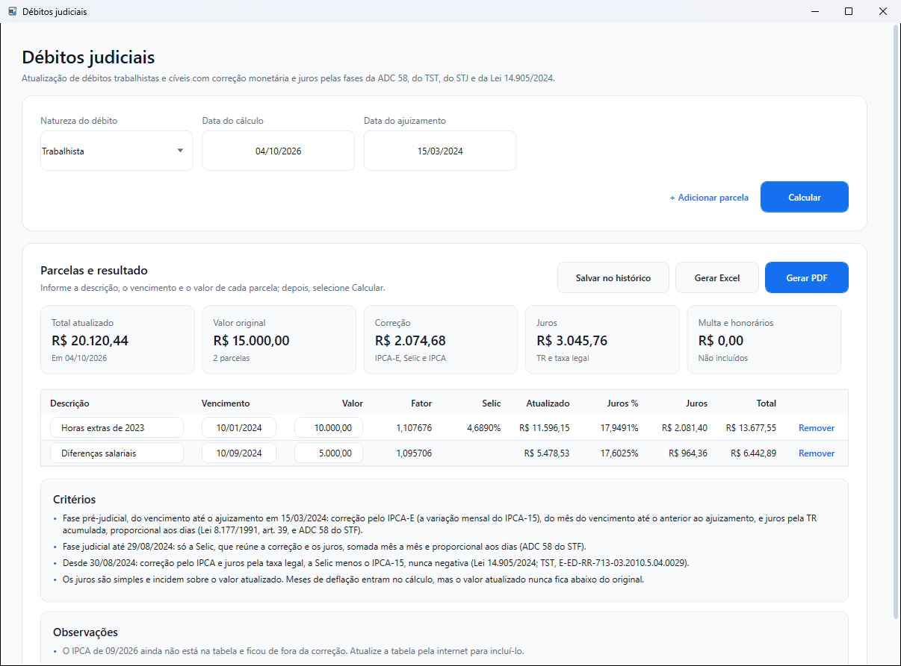

| Campo | O que informar |
| --- | --- |
| Natureza do débito | **Trabalhista** ou **Cível**: cada uma tem as suas fases. |
| Data do cálculo | Até quando o débito é atualizado. |
| Data do ajuizamento | Trabalhista: a data em que a ação foi proposta, que separa a fase pré-judicial da judicial. Vazia, todo o período é pré-judicial. |
| Juros e Data da citação | Cível: os juros correm **do vencimento** (art. 397 do Código Civil) ou **da citação** (art. 405), conforme a decisão; na segunda opção, informe a data da citação. |
| Índice até 29/08/2024 | Cível: **INPC** ou **IPCA**, o índice da decisão ou da tabela do tribunal para a correção antes dos juros e antes da Lei 14.905/2024. |
| Multa e honorários (art. 523) | Cível: a multa de 10% e os honorários de 10% do cumprimento de sentença, sobre o débito atualizado. |
| Parcelas | Descrição, vencimento e valor de cada parcela. **+ Adicionar parcela** inclui outra; **Remover** exclui a linha. |

| Fase | Trabalhista | Cível |
| --- | --- | --- |
| Antes do ajuizamento (trabalhista) ou dos juros (cível) | IPCA-E e juros pela TR, proporcionais aos dias (Lei 8.177/1991, art. 39, e ADC 58 do STF) | O índice escolhido, sem juros |
| Até 29/08/2024 | Só a Selic, que reúne a correção e os juros (ADC 58) | Só a Selic, a partir do início dos juros (STJ, Tema 1.368) |
| Desde 30/08/2024 | IPCA e taxa legal (Lei 14.905/2024; TST, E-ED-RR-713-03.2010.5.04.0029) | IPCA e taxa legal (Código Civil, arts. 389 e 406) |

- Os índices de correção (IPCA-E, INPC e IPCA) são mensais, do mês do início da fase até o anterior ao fim dela. A Selic, a TR e a taxa legal são proporcionais aos dias corridos de cada mês e somadas em juros simples.
- Os juros incidem sobre o valor já atualizado. Meses de deflação entram no cálculo, mas o valor atualizado nunca fica abaixo do original.
- A grade mostra, para cada parcela, o fator de correção, a Selic do período, o valor atualizado, o percentual e o valor dos juros e o total. Os critérios aplicados aparecem abaixo dela:

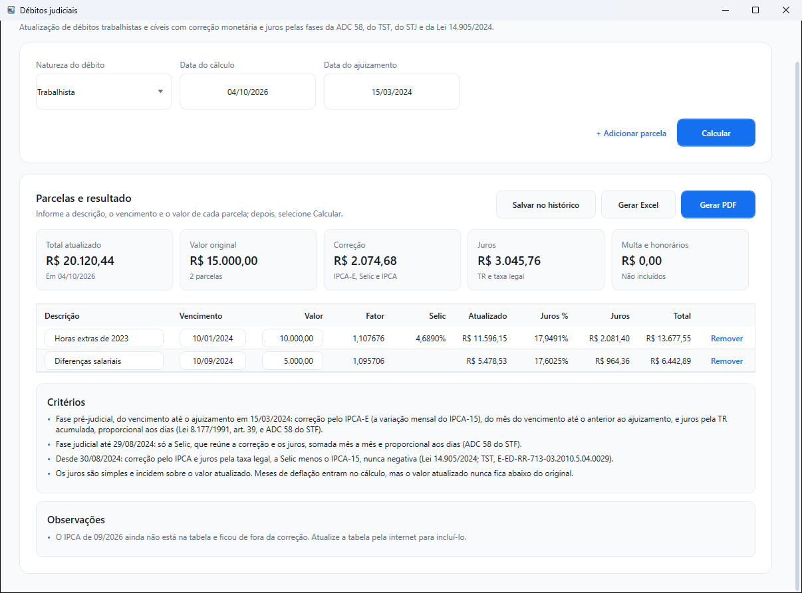

> **Atenção:** os índices vêm das tabelas **IPCA-E**, **IPCA**, **INPC**, **Selic**, **TR** e **Taxa legal** (seção [9.4](#94-as-tabelas-disponíveis)). Um índice de correção que ainda não foi publicado fica de fora, e uma taxa de juros que falta repete a do último mês cadastrado; nos dois casos, as observações avisam. Confira sempre os critérios da decisão: há decisões com índices ou termos iniciais diferentes dos padrões acima.

## 7. Cálculo de estabilidade

Abra pelo cartão **Estabilidade**, no grupo **Férias, 13º e desligamento** da aba **Calculadoras**.

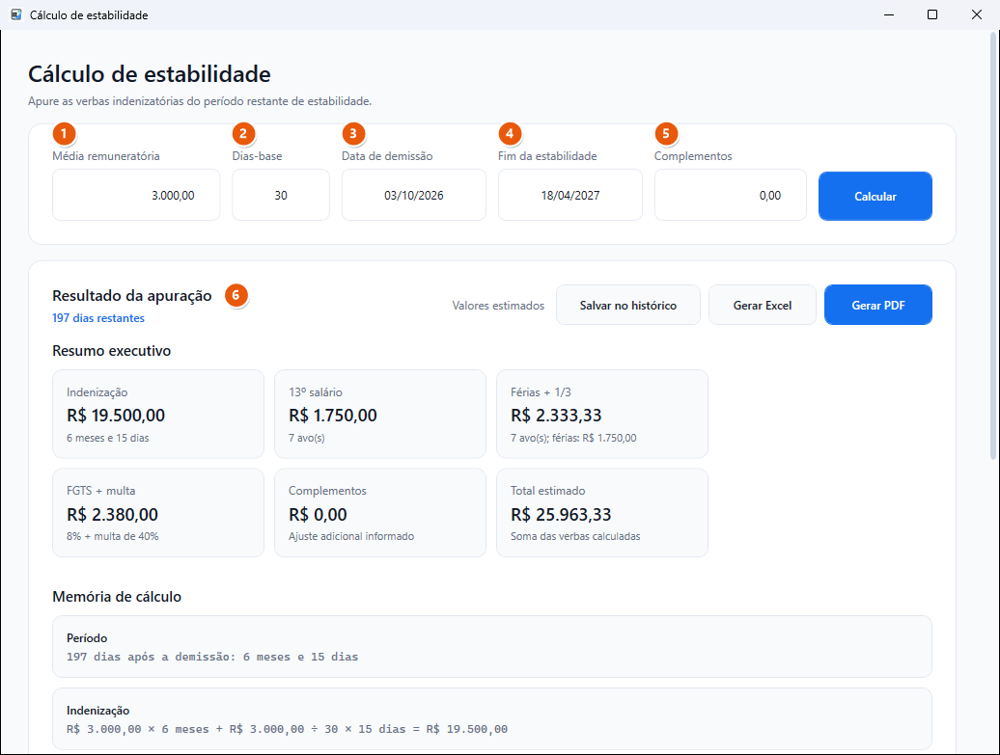

| Nº | Campo | O que informar |
| --- | --- | --- |
| 1 | Média remuneratória | Média da remuneração usada como referência para a indenização. |
| 2 | Dias-base | Divisor para obter o valor diário da média. O padrão é 30. |
| 3 | Data de demissão | Data do desligamento (dd/MM/aaaa). |
| 4 | Fim da estabilidade | Último dia do período de estabilidade (dd/MM/aaaa). Deve ser posterior à demissão. |
| 5 | Complementos | Valores adicionais a somar no total, se houver. |
| 6 | Resultado da apuração | Mostra, enquanto você digita as datas, quantos dias de estabilidade restam. |

Clique em **Calcular** para ver o resumo e a memória de cálculo:

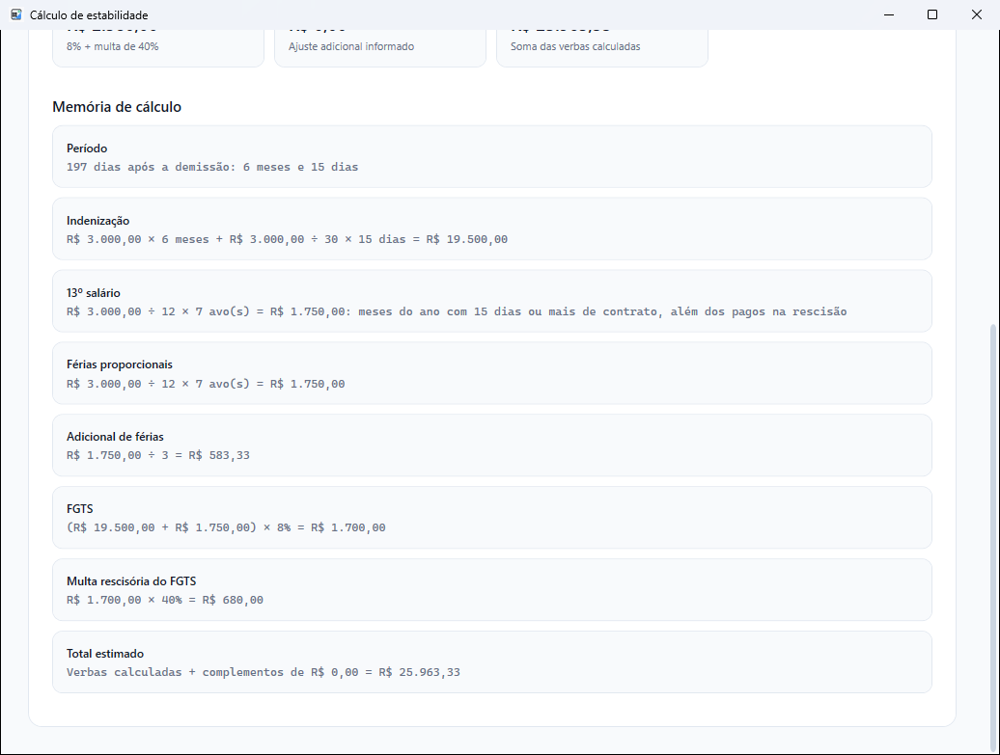

| Verba | Regra aplicada |
| --- | --- |
| Indenização | Os salários do período (Súmula 396 do TST): média × meses cheios + média ÷ dias-base × dias que sobram. De 01/03/2026 a 01/03/2027, por exemplo, são 12 meses. |
| Avos de 13º | Os meses de cada ano civil com 15 dias ou mais de contrato, somando os dias já trabalhados no mês da demissão e descontando os avos pagos na rescisão. |
| Avos de férias | Um avo por mês cheio do período, mais um avo quando a sobra for de 15 dias ou mais. |
| 13º salário | Média ÷ 12 × avos de 13º. |
| Férias proporcionais | Média ÷ 12 × avos de férias. |
| Adicional de férias | Férias ÷ 3. |
| FGTS | (Indenização + 13º salário) × 8%. |
| Multa do FGTS | FGTS × 40%. |
| Total estimado | Soma das verbas + complementos. |

O botão **Gerar PDF** cria um demonstrativo com as verbas, os dados considerados e o **Total a receber**.

## 8. Calculadoras trabalhistas

Além da simulação tributária, da pensão, dos débitos judiciais, da estabilidade e da jornada pelo ponto, a aba **Calculadoras** reúne cálculos para o dia a dia do departamento pessoal e do imposto de renda. As calculadoras deste capítulo usam a mesma janela:

- **Formulário:** os campos do cálculo. Passe o mouse sobre um campo para ver uma dica do que informar. Ao abrir uma calculadora, a competência, o salário e os dependentes do último cálculo já vêm preenchidos. Alguns campos só aparecem quando a opção escolhida em outro campo exige.
- **Calcular:** faz o cálculo. A tecla **Enter** também calcula.
- **Resumo executivo:** os valores mais importantes.
- **Demonstrativo:** proventos, descontos e o resultado, como em um holerite.
- **Valores informativos:** valores que não são pagos ao trabalhador, como o FGTS.
- **Memória de cálculo:** a fórmula de cada valor, inclusive o INSS faixa a faixa e o IRRF nas duas modalidades.
- **Observações:** as premissas e os limites do cálculo.
- **Gerar PDF** e **Gerar Excel:** salvam o demonstrativo completo em um relatório ou em uma planilha.
- **Salvar no histórico:** guarda o formulário com um nome, para reabrir depois (seção [10.3](#103-histórico-de-cálculos)).

O INSS e o IRRF seguem as mesmas regras da simulação tributária, com as tabelas da competência informada: o IRRF aplica a modalidade mais vantajosa para o trabalhador (deduções legais ou desconto simplificado) e a redução mensal, quando prevista.

### 8.1 Salário bruto a partir do líquido

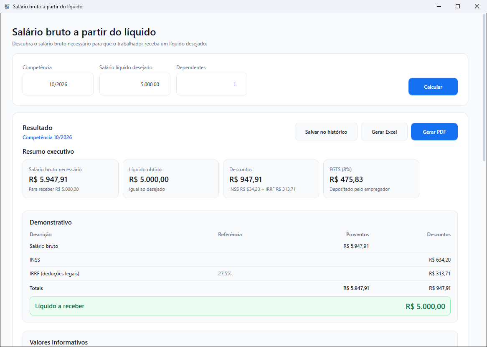

Informe o **salário líquido desejado** e os **dependentes**. O aplicativo procura, por aproximações sucessivas, o salário bruto que, descontados o INSS e o IRRF, resulta nesse líquido. A memória de cálculo mostra a conferência: bruto − INSS − IRRF = líquido.

> **Dica:** para considerar descontos fixos, como vale-transporte ou plano de saúde, some-os ao líquido desejado.

Quando mais de um salário bruto resulta no mesmo líquido, vale o menor. Isso acontece em dois pontos em que o líquido cai de uma vez: quando o IRRF passa de R$ 10,00 e deixa de ter a retenção dispensada e, antes de 03/2020, no limite de cada faixa do INSS, quando a alíquota da faixa seguinte passa a valer sobre todo o salário.

Em raros casos, o arredondamento em centavos impede chegar exatamente ao valor. O aplicativo mostra então o líquido mais próximo e a diferença.

### 8.2 Horas extras e adicionais

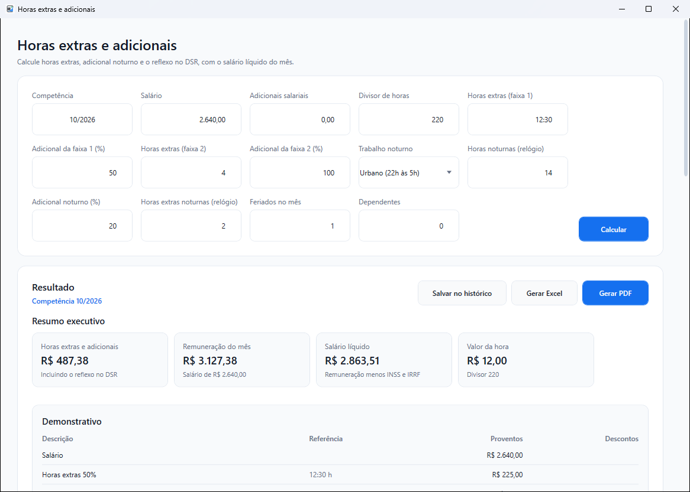

| Campo | O que informar |
| --- | --- |
| Salário | Salário-base mensal. |
| Adicionais salariais | Insalubridade, periculosidade e outros adicionais fixos do mês, que entram no valor da hora (Súmula 264 do TST). |
| Divisor de horas | 220 para 44 horas semanais; 200 para 40; 180 para 36; 150 para 30. |
| Horas extras (faixas 1 e 2) | Horas no formato `10:30` ou `10,5`, com o adicional de cada faixa. O mínimo é 50%; para domingos e feriados, normalmente 100%. O adicional só é conferido na faixa que tem horas. |
| Trabalho noturno | **Urbano (22h às 5h)**, com a hora reduzida, ou **Rural**: das 21h às 5h na lavoura e das 20h às 4h na pecuária, sem hora reduzida (Lei 5.889/1973, art. 7º). Ao escolher o rural, o adicional sugerido passa a 25%. |
| Horas noturnas (relógio) | Horas normais de relógio trabalhadas no período noturno, e na prorrogação depois dele (Súmula 60 do TST). |
| Adicional noturno (%) | Pelo menos 20% no trabalho urbano e 25% no rural. |
| Horas extras noturnas (relógio) | Horas extras feitas no período noturno. Não as repita nas horas extras da faixa 1 nem nas horas noturnas. |
| Feriados no mês | Feriados em dias úteis, usados no DSR. |

- **Valor da hora:** (salário + adicionais salariais) ÷ divisor.
- **Hora extra:** valor da hora × (1 + adicional) × horas.
- **Adicional noturno:** a hora noturna urbana tem 52 minutos e 30 segundos, então 7 horas de relógio valem 8 horas noturnas. O adicional é valor da hora × percentual × horas de relógio × 8/7. No trabalho rural não há redução: valor da hora × percentual × horas.
- **Hora extra noturna:** valor da hora × (1 + adicional noturno) × (1 + adicional da faixa 1) × horas de relógio × 8/7: o adicional noturno entra na base da hora extra (OJ 97 da SDI-1 do TST).
- **DSR:** (horas extras + adicional noturno) ÷ dias úteis do mês × (domingos + feriados).
- O INSS e o IRRF incidem sobre a remuneração total do mês, e o resultado mostra o salário líquido.

### 8.3 13º salário

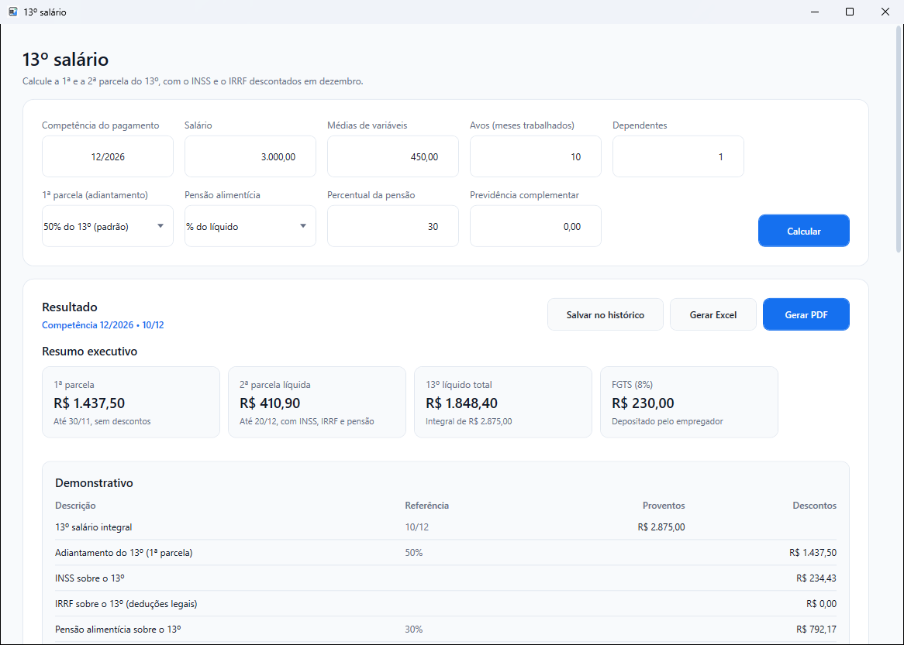

| Campo | O que informar |
| --- | --- |
| Competência do pagamento | Mês da 2ª parcela, normalmente 12/AAAA. |
| Salário e Médias de variáveis | Salário de dezembro e a média anual de horas extras, comissões e adicionais. |
| Avos | Meses do ano com 15 dias ou mais de trabalho, de 1 a 12. |
| 1ª parcela | **50% do 13º**, **Não houve adiantamento** ou **Valor informado**. Na última opção aparece o campo **Valor da 1ª parcela**. |
| Previdência complementar | A contribuição do trabalhador ao PGBL, ao fundo de pensão ou ao Fapi sobre o 13º, descontada na 2ª parcela. |

- **13º integral:** (salário + médias) ÷ 12 × avos.
- **1ª parcela:** paga até 30/11, sem descontos.
- **2ª parcela:** integral − 1ª parcela − INSS − IRRF − pensão alimentícia e previdência complementar (quando houver), paga até 20/12.
- **Previdência complementar:** deduzida da base do IRRF do 13º até 12% do valor integral (Lei 9.532/1997, art. 11; Solução de Consulta Cosit 185/2024), só nas deduções legais. Como o 13º é tributado à parte e não entra na declaração anual, o limite é aplicado na fonte; o excedente é descontado, mas não reduz o IRRF.
- O INSS e o IRRF são calculados sobre o 13º integral, à parte do salário de dezembro. Como o 13º tem tributação exclusiva, o IRRF dele é descontado mesmo quando não passa de R$ 10,00.
- Se a 2ª parcela ficar negativa, porque a 1ª parcela já paga supera o que resta depois dos descontos, o aplicativo avisa nas observações.

### 8.4 Férias

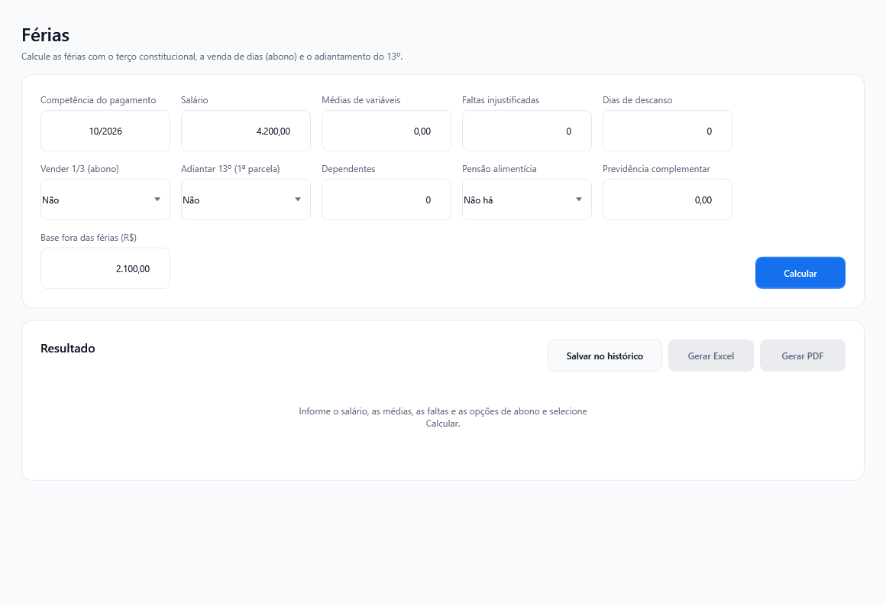

| Campo | O que informar |
| --- | --- |
| Salário e Médias de variáveis | Salário na data das férias e a média de variáveis do período aquisitivo. |
| Faltas injustificadas | Faltas no período aquisitivo, que definem os dias de direito (tabela abaixo). |
| Dias de descanso | Deixe 0 para usar todos os dias de direito que não forem vendidos; informe menos para dividir as férias (mínimo de 5 dias). |
| Vender 1/3 (abono) | Converte 1/3 dos dias em dinheiro, por exemplo 10 de 30 dias. |
| Adiantar 13º (1ª parcela) | Paga metade do 13º junto com as férias. |
| Previdência complementar | A contribuição do trabalhador ao PGBL, ao fundo de pensão ou ao Fapi sobre as férias. |

| Faltas no período aquisitivo | Dias de férias |
| --- | --- |
| Até 5 | 30 |
| De 6 a 14 | 24 |
| De 15 a 23 | 18 |
| De 24 a 32 | 12 |
| Mais de 32 | Sem direito |

- **Férias:** (salário + médias) ÷ 30 × dias de descanso, mais o terço constitucional.
- **Abono pecuniário:** os dias vendidos, também com 1/3. Não tem INSS, IRRF nem FGTS.
- O INSS e o IRRF incidem sobre as férias + 1/3. O IRRF é calculado à parte dos demais rendimentos do mês; o INSS foi calculado só sobre as férias, e na folha ele é somado ao do salário do mês, até o teto.
- **Previdência complementar:** deduzida por inteiro da base do IRRF das férias, só nas deduções legais, como no salário do mês (IN RFB 1.500/2014, art. 52, IV e V). As férias entram na declaração anual, onde se aplica o limite de 12%.

### 8.5 Rescisão

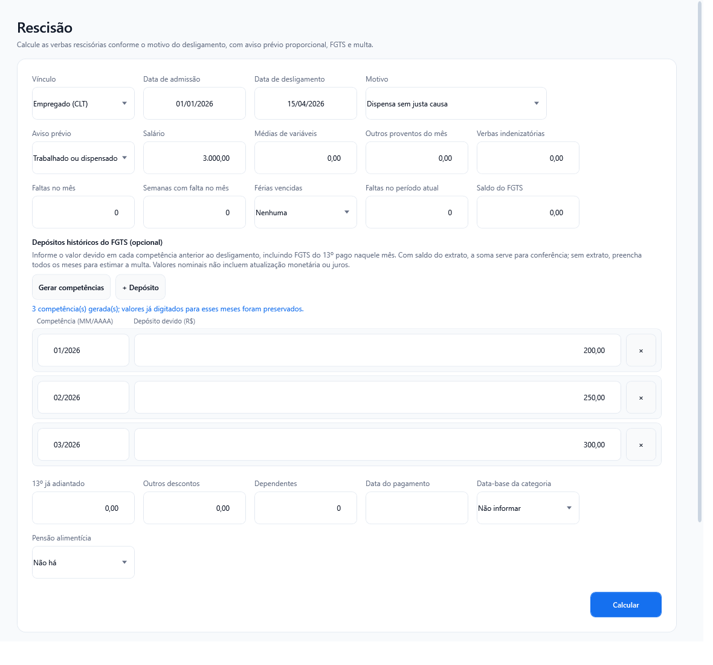

| Campo | O que informar |
| --- | --- |
| Vínculo | **Empregado (CLT)**, **Empregado doméstico** ou **Jovem aprendiz**. O doméstico tem a indenização compensatória de 3,2% no lugar da multa de 40% do FGTS; o aprendiz tem FGTS de 2%. |
| Data de admissão e Data de desligamento | Início do contrato e último dia trabalhado. Com aviso trabalhado, o último dia do aviso. |
| Motivo | Dispensa sem justa causa, pedido de demissão, acordo (CLT, art. 484-A), dispensa por justa causa, fim de contrato a prazo ou a rescisão antecipada do contrato a prazo ou de experiência, **pela empresa** (art. 479) ou **pelo empregado** (art. 480). |
| Aviso prévio | Aparece nos motivos que têm aviso: **Indenizado**, **Trabalhado ou dispensado** ou, no pedido de demissão, **Não cumprido (descontar)**. |
| Fim previsto do contrato | Aparece nas rescisões antecipadas: o último dia previsto do contrato a prazo ou de experiência. |
| Salário e Médias de variáveis | Último salário e a média de variáveis, que entra no aviso, no 13º e nas férias. |
| Outros proventos do mês | Horas extras, adicionais e comissões do mês do desligamento. Somam-se ao saldo de salário nas bases do INSS, do IRRF, da pensão e do FGTS. |
| Verbas indenizatórias | Verbas da convenção ou do acordo sem INSS, IRRF e FGTS, como a multa normativa. |
| Faltas no mês | Faltas injustificadas no mês do desligamento, descontadas dos dias do saldo de salário. |
| Semanas com falta no mês | Semanas do mês do desligamento com falta injustificada: cada uma perde o DSR, um dia de salário (Lei 605/1949, art. 6º). |
| Férias vencidas | Períodos completos cujas férias não foram tiradas (até 2). Com 2 períodos, o mais antigo já passou do prazo de concessão e é pago em dobro (CLT, art. 137). |
| Faltas no período atual | Faltas injustificadas no período aquisitivo em curso, que reduzem as férias proporcionais. |
| Saldo do FGTS | Aparece quando há multa ou saque, e sempre no doméstico. Informe o saldo do extrato; com 0,00, o aplicativo estima o saldo pelo salário atual. |
| 13º já adiantado | 1ª parcela do 13º paga no ano, que é descontada. |
| Outros descontos | Vale-transporte, plano de saúde, vales e adiantamentos. No total, a compensação na rescisão é limitada a uma remuneração mensal (CLT, art. 477, § 5º). |
| Data do pagamento | Deixe em branco se as verbas forem pagas no prazo, no mês do desligamento. O IRRF usa a tabela do mês do pagamento (regime de caixa) e o INSS, a da competência do desligamento, o que faz diferença quando a tabela do IRRF muda na virada do mês, como em 01/2026. Pagamento depois de 10 dias do fim do contrato gera a multa do art. 477, § 8º. |
| Data-base da categoria | Aparece na dispensa sem justa causa: o mês do reajuste da categoria, para a indenização adicional da Lei 7.238/1984. |

| Verba | Sem justa causa | Pedido de demissão | Acordo | Justa causa | Fim de contrato a prazo |
| --- | --- | --- | --- | --- | --- |
| Saldo de salário | Sim | Sim | Sim | Sim | Sim |
| Aviso prévio indenizado | Proporcional | Descontado, se não cumprido | Metade | Não | Não |
| 13º proporcional | Sim | Sim | Sim | Não | Sim |
| Férias vencidas + 1/3 | Sim | Sim | Sim | Sim | Sim |
| Férias proporcionais + 1/3 | Sim | Sim | Sim | Não | Sim |
| Multa do FGTS | 40% | Não | 20% | Não | Não |
| Saque do FGTS | 100% | Não | 80% do saldo e da multa | Não | 100% |

Nas **rescisões antecipadas** do contrato a prazo ou de experiência não há aviso prévio, e são devidos o saldo, o 13º e as férias proporcionais com 1/3:

- **Pela empresa (art. 479):** o empregado recebe também metade da remuneração dos dias que faltavam até o fim previsto, a multa de 40% do FGTS e pode sacar o FGTS (Decreto 99.684/1990, art. 14). A indenização não tem INSS, IRRF nem FGTS.
- **Pelo empregado (art. 480):** sem multa nem saque do FGTS. O empregado deve indenizar os prejuízos que a empresa comprovar, até a metade da remuneração dos dias que faltavam. Esse limite aparece em **Valores informativos** e não é descontado.
- Se o contrato tiver cláusula de rescisão antecipada (art. 481), valem as regras da dispensa sem justa causa, com aviso prévio.

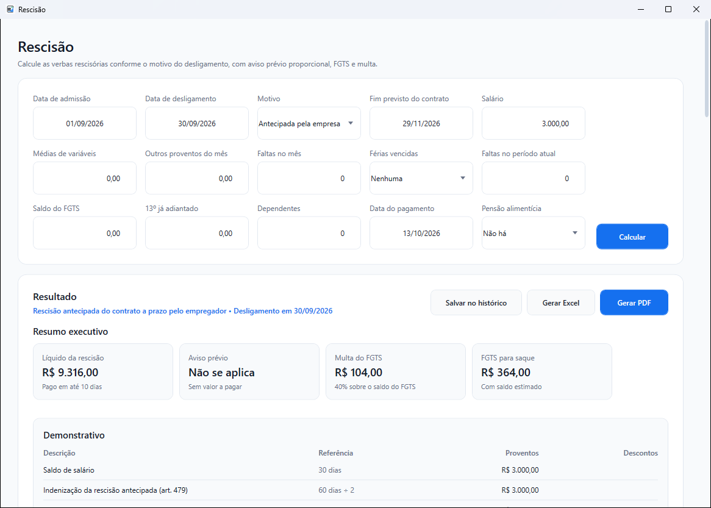

- **Aviso prévio proporcional:** 30 dias mais 3 por ano completo de serviço, até 90 dias (Lei 12.506/2011). No acordo, é pago pela metade, e a projeção no 13º, nas férias e na data de término usa só os dias pagos, como na tabela do eSocial para o código 33.
- **Projeção do aviso:** o aviso indenizado conta como tempo de serviço. O contrato é projetado até o fim do aviso, e os avos a mais de 13º e de férias aparecem nas linhas "sobre o aviso prévio indenizado".
- **Saldo de salário:** salário ÷ 30 × dias trabalhados no mês, no mês comercial de 30 dias, inclusive quando a admissão e o desligamento caem no mesmo mês, menos as faltas do mês.
- **13º proporcional:** um avo para cada mês do ano com 15 dias ou mais de trabalho.
- **Férias proporcionais:** um avo por mês desde o último aniversário da admissão, contando a fração de 15 dias ou mais, reduzidas conforme as faltas.
- **Impostos:** o saldo de salário e o 13º têm INSS e IRRF, cada um calculado à parte. Aviso indenizado, férias indenizadas e multa do FGTS são isentos.
- **Férias vencidas em dobro:** com 2 períodos vencidos, a linha **Férias vencidas em dobro** traz 2 salários do período mais antigo, e o 1/3 incide sobre o total das férias vencidas.
- **FGTS:** o depósito do mês é de 8% sobre o saldo de salário, o aviso indenizado e o 13º, menos a 1ª parcela do 13º, que já teve o FGTS depositado no mês em que foi paga. A multa incide sobre o saldo do FGTS mais esse depósito. No acordo, o saque é de 80% do saldo, inclusive da multa de 20%, como orienta o Manual de Movimentação da Conta Vinculada do FGTS da Caixa.
- **Saldo do FGTS estimado:** sem o saldo do extrato, o aplicativo estima os depósitos anteriores ao mês do desligamento: os meses de contrato, o 13º dos anos anteriores e a 1ª parcela do 13º deste ano. Informe o saldo do extrato para obter a multa e o saque exatos.
- **Indenização adicional (Lei 7.238/1984, art. 9º):** na dispensa sem justa causa, se o contrato, projetado pelo aviso, terminar nos 30 dias que antecedem a data-base, o empregado recebe um salário a mais (Súmulas 182 e 242 do TST). Se a projeção passar da data-base, não há indenização, mas as verbas devem ser pagas com o salário reajustado (Súmula 314); o aplicativo avisa nas observações.
- **Multa por atraso (art. 477, § 8º):** com a data do pagamento depois de 10 dias do fim do contrato, entra um salário de multa. Ela é tratada como indenização, sem INSS, IRRF nem FGTS, como entende a maior parte dos tribunais.
- **Seguro-desemprego:** na dispensa sem justa causa e na rescisão antecipada pela empresa, **Valores informativos** traz uma estimativa para a 1ª solicitação, com os meses deste contrato e a remuneração atual como média. Para outras situações, use a calculadora [Seguro-desemprego](#812-seguro-desemprego).
- **Empregado doméstico:** no lugar da multa de 40%, a indenização compensatória de 3,2%, estimada em 40% do saldo do FGTS (3,2% é 40% de 8%) mais os 3,2% do mês. Na dispensa sem justa causa, ela vai para o empregado; no acordo, a metade; nos demais motivos, volta ao empregador. O seguro-desemprego do doméstico é de um salário mínimo, em até 3 parcelas.
- **Jovem aprendiz:** FGTS de 2%. No fim do contrato e nas hipóteses do art. 433 da CLT, não há as indenizações dos arts. 479 e 480.
- **DSR perdido e outros descontos:** o DSR perdido reduz a base do INSS, do IRRF e do FGTS do mês; os outros descontos saem só do líquido.

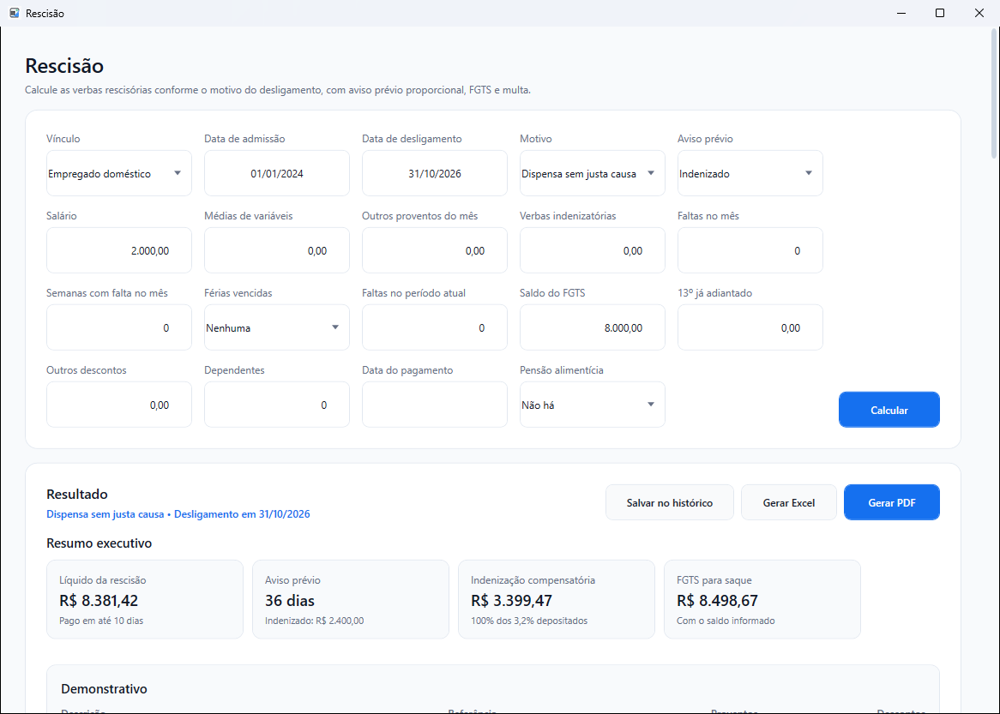

A memória de cálculo detalha o contrato, o aviso, a projeção, cada verba e o FGTS:

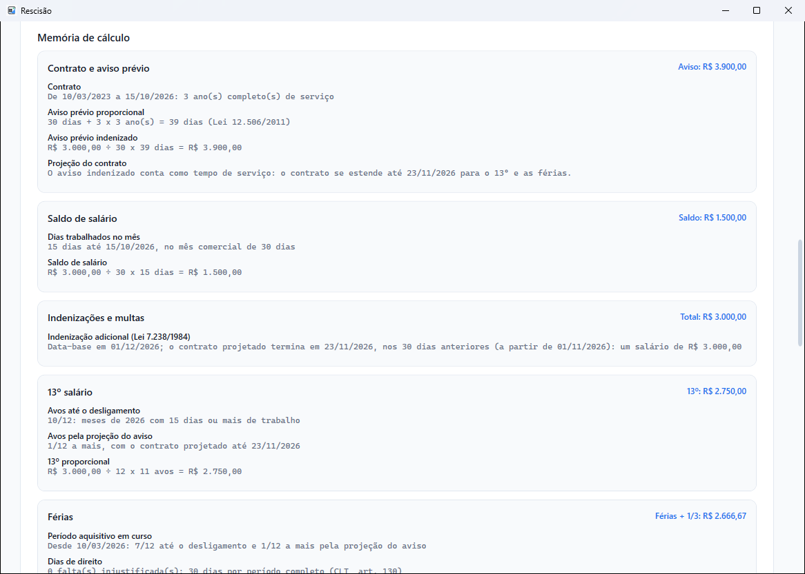

> **Atenção:** a rescisão deve ser paga em até 10 dias após o fim do contrato (CLT, art. 477, § 6º). Verbas e descontos específicos da convenção coletiva entram nos campos de outros proventos, verbas indenizatórias e outros descontos: confira na convenção a incidência de cada um.

### 8.6 Custo do funcionário

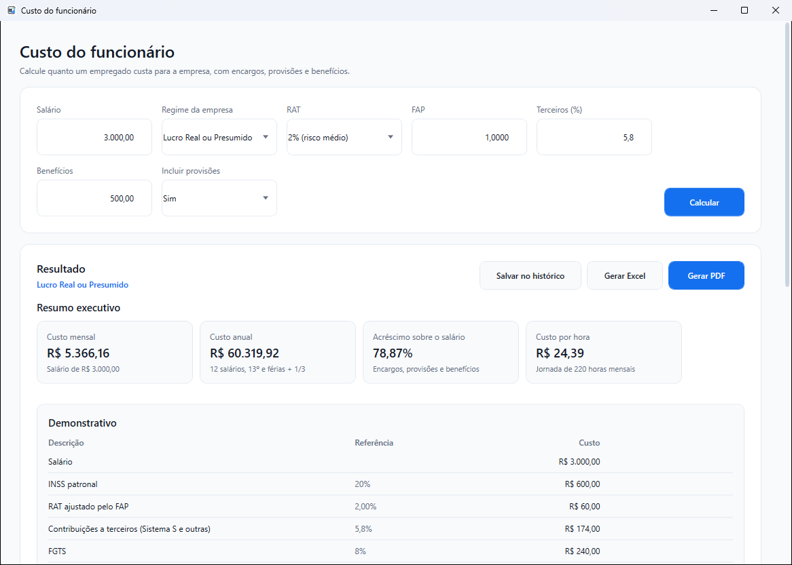

Informe o **salário**, o **regime da empresa**, o **RAT** e o **FAP**, as **contribuições a terceiros**, o custo mensal com **benefícios** (já descontada a parte do empregado) e se deseja **incluir as provisões** de 13º e férias.

| Encargo | Lucro Real ou Presumido | Simples (anexos I a III e V) | Simples (anexo IV) |
| --- | --- | --- | --- |
| INSS patronal (20%) | Sim | Incluído no DAS | Sim |
| RAT ajustado pelo FAP | Sim | Incluído no DAS | Sim |
| Terceiros (normalmente 5,8%) | Sim | Não | Não |
| FGTS (8%) | Sim | Sim | Sim |

- **Provisões:** 13º = salário ÷ 12; férias + 1/3 = salário ÷ 12 × 4/3. Os encargos também incidem sobre elas.
- O resultado mostra o custo mensal, o custo anual, o acréscimo sobre o salário e o custo por hora, numa jornada de 220 horas.
- **Empregador doméstico:** escolha esse regime para os encargos do DAE: 8% de contribuição patronal, 0,8% de GILRAT, 8% de FGTS e 3,2% de indenização compensatória, 20% ao todo.

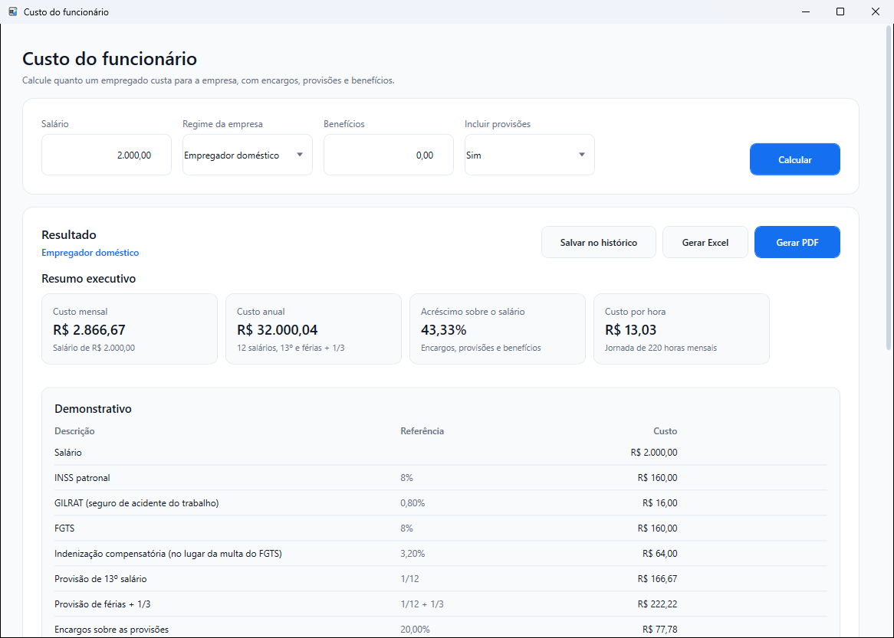

- **Jovem aprendiz:** marque **Sim** para o FGTS de 2% em vez de 8%.
- **Custo anual:** 12 salários, o 13º e o 1/3 de férias, com os encargos e os benefícios. Ele é o custo mensal × 12 menos o salário e os encargos do mês de férias, que já estão na provisão de férias. Até a versão 1.3.0, esse mês era contado duas vezes, e o custo anual saía cerca de um salário maior.

### 8.7 Pró-labore e autônomo

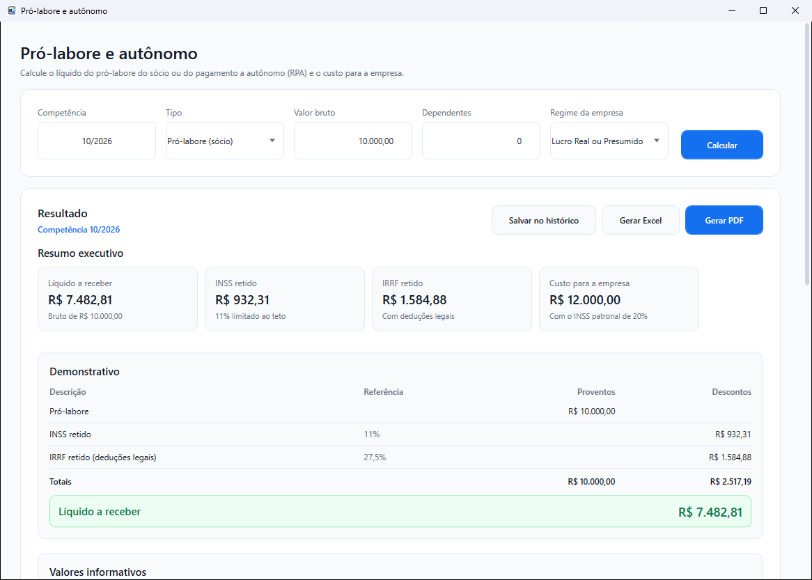

Escolha o **tipo**, **pró-labore** do sócio ou **autônomo (RPA)**, e informe o valor bruto, os dependentes e o regime da empresa. Para o autônomo, aparece o campo **ISS retido (%)**, usado quando a lei do município exige a retenção.

- **INSS:** 11% do valor, limitado ao teto do INSS e truncado nos centavos, como no eSocial.
- **IRRF:** tabela mensal, com a dedução do INSS e dos dependentes ou o desconto simplificado, o que for mais vantajoso.
- **Custo para a empresa:** valor bruto mais o INSS patronal de 20%, exceto no Simples Nacional, anexos I a III e V.
- Pró-labore e RPA não têm FGTS, 13º nem férias.

### 8.8 Insalubridade e periculosidade

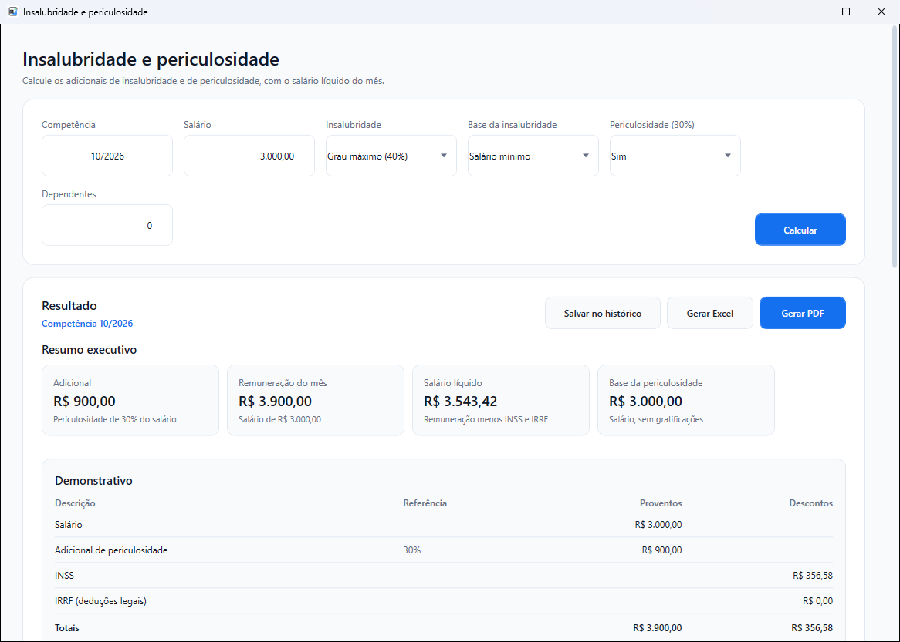

| Campo | O que informar |
| --- | --- |
| Salário | Salário-base, sem gratificações, prêmios ou outros adicionais. |
| Insalubridade | **Não há**, **Grau mínimo (10%)**, **Grau médio (20%)** ou **Grau máximo (40%)**, conforme o laudo técnico (NR-15). |
| Base da insalubridade | **Salário mínimo** (padrão), **Salário** ou **Valor informado**, quando a convenção coletiva prevê outra base, como o piso da categoria. Aparece só quando há insalubridade. |
| Periculosidade (30%) | **Sim** para atividades perigosas, como inflamáveis, explosivos, energia elétrica, segurança patrimonial ou uso de motocicleta (CLT, art. 193). |

- **Insalubridade:** base × 10%, 20% ou 40%. O salário mínimo de cada competência vem da tabela **Salário mínimo**.
- **Periculosidade:** salário × 30%.
- **Não se acumulam:** quando os dois se aplicam, o empregado recebe o mais vantajoso (CLT, art. 193, § 2º). O aplicativo aplica o maior e mostra o outro em **Valores informativos**, para comparação.
- O INSS e o IRRF incidem sobre a remuneração com o adicional, e o resultado mostra o salário líquido.

### 8.9 Salário-família

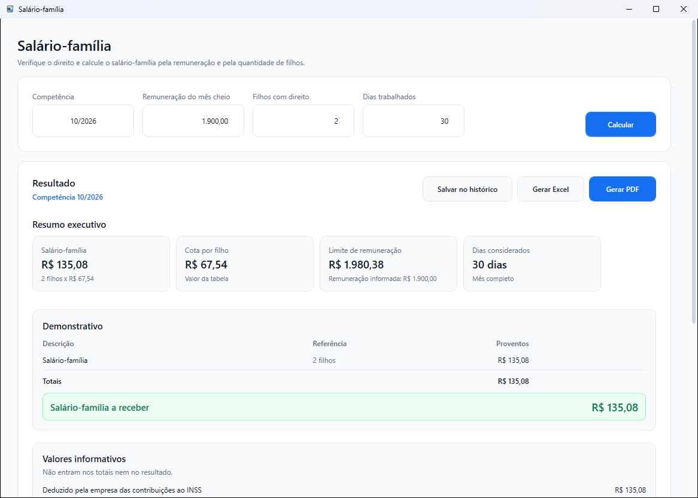

Informe a **remuneração do mês cheio**, os **filhos com direito** (até 14 anos, ou inválidos de qualquer idade) e os **dias trabalhados**: 30 no mês completo, ou os dias de trabalho nos meses de admissão e de desligamento.

A remuneração comparada ao limite é o salário de contribuição do mês inteiro, com horas extras e adicionais e sem o 13º e o 1/3 de férias. Nos meses de admissão e de desligamento, informe a remuneração do mês completo, não a proporcional aos dias trabalhados. Por isso este campo não vem preenchido com o salário de outras calculadoras.

- Quem recebe até o **limite de remuneração** da tabela tem direito a uma **cota por filho**. Acima do limite, não há salário-família no mês. Até 10/2019 havia duas faixas, com cotas diferentes.
- Nos meses de admissão e de desligamento, só a cota é proporcional aos dias trabalhados; o direito continua sendo verificado pela remuneração do mês cheio.
- A cota exige a certidão de nascimento, o atestado de vacinação anual até os 6 anos e a comprovação semestral de frequência escolar a partir dos 4 anos (Decreto 3.048/1999, art. 84).
- O salário-família não tem INSS, IRRF nem FGTS. A empresa paga junto com o salário e deduz o valor das contribuições ao INSS.
- Se pai e mãe tiverem direito, os dois recebem.

### 8.10 PLR (participação nos lucros ou resultados)

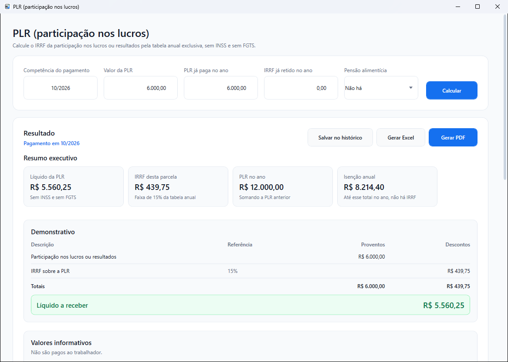

| Campo | O que informar |
| --- | --- |
| Competência do pagamento | Mês do pagamento, que define a tabela anual usada. |
| Valor da PLR | Valor bruto desta parcela. |
| PLR já paga no ano e IRRF já retido no ano | A parcela anterior do mesmo ano e o imposto retido nela, quando houver. |
| Pensão alimentícia | Pensão descontada desta PLR, como percentual ou valor informado. Veja a seção [8.11](#811-pensão-alimentícia-no-13º-nas-férias-na-rescisão-e-na-plr). |

- A PLR tem **tributação exclusiva na fonte**, pela **tabela anual** da PLR (Lei 10.101/2000), separada do salário. Não há dedução de dependentes, desconto simplificado nem a redução mensal do IRRF; só a pensão alimentícia reduz a base.
- Com mais de um pagamento no ano, o imposto é recalculado sobre o total e o valor já retido é descontado:

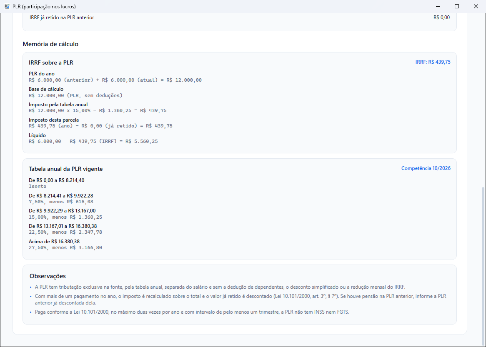

- Paga conforme a lei, no máximo duas vezes por ano e com intervalo de pelo menos um trimestre, a PLR não tem INSS nem FGTS.

### 8.11 Pensão alimentícia no 13º, nas férias, na rescisão e na PLR

As calculadoras de 13º salário, férias, rescisão e PLR têm o campo **Pensão alimentícia**, para descontar a pensão definida na decisão judicial ou no acordo:

| Opção | Como a pensão é calculada |
| --- | --- |
| Não há | Sem pensão. É a opção inicial. |
| % do líquido | Percentual, informado em **Percentual da pensão**, sobre a verba menos o INSS e o IRRF. Como a pensão também reduz o IRRF, o cálculo se repete até o valor se estabilizar, como na calculadora de pensão. |
| % do bruto | Percentual sobre a verba, sem descontos. |
| Valor informado | O valor digitado em **Valor da pensão**. |

| Calculadora | Sobre o que a pensão incide |
| --- | --- |
| 13º salário | O 13º integral. A pensão é descontada na 2ª parcela; se a empresa já descontou pensão na 1ª parcela, abata esse valor. |
| Férias | As férias + 1/3. O abono pecuniário, de natureza indenizatória, e o adiantamento do 13º ficam fora da base. |
| Rescisão | O saldo de salário e o 13º, cada um com a pensão deduzida do seu próprio IRRF. As verbas indenizatórias (aviso prévio indenizado, férias indenizadas com 1/3, FGTS e multa) ficam fora; se a decisão determinar a incidência sobre elas, use **Valor informado**. O valor informado é descontado do saldo de salário. |
| PLR | A PLR desta parcela. A pensão reduz a base da tabela anual da PLR. |

No 13º, nas férias e na rescisão, a pensão é deduzida da base do IRRF na modalidade de deduções legais; no desconto simplificado, não. O aplicativo aplica a modalidade de menor imposto. O demonstrativo mostra a pensão entre os descontos, e a memória de cálculo ganha o grupo **Pensão alimentícia**, com a regra, a base e o valor:

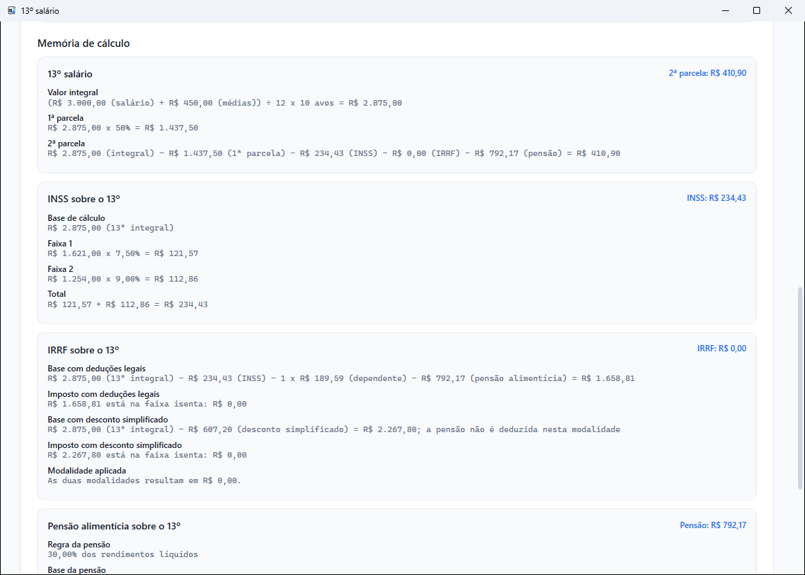

### 8.12 Seguro-desemprego

Abra pelo cartão **Seguro-desemprego**, no grupo **Férias, 13º e desligamento**. Ele calcula o valor de cada parcela e quantas parcelas o trabalhador dispensado sem justa causa recebe.

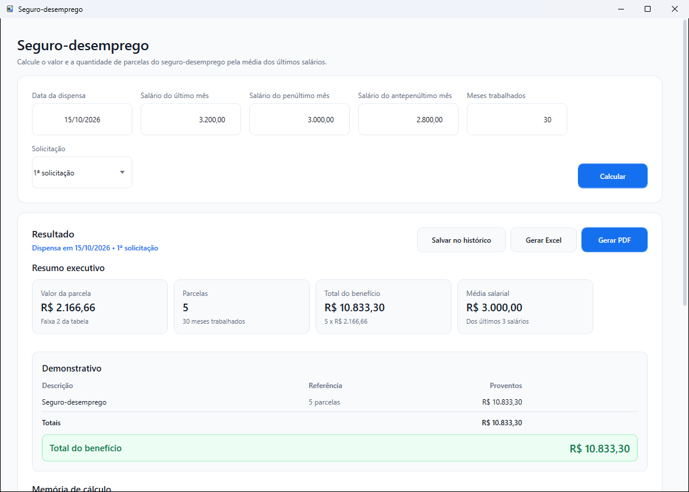

| Campo | O que informar |
| --- | --- |
| Data da dispensa | Data do desligamento, que define a tabela usada. |
| Salários do último, do penúltimo e do antepenúltimo mês | Os salários dos 3 meses anteriores à dispensa, com horas extras e adicionais. Deixe 0,00 nos meses sem salário: a média usa só os meses informados. |
| Meses trabalhados | Meses com carteira assinada nos 36 meses antes da dispensa, em qualquer emprego; a fração de 15 dias ou mais conta como mês. |
| Solicitação | **1ª solicitação**, **2ª solicitação** ou **3ª ou seguinte**, contando esta. |

| Regra | Como funciona (Lei 7.998/1990, com a redação da Lei 13.134/2015) |
| --- | --- |
| Valor da parcela | Pela média dos salários, na tabela **Seguro-desemprego** vigente na dispensa. Em 2026: até R$ 2.222,17, 80% da média; até R$ 3.703,99, R$ 1.777,74 mais 50% do que passar de R$ 2.222,17; acima, R$ 2.518,65. A parcela nunca fica abaixo do salário mínimo. |
| Carência | Salário em pelo menos 12 dos últimos 18 meses na 1ª solicitação, 9 dos últimos 12 na 2ª e em cada um dos 6 últimos nas seguintes. O aplicativo considera que os meses informados são os imediatamente anteriores à dispensa. |
| Parcelas | 3 parcelas de 6 a 11 meses trabalhados (a partir da 2ª solicitação), 4 de 12 a 23 meses e 5 com 24 meses ou mais. |

A memória de cálculo mostra a média, a fórmula da faixa e a regra das parcelas:

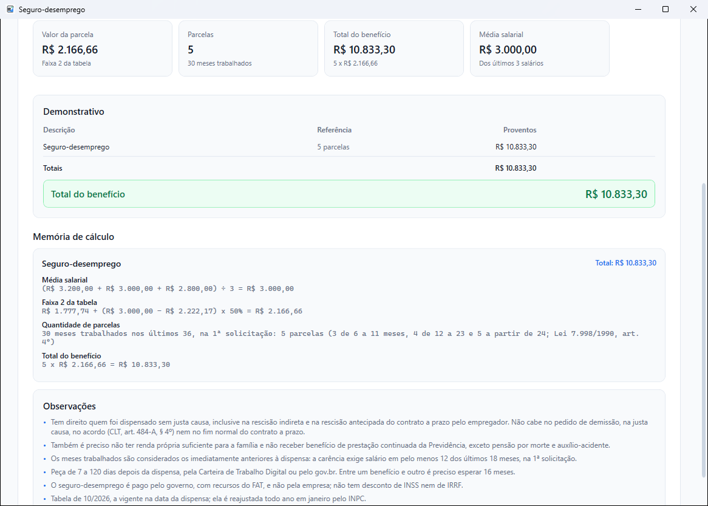

Não têm direito o pedido de demissão, a justa causa, o acordo (CLT, art. 484-A, § 4º) e o fim normal do contrato a prazo. O benefício é pago pelo governo, não pela empresa, não tem desconto de INSS nem de IRRF e deve ser pedido de 7 a 120 dias depois da dispensa.

**Empregado doméstico:** escolha o vínculo **Empregado doméstico**. A parcela é de um salário mínimo, em até 3 parcelas, para quem trabalhou como doméstico pelo menos 15 meses nos últimos 24 (LC 150/2015, arts. 26 e 28), e deve ser pedida de 7 a 90 dias depois da dispensa. Os salários e a solicitação não entram no cálculo e ficam ocultos.

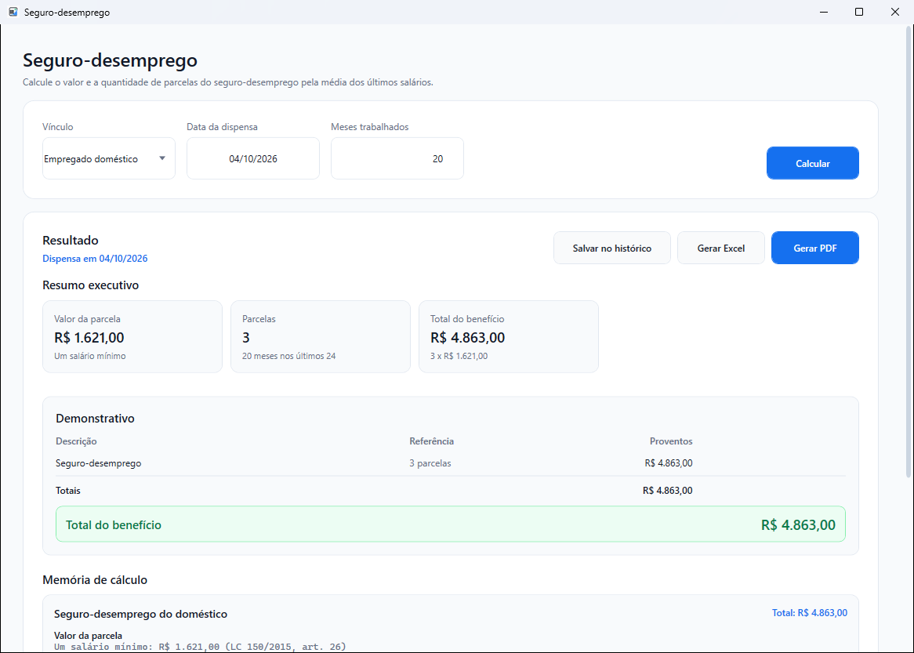

### 8.13 CLT x PJ

Abra pelo cartão **CLT x PJ**, no grupo **Impostos e salário**. Ele compara, em um ano, o mesmo profissional como empregado e como PJ no Simples Nacional: o que sobra para ele e quanto custa para a empresa.

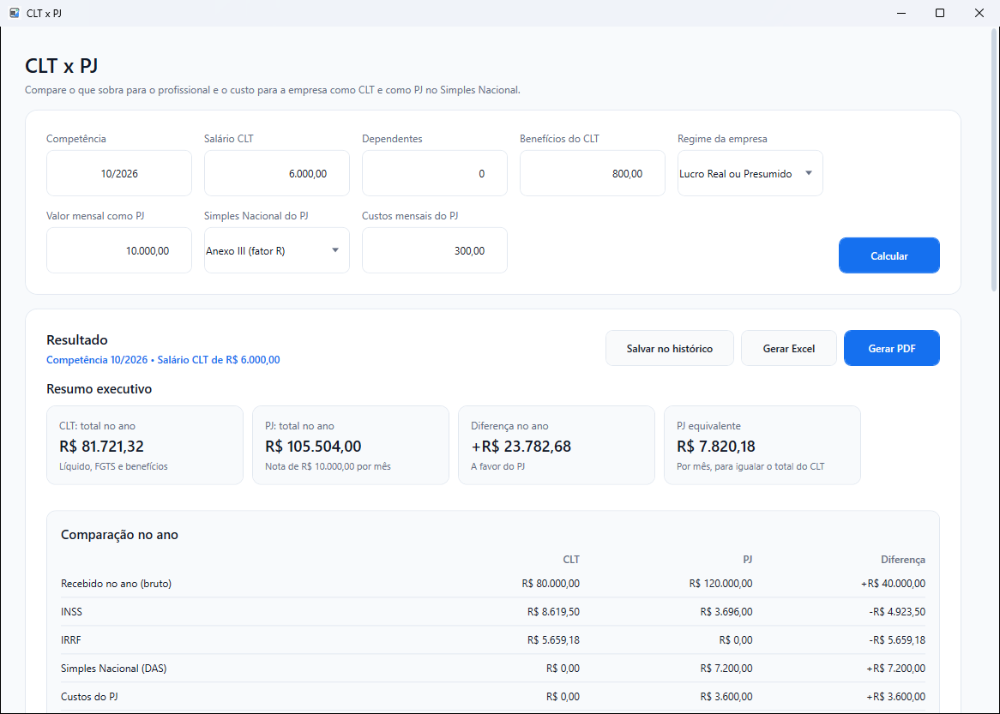

| Campo | O que informar |
| --- | --- |
| Competência, Salário CLT e Dependentes | O salário como empregado e os dependentes para o IRRF, nos dois regimes. |
| Benefícios do CLT | Vale-refeição, vale-alimentação, plano de saúde e outros benefícios pagos pela empresa por mês. |
| Regime da empresa | Define os encargos do CLT: no Lucro Real ou Presumido, 20% de INSS patronal, RAT de 2% (FAP 1), 5,8% de terceiros e 8% de FGTS; no Simples, anexos I a III e V, só o FGTS; no anexo IV, 20% + RAT + FGTS. |
| Valor mensal como PJ | O valor da nota fiscal por mês. Deixe 0,00 para o aplicativo calcular o valor que iguala o total do CLT. |
| Simples Nacional do PJ | **Anexo III (fator R)**: com pró-labore de 28% do faturamento, serviços do anexo V passam para o III. **Anexo III**: atividade já tributada nele. **Anexo V**: sem o fator R. Nas duas últimas, o pró-labore é de um salário mínimo. |
| Custos mensais do PJ | Contabilidade, taxas e outros custos fixos da empresa do PJ. |

A tabela **Comparação no ano** coloca lado a lado o recebido, o INSS, o IRRF, o DAS, os custos, o líquido, o FGTS, os benefícios, o **total para o profissional** e o **custo para a empresa**, com a diferença:

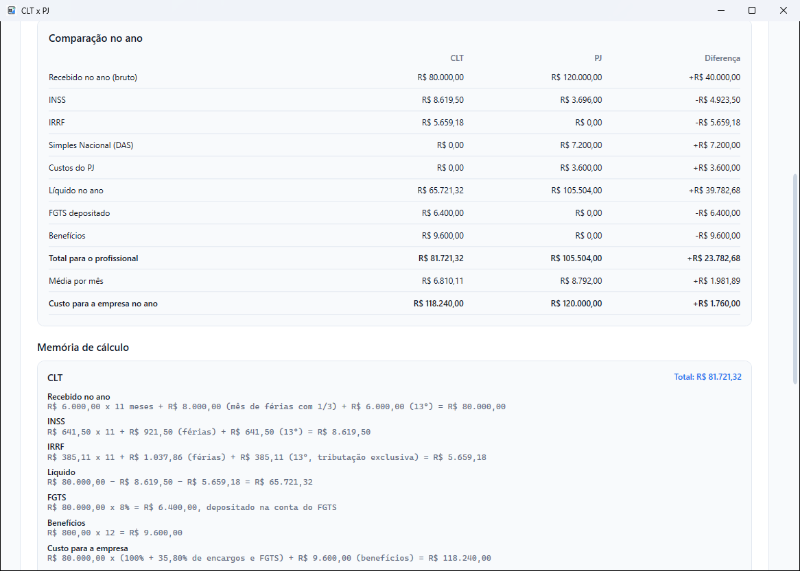

- **CLT:** 11 meses de salário, o mês de férias com 1/3 e o 13º, com INSS e IRRF de cada um. O total soma o líquido, o FGTS depositado (8% de tudo) e os benefícios.
- **PJ:** o DAS pela alíquota efetiva do anexo, com a receita de 12 meses igual a 12 vezes o valor mensal (Lei Complementar 123/2006); o pró-labore, com INSS de 11% e IRRF; e os custos. O restante é distribuído como lucro, isento de IR. O ISS e a contribuição patronal sobre o pró-labore estão no DAS.
- **PJ equivalente:** o menor valor mensal de nota com o qual o total do PJ alcança o do CLT.

> **Atenção:** como PJ não há FGTS, 13º, férias remuneradas, seguro-desemprego nem multa do FGTS na saída. Acima de R$ 50 mil por mês, o lucro distribuído tem retenção de IRRF de 10% (Lei 15.270/2025), que não está no cálculo; o aplicativo avisa nas observações, e a calculadora [Dividendos](#817-dividendos) faz a conta. O limite do Simples Nacional é de R$ 4,8 milhões por ano.

### 8.14 Holerite do mês

Abra pelo cartão **Holerite do mês**, no grupo **Remuneração e custos**. Ele monta o holerite completo de um mês, com as mesmas regras das calculadoras de horas extras, de insalubridade e periculosidade e de salário-família.

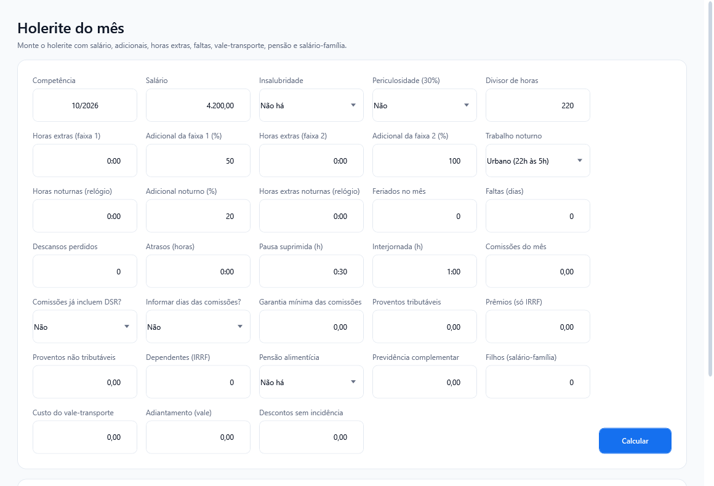

| Campo | O que informar |
| --- | --- |
| Salário | Salário-base mensal, sem adicionais. Deixe 0,00 para comissionista puro e informe as comissões no campo próprio. |
| Insalubridade e Periculosidade (30%) | O grau da insalubridade, sobre o salário mínimo, e a periculosidade, sobre o salário. Os dois não se acumulam: vale o maior (CLT, art. 193, § 2º). |
| Horas extras, trabalho noturno e feriados | Como na calculadora de horas extras (seção 8.2), inclusive as horas extras noturnas e o trabalho rural. |
| Faltas (dias) e Descansos perdidos | Faltas injustificadas e os domingos e feriados perdidos por elas: um por semana com falta, mais o feriado dessa semana (Lei 605/1949, art. 6º). Somados, não passam de 30 dias. |
| Atrasos (horas) | Atrasos e saídas antecipadas, descontados pelo valor da hora. |
| Comissões do mês e Comissões já incluem DSR? | Informe as comissões sem DSR para calculá-lo automaticamente. Se o total já inclui DSR, marque **Sim**: o aplicativo separa as parcelas sem somar um segundo repouso. |
| Informar dias das comissões? | Para escala ou período parcial, informe os dias úteis e os repousos previstos. Os descansos perdidos são descontados da quantidade de repousos remunerados. |
| Garantia mínima das comissões | Deixe 0,00 para o salário mínimo nacional em mês completo. Informe um piso maior da categoria ou a garantia proporcional aplicável ao período quando os dias forem informados. |
| Proventos tributáveis | Outros proventos com INSS, IRRF e FGTS. Comissões informadas aqui já devem incluir DSR e não podem ser repetidas no campo próprio. |
| Prêmios (só IRRF) | Prêmios por desempenho superior ao esperado (CLT, art. 457, §§ 2º e 4º). Têm IRRF e entram na base da pensão, mas não têm INSS nem FGTS. Valores pagos todo mês ou sem ligação com o desempenho podem ser considerados salário: nesse caso, informe-os nos proventos tributáveis. |
| Proventos não tributáveis | Ajuda de custo, diárias de viagem, reembolsos de despesas e outros valores sem INSS, IRRF e FGTS. Só somam no líquido: ficam fora da pensão e do limite do salário-família. |
| Dependentes (IRRF) | Os dependentes declarados para o IRRF: cada um é deduzido da base na modalidade de deduções legais. O desconto simplificado substitui essa dedução quando resulta em imposto menor. |
| Pensão alimentícia | A pensão da decisão: percentual do líquido ou do bruto, ou valor informado. |
| Previdência complementar | A contribuição do trabalhador ao PGBL, ao fundo de pensão ou ao Fapi descontada no mês. É deduzida por inteiro da base do IRRF nas deduções legais (IN RFB 1.500/2014, art. 52, IV e V): o limite de 12% dos rendimentos só é aplicado na declaração anual. Não reduz o INSS, o FGTS nem a base da pensão. |
| Filhos (salário-família) | Os filhos de até 14 anos, ou inválidos, para o salário-família. |
| Custo do vale-transporte | Custo das passagens do mês. O desconto é de até 6% do salário-base, sem os adicionais; a empresa paga o restante (Lei 7.418/1985, art. 4º). |
| Adiantamento (vale) e Descontos sem incidência | Valores que saem do líquido sem reduzir o INSS, o IRRF nem o FGTS, como o vale, o consignado e o plano de saúde. |

- **Remuneração do mês:** salário, adicional, comissões, DSR das comissões, eventual complemento da garantia mínima, demais proventos tributáveis, horas extras, adicional noturno e DSR das horas, menos as faltas, os descansos perdidos e os atrasos. É a base do INSS e do FGTS e define o salário-família.
- **Rendimentos do IRRF:** a remuneração do mês mais os prêmios. Deles saem o INSS, os dependentes, a pensão e a previdência complementar (deduções legais) ou o desconto simplificado, o que resultar em imposto menor. A base do IRRF aplicada aparece nos informativos.
- **Faltas e descansos perdidos:** salário-dia (salário e adicional ÷ 30) × dias.
- **Comissões e horas extras:** o DSR sobre comissões é separado do DSR das horas extras. Para comissionista misto, os campos de horas calculam a parcela fixa; o adicional de horas extras sobre as comissões depende das horas efetivamente trabalhadas (Súmula 340 do TST). Informe o valor já apurado em **Proventos tributáveis**, com o DSR correspondente. Para comissionista puro, não use os campos de horas extras ou noturnas nesta tela.
- **Salário-família:** pela remuneração do mês, uma cota por filho, sem INSS, IRRF nem FGTS. Nos meses de admissão e desligamento, use a calculadora de salário-família, que faz a cota proporcional.
- O 13º e as férias pagos no mês têm cálculo próprio, nas calculadoras de 13º e de férias.

### 8.15 Jornada pelo ponto

Abra pelo cartão **Jornada pelo ponto**, no grupo **Remuneração e custos**. A partir das marcações de entrada e saída de cada dia do mês, ela apura as horas normais, as extras, as noturnas, as faltas, os atrasos e os intervalos não concedidos, e leva os totais para a calculadora de horas extras ou para o holerite.

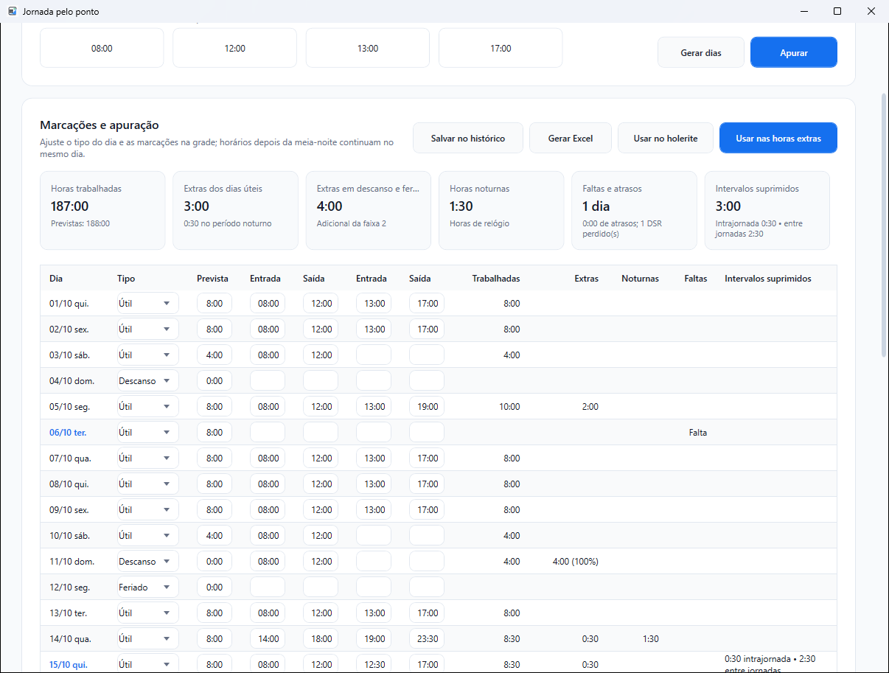

1. Informe a **competência**, a **jornada** de segunda a sexta e de sábado (0:00 quando o sábado é compensado), o **trabalho noturno** e o **horário padrão**.
2. Clique em **Gerar dias**: os dias úteis vêm com o horário padrão e o domingo como descanso.
3. Na grade, ajuste o **tipo** de cada dia (**Útil**, **Descanso** ou **Feriado**) e as marcações que forem diferentes. Deixe as marcações em branco nos dias de falta. Horários depois da meia-noite continuam no mesmo dia.
4. Clique em **Apurar**. Os cartões mostram os totais, e a grade, o resultado de cada dia; os dias com falta ou intervalo suprimido ficam destacados.
5. Clique em **Usar nas horas extras** ou em **Usar no holerite**: a calculadora abre com as horas, os feriados e, no holerite, as faltas, os descansos perdidos e os atrasos. Informe o salário e calcule.

| Regra | Como funciona |
| --- | --- |
| Horas extras | O que passa da jornada prevista do dia útil, contado nos últimos minutos trabalhados. Variações de até 10 minutos no dia não contam como extra nem como atraso (CLT, art. 58, § 1º, e Súmula 366 do TST). |
| Descansos e feriados | Todo o trabalho nesses dias é hora extra com o adicional da faixa 2, normalmente 100%. |
| Horas noturnas | Urbano: das 22h às 5h; rural: das 21h às 5h na lavoura e das 20h às 4h na pecuária. Quem cumpre todo o período noturno e continua trabalhando tem as horas seguintes também como noturnas (Súmula 60, II, do TST). As horas são de relógio; a calculadora de horas extras faz a redução da hora urbana. |
| Faltas | Dia útil com jornada prevista e sem marcações. Cada semana com falta perde o descanso remunerado (Lei 605/1949, art. 6º). |
| Intervalo intrajornada | Pelo menos 1 hora acima de 6 horas de trabalho e 15 minutos acima de 4 horas (CLT, art. 71), somando as pausas do dia. O tempo que faltou é pago como indenização, com 50% (art. 71, § 4º). |
| Intervalo entre jornadas | Pelo menos 11 horas entre a última saída de um dia e a primeira entrada do seguinte (CLT, art. 66). As horas que faltaram são pagas como extras (OJ 355 da SDI-1 do TST). |

> **Atenção:** os intervalos suprimidos aparecem nos totais, mas não vão para as horas extras: inclua-os na faixa 1 da calculadora se forem devidos. O botão **Gerar Excel** salva os dias e os totais em uma planilha.

### 8.16 IRPF anual

Abra pelo cartão **IRPF anual**, no grupo **Impostos e salário**. Ele simula a declaração do imposto de renda a partir do ano-calendário 2026 (declaração de 2027), com as regras da Lei 15.270/2025.

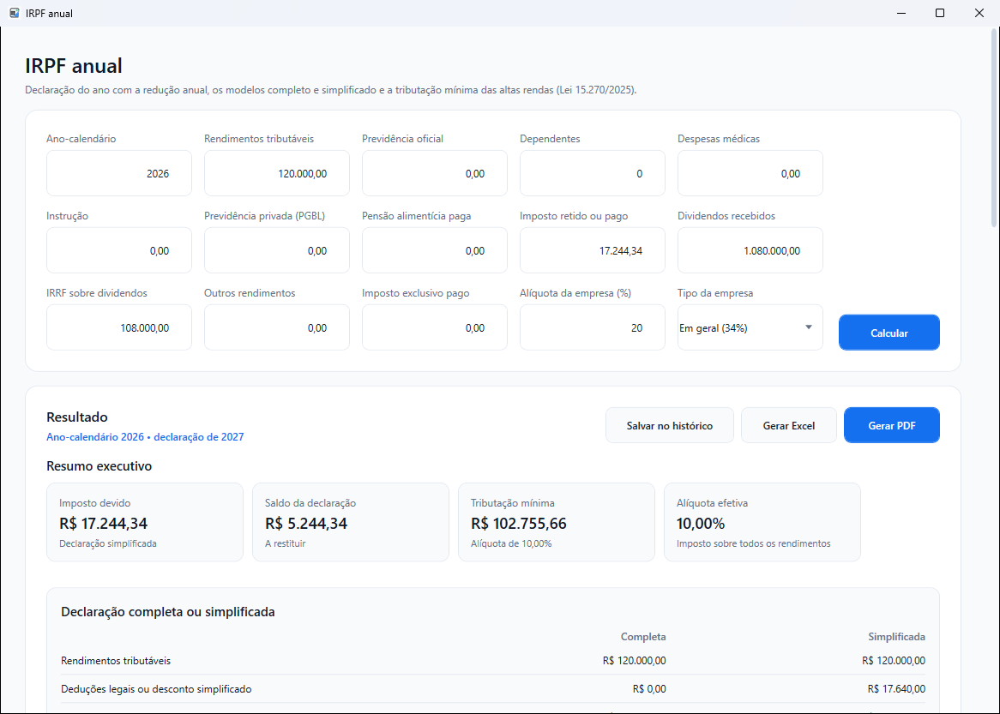

| Campo | O que informar |
| --- | --- |
| Rendimentos tributáveis | Salários, pró-labore, aluguéis e outros rendimentos tributáveis do ano. O 13º e a PLR têm tributação exclusiva e ficam de fora. |
| Previdência oficial, Dependentes, Despesas médicas, Instrução, Previdência privada (PGBL) e Pensão alimentícia paga | As deduções do modelo completo. A instrução vai até R$ 3.561,50 por pessoa e o PGBL, até 12% dos rendimentos tributáveis; cada dependente deduz R$ 2.275,08. |
| Imposto retido ou pago | O IRRF dos rendimentos tributáveis, o carnê-leão e os pagamentos complementares do ano. |
| Dividendos recebidos e IRRF sobre dividendos | Os lucros e dividendos do ano e a retenção de 10% feita sobre eles. |
| Outros rendimentos e Imposto exclusivo pago | Rendimentos isentos ou de tributação exclusiva que entram na tributação mínima, como 13º, PLR, JCP e aplicações, e o imposto pago sobre eles. |
| Alíquota da empresa e Tipo da empresa | A alíquota efetiva de IRPJ e CSLL da empresa que pagou os dividendos e a sua alíquota nominal (34%, 40% ou 45%), para o redutor da tributação mínima. Deixe 0 para não calcular o redutor. |

- **Modelos:** o completo deduz as despesas informadas; o simplificado desconta 20% dos rendimentos tributáveis, até R$ 17.640,00. O aplicativo calcula os dois e escolhe o de menor imposto.
- **Tabela anual:** isento até R$ 29.145,60; 7,5%, 15%, 22,5% e 27,5% nas faixas seguintes, com as parcelas a deduzir da Receita Federal.
- **Redução anual (Lei 9.250/1995, art. 11-A):** com rendimentos tributáveis de até R$ 60.000,00, o imposto é zerado, até R$ 2.694,15; até R$ 88.200,00, a redução é de R$ 8.429,73 − 0,095575 × rendimentos. Ela vale nos dois modelos e nunca passa do imposto.
- **Tributação mínima (art. 16-A):** quando todos os rendimentos do ano, inclusive isentos e exclusivos, passam de R$ 600 mil, a alíquota é (rendimentos ÷ 60.000) − 10%, até 10% a partir de R$ 1,2 milhão. Do valor são deduzidos o IRPF devido e o imposto exclusivo pago e, depois, a retenção sobre os dividendos.
- **Redutor (art. 16-B):** se a alíquota efetiva da empresa somada à da pessoa sobre os dividendos passar da nominal, a diferença sobre os dividendos reduz a tributação mínima.

A memória de cálculo mostra os dois modelos, a redução e a tributação mínima passo a passo:

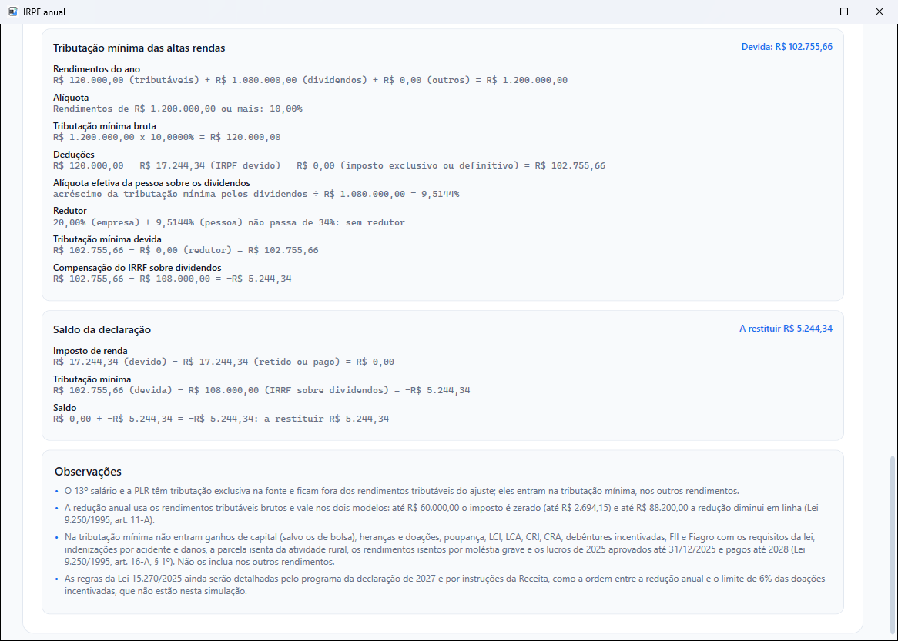

> **Atenção:** a simulação segue o texto da lei e as tabelas publicadas pela Receita Federal para 2026. O programa da declaração de 2027 e instruções da Receita ainda vão detalhar pontos como a ordem entre a redução anual e o limite das doações incentivadas, que não estão no cálculo.

### 8.17 Dividendos

Abra pelo cartão **Dividendos**, no grupo **Impostos e salário**. Ele calcula a retenção de IRRF sobre lucros e dividendos pagos desde 01/2026.

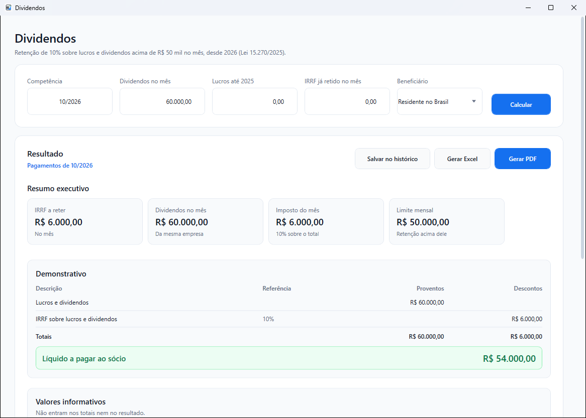

| Campo | O que informar |
| --- | --- |
| Competência | Mês dos pagamentos. |
| Dividendos no mês | Total pago no mês pela mesma empresa à mesma pessoa, somando todos os pagamentos. |
| Lucros até 2025 | Parte de lucros apurados até 2025, com distribuição aprovada até 31/12/2025, que não sofre retenção. |
| IRRF já retido no mês | Imposto retido em pagamentos anteriores do mesmo mês. |
| Beneficiário | **Residente no Brasil** ou **no exterior**. |

- **Residente no Brasil:** se o total do mês passar de R$ 50.000,00, a retenção é de 10% sobre o total, e não só sobre o excedente (Lei 9.250/1995, art. 6º-A). A cada novo pagamento no mês, o imposto é refeito sobre o total e o que já foi retido é descontado.
- **Residente no exterior:** 10% sobre qualquer valor (Lei 9.249/1995, art. 10, § 4º).
- A retenção é antecipação: na declaração, ela é compensada na tributação mínima e, para quem recebe até R$ 600 mil no ano, volta como restituição.
- Os juros sobre capital próprio seguem regra própria, com IRRF de 17,5% desde 01/2026 (LC 224/2025).

### 8.18 Tributo em atraso

Abra pelo cartão **Tributo em atraso**, no grupo **Impostos e salário**. Ele calcula a multa e os juros de uma guia federal paga depois do vencimento.

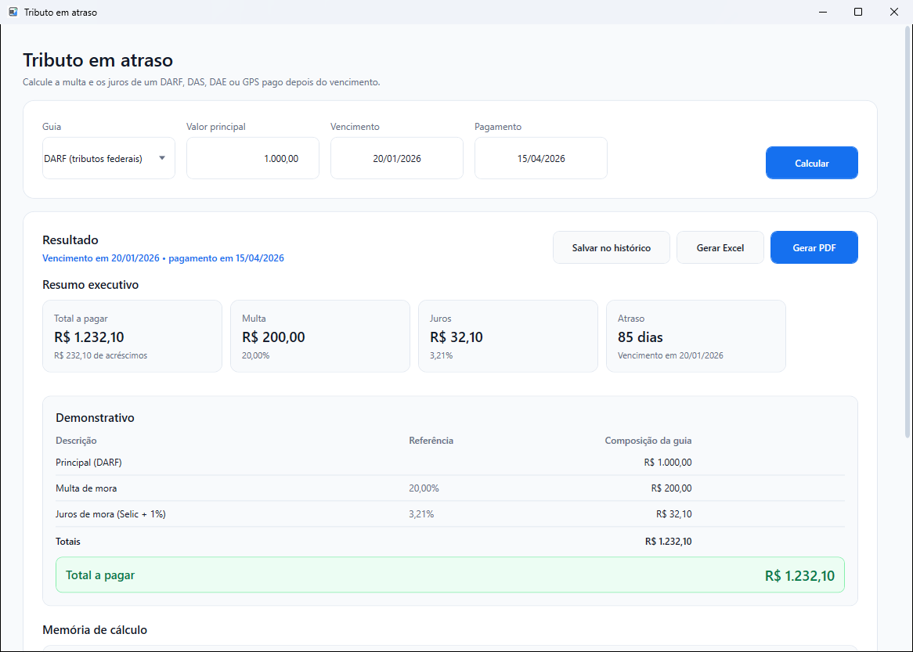

| Campo | O que informar |
| --- | --- |
| Guia | **DARF**, **DAS** do Simples Nacional, **DAE** do empregador doméstico ou **GPS** do INSS: todas seguem a mesma regra. |
| Valor principal | Valor da guia no vencimento, sem acréscimos. |
| Vencimento | Data de vencimento, já prorrogada para o dia útil seguinte quando cai em fim de semana ou feriado. |
| Pagamento | Data em que a guia será paga. |

- **Multa de mora:** 0,33% por dia de atraso, do dia seguinte ao vencimento até o pagamento, limitada a 20% (Lei 9.430/1996, art. 61).
- **Juros:** a Selic de cada mês, do mês seguinte ao vencimento até o anterior ao pagamento, somada, mais 1% no mês do pagamento. Pago no próprio mês do vencimento, não há juros; no mês seguinte, só o 1%.
- A Selic vem da tabela **Selic**: se faltar o mês anterior ao pagamento, atualize a tabela pela internet.
- Não vale para o FGTS em atraso nem para tributos estaduais e municipais, que têm regras próprias.

### 8.19 Correção de valores

Abra pelo cartão **Correção de valores**, no grupo **Pensão e débitos judiciais**. Ele atualiza um valor por um índice mensal, como a Calculadora do Cidadão do Banco Central, com juros e multa opcionais.

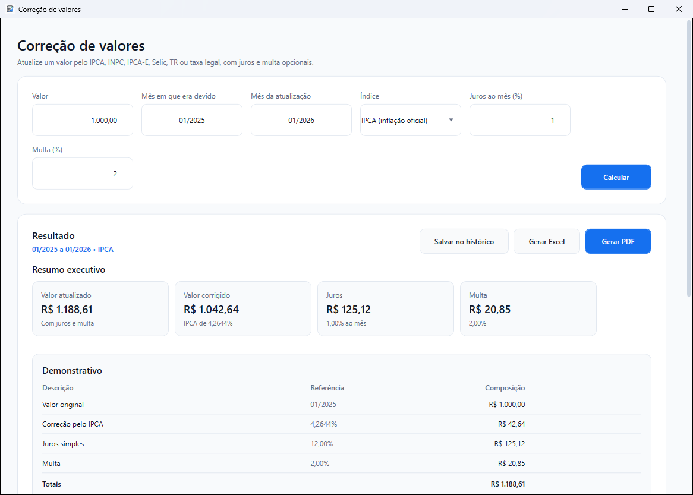

| Campo | O que informar |
| --- | --- |
| Valor | Valor na data em que era devido. |
| Mês em que era devido e Mês da atualização | A correção usa as variações do primeiro mês até o mês anterior ao da atualização. |
| Índice | **IPCA**, **INPC**, **IPCA-E**, **Selic**, **TR** ou **taxa legal**, das tabelas de índices. Sem índice no contrato ou na decisão, o IPCA é o índice legal desde a Lei 14.905/2024. |
| Juros ao mês (%) | Juros simples por mês cheio, sobre o valor corrigido, como 1% ao mês de um contrato; 0 para só corrigir. |
| Multa (%) | Multa sobre o valor corrigido, como os 2% de uma conta em atraso; 0 quando não há. |

Para débitos de processos, use [Débitos judiciais](#6-pensão-alimentícia-e-débitos-judiciais), que segue as fases definidas pelo STF e pela Lei 14.905/2024; para tributos federais, use [Tributo em atraso](#818-tributo-em-atraso).

### 8.20 Empregado doméstico (DAE)

Abra pelo cartão **Empregado doméstico (DAE)**, no grupo **Remuneração e custos**. Ele calcula o salário líquido do doméstico e o DAE do mês, a guia única do eSocial (LC 150/2015, arts. 34 e 35).

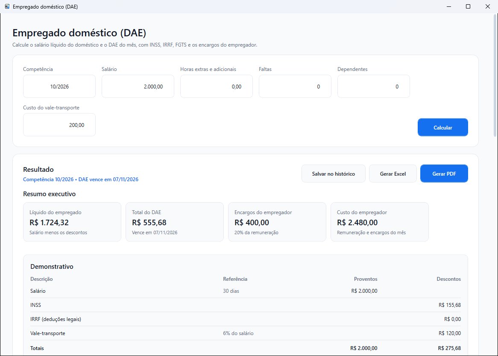

Informe a **competência**, o **salário**, as **horas extras e adicionais** do mês, as **faltas**, os **dependentes** e o **custo do vale-transporte**, que é descontado até 6% do salário.

| Parcela do DAE | Alíquota | Quem paga |
| --- | --- | --- |
| Contribuição patronal | 8% | Empregador |
| GILRAT (seguro de acidente do trabalho) | 0,8% | Empregador |
| FGTS | 8% | Empregador |
| Indenização compensatória | 3,2% | Empregador |
| INSS do empregado | Tabela progressiva | Descontado do empregado |
| IRRF do empregado | Tabela mensal | Descontado do empregado |

- O DAE vence no dia 7 do mês seguinte; se não for dia útil, pague no dia útil anterior.
- A **indenização compensatória** substitui a multa de 40% do FGTS: na dispensa sem justa causa ela vai para o empregado; na justa causa, no pedido de demissão e no fim do contrato a prazo, volta ao empregador.
- No 13º e nas férias, use as calculadoras próprias; na saída, a [Rescisão](#85-rescisão) com o vínculo **Empregado doméstico**.

### 8.21 Estágio

Abra pelo cartão **Estágio**, no grupo **Remuneração e custos**. Ele calcula o líquido da bolsa e o recesso remunerado (Lei 11.788/2008).

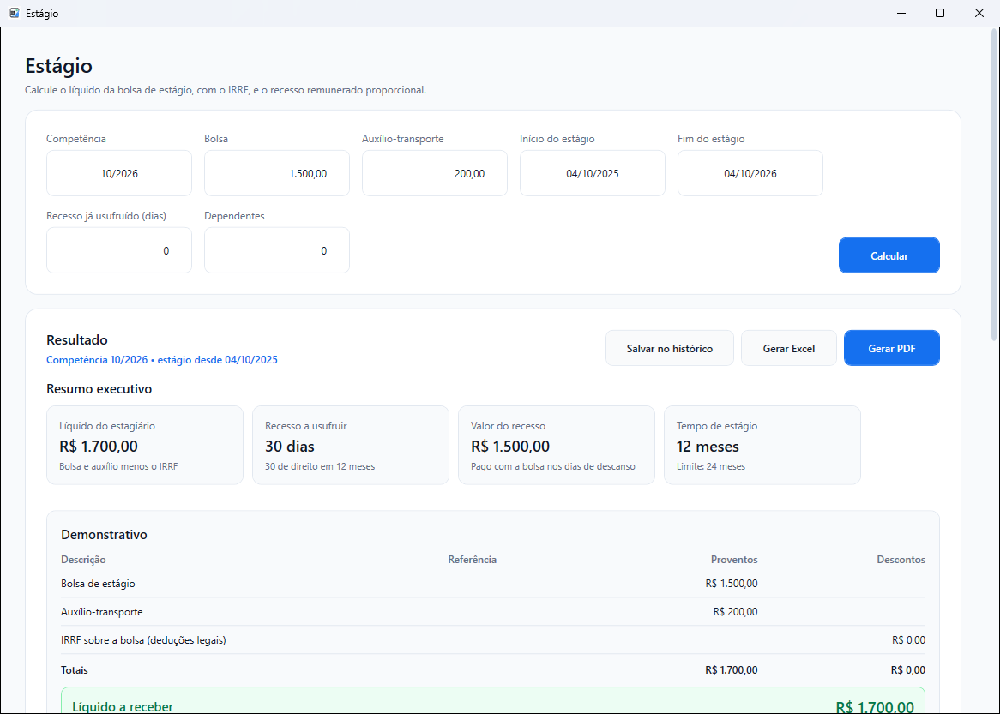

- O estágio não é emprego: não há INSS, FGTS, 13º nem férias. A bolsa tem IRRF pela tabela mensal.
- O **recesso** é de 30 dias por ano de estágio, proporcional nos períodos menores (a fração de 15 dias conta como mês), remunerado com a bolsa. Informe os dias já usufruídos para ver o saldo.
- O estágio não pode passar de 2 anos na mesma empresa, exceto para a pessoa com deficiência; o aplicativo avisa quando passa.
- O auxílio-transporte fica fora da base do IRRF, como ressarcimento de despesa.

### 8.22 Trabalho intermitente

Abra pelo cartão **Trabalho intermitente**, no grupo **Remuneração e custos**. Ele calcula o pagamento ao fim de cada período de convocação (CLT, art. 452-A, § 6º).

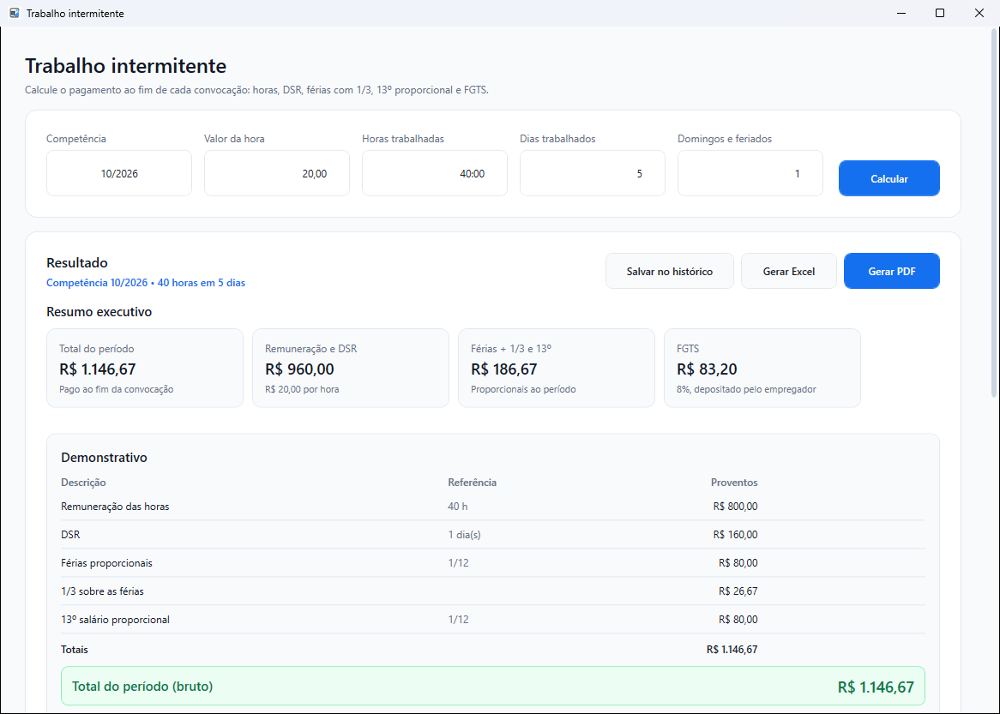

| Verba | Como é calculada |
| --- | --- |
| Remuneração | Valor da hora × horas trabalhadas. O valor da hora não pode ser menor que o do salário mínimo. |
| DSR | Remuneração ÷ dias trabalhados × domingos e feriados do período. |
| Férias proporcionais + 1/3 | (Remuneração + DSR) ÷ 12, mais 1/3. |
| 13º proporcional | (Remuneração + DSR) ÷ 12. |
| FGTS | 8% da remuneração, do DSR e do 13º, depositados pelo empregador. |

O INSS e o IRRF dependem de como cada verba é lançada na folha e não são calculados: some os valores do mês na Simulação tributária ou confira com a contabilidade.

### 8.23 Carnê-leão

Abra pelo cartão **Carnê-leão**, no grupo **Impostos e salário**. Ele calcula o IR mensal sobre rendimentos recebidos de pessoas físicas e do exterior.

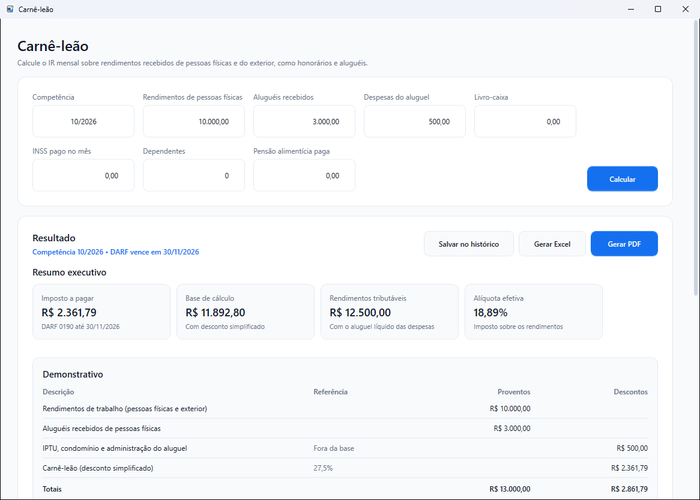

| Campo | O que informar |
| --- | --- |
| Competência | Mês do recebimento: o carnê-leão segue o regime de caixa. |
| Rendimentos de pessoas físicas | Honorários, consultas, aulas e outros rendimentos de trabalho recebidos de pessoas físicas ou do exterior. |
| Aluguéis recebidos e Despesas do aluguel | Aluguéis recebidos de pessoas físicas; IPTU, condomínio e taxa de administração pagos pelo locador são abatidos. |
| Livro-caixa | Despesas do consultório ou escritório de quem trabalha por conta própria, até o valor dos rendimentos de trabalho. |
| Outras deduções legais | INSS pago no mês, dependentes e pensão alimentícia paga. |

- O imposto usa a tabela mensal, compara as deduções legais com o desconto simplificado e aplica a redução mensal da Lei 15.270/2025, como no IRRF dos salários.
- Pague em DARF, código 0190, até o último dia útil do mês seguinte, pelo Carnê-Leão Web, no e-CAC. Um imposto de menos de R$ 10,00 não é pago: soma-se ao do mês seguinte.
- Rendimentos pagos por empresa brasileira e sujeitos a IRRF no Brasil ficam fora do carnê-leão. Rendimentos de fonte situada no exterior, inclusive salário de empregador estrangeiro, entram na apuração mensal do residente no Brasil; para converter a moeda e conferir o imposto pago lá, use a calculadora abaixo.

#### 8.23.1 Trabalho no exterior — residente no Brasil

Abra **Trabalho no exterior** em **Impostos e salário** para simular um recebimento mensal de trabalho de fonte estrangeira como **pessoa física residente fiscal no Brasil**. Escolha **Emprego assalariado** ou **Serviço como pessoa física**. O segundo permite livro-caixa comprovado; o primeiro não. A calculadora não cobre faturamento por empresa brasileira, não residentes, décimo terceiro ou situações especiais de servidores brasileiros no exterior.

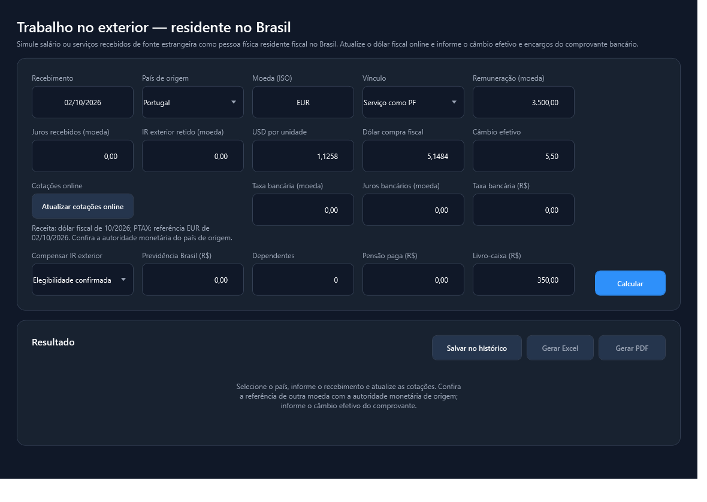

<!-- pdf:quebra-pagina -->

| Campo | Como preencher |
| --- | --- |
| Recebimento, país e moeda | Data do crédito e país da fonte pagadora. Selecione o país na lista; ela sugere a moeda, que pode ser corrigida conforme o contrato. Use **Outro país** e informe o nome quando necessário. O carnê-leão usa o mês do recebimento mesmo se o dinheiro ficar no exterior. |
| Remuneração e juros recebidos | Valores brutos na moeda original. Juros de mora por atraso de salário são mostrados como isentos no Brasil; juros de serviços integram a base tributável. |
| IR exterior retido | Imposto de renda efetivamente descontado **desse recebimento** e atribuível à remuneração tributável também no Brasil, na moeda original. Separe eventual imposto sobre juros de salário isentos no Brasil; previdência estrangeira não entra aqui. |
| USD por unidade | Valor em dólares de **uma unidade da moeda de origem**, na data do recebimento. Para USD, use 1. Em outra moeda, o botão fornece uma **referência PTAX de fechamento** quando publicada para a data. Confira e corrija pela cotação da autoridade monetária do país de origem, exigida pela Receita. Em dia sem boletim, preencha manualmente. |
| Dólar compra fiscal | Cotação de compra em reais por USD, do **último dia útil da primeira quinzena do mês anterior ao recebimento**. O botão **Atualizar cotações online** busca o mês do recebimento na [tabela de conversão da Receita](https://www.gov.br/receitafederal/pt-br/assuntos/meu-imposto-de-renda/tabelas/conversao). Se o mês ainda não estiver publicado ou a rede falhar, preencha manualmente. |
| Câmbio efetivo | Reais por unidade da moeda pagos pela instituição; já inclui eventual spread. Não informe o valor total creditado neste campo. |
| Taxa bancária, juros bancários | Custos efetivamente cobrados na moeda estrangeira ou em reais, conforme o rótulo. Juros de financiamento ou de atraso cobrados pela instituição são distintos dos juros **recebidos** da fonte pagadora. Não duplique uma taxa já incorporada ao câmbio efetivo. |
| Compensar IR exterior | Selecione **Elegibilidade confirmada** somente quando houver tratado ou reciprocidade aplicável e o imposto não for recuperável no exterior. O crédito fica limitado ao IR brasileiro da renda estrangeira do mês. |
| Previdência Brasil, dependentes, pensão e livro-caixa | Deduções brasileiras efetivamente permitidas e pagas no mês. Livro-caixa aparece apenas para serviços como pessoa física; despesas estrangeiras exigem conversão e documentação próprias antes de informar o valor em reais. |

O resultado separa **conversão fiscal** (base do IR e do crédito estrangeiro) de **conversão efetiva** (valor recebido no banco). Taxas, juros bancários e spread afetam o dinheiro disponível, mas não são automaticamente deduções do carnê-leão. O imposto brasileiro usa a tabela mensal da competência e compara deduções legais com desconto simplificado. Quando devido, o DARF 0190 vence no último dia útil do mês seguinte; valores inferiores a R$ 10,00 são acumulados. O resumo mostra o crédito bancário antes do imposto brasileiro e o disponível estimado depois dele.

Exemplo com valores ilustrativos, sem outras deduções: salário de USD 10.000, juros de mora recebidos de USD 50, imposto exterior de USD 2.000, cotação fiscal de R$ 5,00/USD e câmbio efetivo de R$ 4,80/USD. Com taxas de USD 10 e R$ 20 e juros bancários de USD 5, o banco credita **R$ 38.548,00**. Para outubro de 2026, o IR brasileiro sobre o salário é **R$ 12.674,29** antes do crédito. Se a compensação de **R$ 10.000,00** for legalmente cabível, restam **R$ 2.674,29** de carnê-leão e **R$ 35.873,71** disponíveis após os tributos.

Use um recebimento por simulação. Imposto exterior pago em outra data, outros rendimentos do mês, previdência estrangeira, imposto devido no outro país e aplicação concreta de tratados exigem apuração própria. A atualização consulta apenas o dólar fiscal da Receita e, quando disponível, uma referência de [câmbio PTAX do Banco Central](https://dadosabertos.bcb.gov.br/dataset/dolar-americano-usd-todos-os-boletins-diarios) para a moeda selecionada. **Câmbio efetivo, taxas, juros e IR estrangeiro retido não podem ser apurados de uma cotação pública:** informe os valores da operação e dos comprovantes. Consulte as orientações da [Receita sobre rendimentos do exterior](https://www.gov.br/receitafederal/pt-br/assuntos/meu-imposto-de-renda/pagamento/carne-leao/rendimentos) e [deduções do carnê-leão](https://www.gov.br/receitafederal/pt-br/assuntos/meu-imposto-de-renda/pagamento/carne-leao/deducoes).

### 8.24 Ganho de capital

Abra pelo cartão **Ganho de capital**, no grupo **Impostos e salário**. Ele calcula o IR na venda de um imóvel ou de outro bem pela pessoa física.

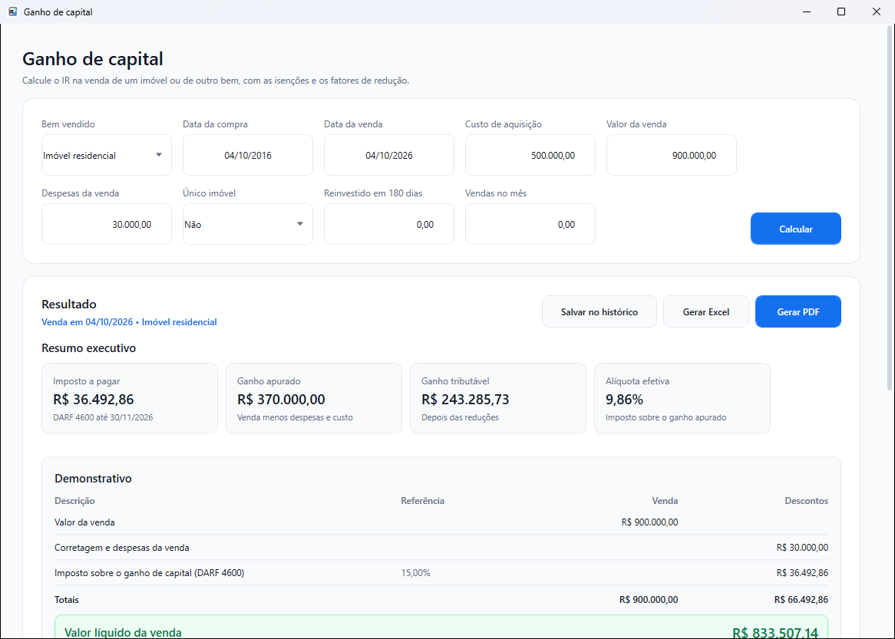

| Regra | Como funciona |
| --- | --- |
| Ganho | Valor da venda, menos as despesas da venda (como a corretagem) e o custo de aquisição declarado. |
| Pequeno valor | Vendas de bens da mesma natureza de até R$ 35.000,00 no mês são isentas (Lei 9.250/1995, art. 22). |
| Único imóvel | Isento até R$ 440.000,00, se for o único imóvel e não houve outra venda de imóvel em 5 anos (art. 23). |
| Imóvel comprado até 1988 | Redução de 5% por ano antes de 1989; comprado até 1969, isento (Lei 7.713/1988, art. 18). |
| Fatores FR1 e FR2 | Reduzem o ganho dos imóveis pelo tempo de posse, de 01/1996 a 11/2005 e de 12/2005 até a venda (Lei 11.196/2005, art. 40). |
| Reinvestimento | A parte da venda de imóvel residencial aplicada em outro imóvel residencial em 180 dias fica isenta (art. 39). |
| Alíquotas | 15% até R$ 5 milhões de ganho, 17,5% até R$ 10 milhões, 20% até R$ 30 milhões e 22,5% acima. |

O imposto é pago em DARF, código 4600, até o último dia útil do mês seguinte ao da venda. Confira o resultado no programa GCAP da Receita Federal, que gera o demonstrativo para a declaração. Ações vendidas em bolsa têm regras próprias e não entram aqui.

### 8.25 Afastamentos e licenças

Abra pelo cartão **Afastamentos e licenças**, no grupo **FGTS, afastamentos e benefícios**. Ele mostra quem paga cada parte do afastamento, quanto e até quando.

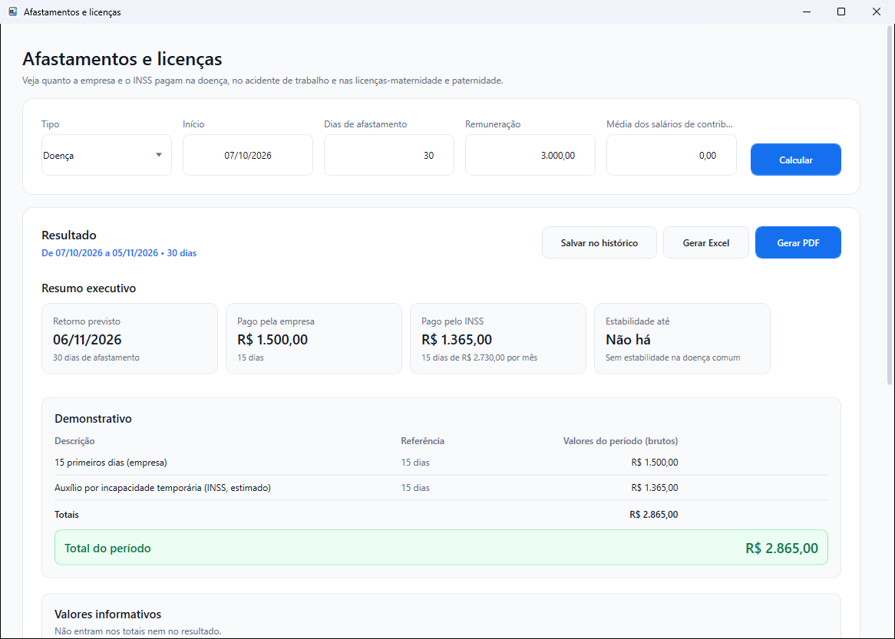

| Tipo | Regra |
| --- | --- |
| Doença | A empresa paga os 15 primeiros dias; o INSS, a partir do 16º, com o auxílio estimado em 91% da média dos salários, entre o salário mínimo e o teto. O FGTS para no 16º dia. |
| Acidente de trabalho | Como na doença, mas o FGTS continua durante todo o afastamento e, depois do auxílio do INSS, há 12 meses de estabilidade a partir do retorno. |
| Licença-maternidade | 120 dias de salário-maternidade, igual à remuneração, pago pela empresa e compensado nas contribuições; a Empresa Cidadã prorroga por 60 dias. Estabilidade até 5 meses após o parto. |
| Licença-paternidade | 5 dias até 2026, 10 em 2027, 15 em 2028 e 20 a partir de 2029 (LC 229/2026); a Empresa Cidadã acrescenta 15 dias. Garantia de emprego até um mês depois da licença. |

O auxílio do INSS é uma estimativa: o valor exato sai da média de todos os salários de contribuição. Afastamento por doença de mais de 6 meses no período aquisitivo tira o direito às férias desse período (CLT, art. 133).

### 8.26 Saque-aniversário do FGTS

Abra pelo cartão **Saque-aniversário do FGTS**, no grupo **FGTS, afastamentos e benefícios**. Informe o **saldo do FGTS antes do saque simulado**, somando todas as contas, incluindo a garantia bloqueada e excluindo a multa rescisória, e o **mês de aniversário**. Não desconte novamente valores de saques que já foram debitados do saldo.

Em **Parcela ao banco (R$)**, informe quanto **deste saque anual** será repassado ao banco por antecipações anteriores, conforme contrato ou extrato. O campo é opcional: deixe zero se esse saque não estiver comprometido. Não informe o total líquido recebido nos empréstimos, o saldo bloqueado como garantia, parcelas de outros anos ou contratos quitados. Esses valores não permitem determinar sozinhos a parcela cedida deste ano; consulte o contrato ou a instituição financeira.

A tabela calcula o **saque bruto** sobre o saldo informado. A parcela cedida aparece como desconto e o resultado é o **disponível estimado**. Exemplo: saldo de R$ 8.000,00 gera saque bruto de R$ 2.250,00; com R$ 1.800,00 cedidos ao banco, restam R$ 450,00 para o trabalhador. Se todo o saque estiver comprometido, o disponível será zero. O saldo após o saque é R$ 5.750,00 em ambos os casos, pois inclui a saída ao banco, e pode continuar bloqueado como garantia de anos futuros.

Informe valores com até duas casas decimais; a parcela ao banco não pode superar o saque bruto. Contratos anteriores a novembro de 2025 podem ter parcelas superiores a R$ 500,00. A calculadora não simula novas contratações, outros bloqueios nem liberações excepcionais; confirme a disponibilidade no aplicativo FGTS. Consulte a [orientação oficial sobre saque-aniversário e antecipações](https://www.fgts.gov.br/Paginas/trabalhador/saque/saque-aniversario.aspx).

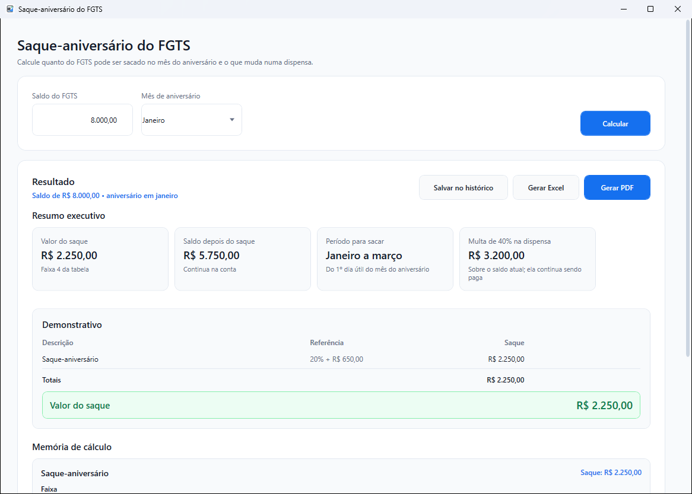

| Saldo | Alíquota | Parcela adicional |
| --- | --- | --- |
| Até R$ 500,00 | 50% | — |
| De R$ 500,01 a R$ 1.000,00 | 40% | R$ 50,00 |
| De R$ 1.000,01 a R$ 5.000,00 | 30% | R$ 150,00 |
| De R$ 5.000,01 a R$ 10.000,00 | 20% | R$ 650,00 |
| De R$ 10.000,01 a R$ 15.000,00 | 15% | R$ 1.150,00 |
| De R$ 15.000,01 a R$ 20.000,00 | 10% | R$ 1.900,00 |
| Acima de R$ 20.000,00 | 5% | R$ 2.900,00 |

O saque fica disponível do 1º dia útil do mês do aniversário até o fim do segundo mês seguinte. Na regra geral, quem está no saque-aniversário e é dispensado sem justa causa recebe a multa de 40%, mas não saca o saldo por rescisão; o retorno ao saque-rescisão exige ausência de antecipação contratada e só vale a partir do 25º mês depois do pedido.

### 8.27 Abono salarial (PIS/Pasep)

Abra pelo cartão **Abono salarial (PIS/Pasep)**, no grupo **FGTS, afastamentos e benefícios**. Ele verifica o direito ao abono e calcula o valor.

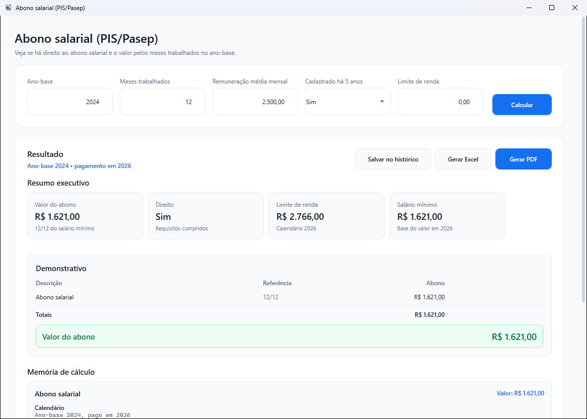

| Campo | O que informar |
| --- | --- |
| Ano-base | Ano trabalhado; o abono é pago dois anos depois (o de 2024, em 2026). |
| Meses trabalhados | Meses com carteira assinada no ano-base; a fração de 15 dias conta como mês. |
| Remuneração média mensal | Média das remunerações no ano-base. |
| Cadastrado há 5 anos | Inscrito no PIS/Pasep há pelo menos 5 anos. |
| Limite de renda | Deixe 0,00 para usar o limite publicado; para um calendário que o aplicativo ainda não tem, informe o divulgado pelo Ministério do Trabalho. |

- **Valor:** o salário mínimo do ano do pagamento ÷ 12 × meses trabalhados.
- **Limite de renda:** até o calendário de 2025, dois salários mínimos (R$ 2.640,00); a partir do de 2026, o valor passou a ser corrigido só pelo INPC, até chegar a um salário mínimo e meio (EC 135/2024). No calendário de 2026, R$ 2.766,00.
- Também é preciso ter trabalhado pelo menos 30 dias no ano-base e ter os dados informados pelo empregador no eSocial.

### 8.28 Comissões e DSR

Abra pelo cartão **Comissões e DSR**, no grupo **Remuneração e custos**. A calculadora separa comissões e repouso remunerado, mostra a remuneração do mês com INSS e IRRF, o depósito de FGTS e o impacto líquido das comissões.

| Campo | O que informar |
| --- | --- |
| Salário fixo | Parcela fixa mensal; deixe 0,00 para comissionista puro. |
| Valor das comissões | Comissões do mês **sem DSR**. Se o valor já contém o repouso, marque **Valor já inclui DSR?** para dividir as parcelas sem duplicar o pagamento. |
| Feriados em dias úteis | Na contagem automática, informe os feriados que não caem no domingo. O sábado é contado como útil. |
| Informar dias do período? | Para admissão, desligamento, afastamento, escala ou regra coletiva diferente, informe os dias úteis e os repousos previstos do período. A soma não pode superar os dias da competência. |
| Repousos perdidos | Repousos ou feriados sem remuneração por falta injustificada; são retirados dos repousos previstos antes de calcular o DSR. |
| Garantia mínima do período | Deixe 0,00 para usar o salário mínimo nacional no mês completo. Informe o piso da categoria quando maior. Com dias informados, preencha a garantia aplicável ao período. |
| Dependentes (IRRF) | Dependentes usados na modalidade de deduções legais do IRRF. |

- **DSR:** comissões sem DSR ÷ dias úteis × repousos remunerados. A calculadora arredonda o DSR aos centavos. Se o total informado já contém DSR, ela separa o total proporcionalmente aos dias, preservando o valor pago.
- **Garantia mínima:** quando salário fixo + comissões + DSR fica abaixo da garantia informada ou do salário mínimo, a diferença aparece como complemento salarial, com INSS, IRRF e FGTS. A garantia de quem recebe remuneração variável está prevista no art. 7º, VII, da Constituição e na Lei 8.716/1993.
- **Impacto líquido:** diferença entre o líquido deste cenário e o de um cenário sem comissões, mantendo a garantia mínima. Por isso, uma comissão pequena pode substituir parte do complemento sem aumentar o líquido.
- **Uso no holerite:** informe as comissões sem DSR no campo **Comissões do mês** do holerite, que faz a mesma apuração. Se quiser lançar o total pronto em **Proventos tributáveis**, deixe o campo próprio de comissões zerado. O DSR das horas extras permanece separado.
- **Limite do cenário:** o líquido desta calculadora considera salário fixo, comissões, DSR e complemento, sem outros adicionais, descontos ou benefícios. Use **Holerite do mês** para a folha completa. O FGTS é informativo e não reduz o líquido.

### 8.29 INSS em múltiplos vínculos

Abra pelo cartão **INSS em múltiplos vínculos**, no grupo **Impostos e salário**. Informe uma competência a partir de 03/2020. A tela já apresenta dois vínculos, que é a quantidade mínima para este cálculo:

1. Em cada vínculo, selecione a **Categoria** e digite a **Remuneração (R$)** da competência. A **Fonte** é opcional; pode ser o nome da empresa ou do tomador e aparece no demonstrativo.
2. Use **+ Adicionar vínculo** para incluir outros empregos ou serviços. A ordem na tela é a ordem de desconto. Use as setas **↑** e **↓** para reorganizar; o botão **×** remove um vínculo adicional.
3. Selecione **Calcular** para ver a contribuição por vínculo, as faixas usadas e a parcela do teto disponível em cada etapa.

As categorias disponíveis são **Empregado**, **Doméstico**, **Avulso**, **Individual (11%)** para contribuinte individual com retenção pela empresa e **Individual EBAS (20%)** quando o tomador for entidade beneficente nessa condição. A simulação aceita de 2 a 50 vínculos. O aplicativo não precisa do CNPJ ou CPF para simular.

- **Teto compartilhado:** a remuneração de todos os vínculos ocupa o mesmo limite máximo mensal do salário de contribuição. Quando um vínculo cruza o teto, apenas a parte residual sofre desconto; os seguintes não geram novo desconto.
- **Faixas progressivas:** empregado, doméstico e avulso compartilham as faixas na ordem informada. Cada faixa de cada vínculo é truncada em centavos. O contribuinte individual ocupa o teto, mas não avança a faixa progressiva dos empregados.
- **Categorias na mesma fonte:** se um empregador informar empregado e contribuinte individual no mesmo evento, coloque a linha de empregado antes da de contribuinte individual; o eSocial calcula nessa ordem.
- **Resultado:** a memória mostra a base já ocupada, a base tributada, cada faixa e o desconto por vínculo. O total **Após INSS** é anterior ao IRRF e aos demais descontos da folha. Para conferir o holerite de cada fonte pagadora, compare apenas o desconto do vínculo correspondente, não a soma de todos.
- **Outras apurações:** 13º salário tem INSS separado. Rendimentos de RPPS não entram neste teto do RGPS. Recolhimento por conta própria em GPS usa a base residual e não está incluído nesta calculadora.

Regras e exemplos numéricos: [Manual de Orientação do eSocial, seção “Múltiplos Vínculos”](https://www.gov.br/esocial/pt-br/documentacao-tecnica/manuais/mos-s-1-3-consolidada-ate-a-no-s-1-3-08-2026-com-marcacoes.pdf).

### 8.30 Diferenças de reajuste retroativo

Abra pelo cartão **Diferenças de reajuste retroativo**, em **Remuneração e custos**.

1. Informe o **início** e o **fim** do período, o **salário anterior** e o **percentual de reajuste**. Clique em **Gerar meses**. O aplicativo preenche até 120 competências com o salário anterior e o salário reajustado.
2. Revise a grade. Em cada competência, **Salário pago** é o valor efetivamente pago e **Salário devido** é o valor correto após o reajuste. Edite as linhas com antecipação, promoção, admissão, afastamento ou salário proporcional. O botão **Gerar meses** substitui as linhas já editadas.
3. Se houver 13º ou férias gozadas **já pagos** com base inferior, adicione um lançamento próprio. Informe o mês, a base salarial paga, a base correta e os **avos** do 13º ou **dias** de férias. A calculadora aplica a proporção e, nas férias, o terço constitucional. O limite é de 10 lançamentos extras.
4. Clique em **Calcular**. O resultado separa salários, 13º e férias, mostra a diferença de cada lançamento e estima o FGTS à alíquota de 8%. O FGTS é depósito do empregador e não reduz o total bruto devido.

**Atenção ao mês das férias:** informe na linha mensal apenas o salário efetivamente pago ou devido fora da parcela de férias; registre as férias gozadas no lançamento específico para evitar contagem em duplicidade. Férias indenizadas não usam este lançamento.

O demonstrativo é **bruto**: não calcula INSS, IRRF, juros, atualização monetária nem diferenças de rescisão. A tributação das parcelas retroativas depende da data e da forma do pagamento; confira a folha e o eSocial antes de efetuar o recolhimento. Para diferenças previstas em acordo ou convenção, confira também os períodos de referência no S-1200/InfoPerAnt e a alteração contratual S-2206.

Fundamentos: [Manual de Orientação do eSocial](https://www.gov.br/esocial/pt-br/documentacao-tecnica/manuais/mos-s-1-3-consolidada-ate-a-no-s-1-3-07-2026-com-marcacoes.pdf), [Lei 4.090/1962 (13º)](https://www.planalto.gov.br/ccivil_03/leis/l4090.htm), [CLT, art. 142 (férias)](https://www.planalto.gov.br/ccivil_03/decreto-lei/del5452compilado.htm) e [Lei 8.036/1990, art. 15 (FGTS)](https://www.planalto.gov.br/ccivil_03/leis/l8036compilada.htm).

### 8.31 Média de verbas variáveis

Abra pelo cartão **Média de verbas variáveis**, em **Remuneração e custos**. Esta calculadora organiza os valores mensais que você poderá informar como **Médias de variáveis** nas calculadoras de férias, 13º ou rescisão.

1. Informe início e fim do período em **MM/AAAA** e clique em **Gerar meses**. O limite é de 24 competências. Gerar novamente substitui os valores já digitados.
2. Informe, em cada mês, comissões, DSR, horas extras, adicionais e outras parcelas **de natureza salarial**. Se não houve pagamento em um mês do período, deixe as colunas desse mês zeradas. Não repita na coluna DSR o valor que já estiver incluído nas comissões ou em outra coluna. Quando a regra exigir atualizar o valor das horas ou dos adicionais, ajuste os lançamentos antes de calcular.
3. Confira o **divisor**. A geração sugere o número de competências, inclusive as zeradas. Altere-o somente quando o critério aplicável ao vínculo e à verba exigir outro divisor. A memória mostra o total e a média de cada categoria, além dos valores lançados em cada mês.

A **média mensal total** é a soma de todas as verbas informadas dividida pelo divisor, arredondada nos centavos. As médias individuais são arredondadas separadamente e podem somar um centavo a mais ou a menos. Esta ferramenta não determina automaticamente qual período ou divisor deve ser usado em cada verba: para comissões nas férias, a CLT prevê a média dos 12 meses anteriores à concessão; para adicionais e horas de valor não uniforme, o período aquisitivo e reajustes posteriores podem alterar a base. Para o 13º, confira os meses trabalhados no ano e a revisão após dezembro. Consulte também a norma coletiva.

Fundamentos: [CLT, art. 142, §§ 1º a 6º](https://www.planalto.gov.br/ccivil_03/decreto-lei/del5452compilado.htm) e [Lei 4.090/1962](https://www.planalto.gov.br/ccivil_03/leis/l4090.htm).

### 8.32 Banco de horas

Abra pelo cartão **Banco de horas**, em **Remuneração e custos**. A tela concilia um **ciclo** de compensação por vez.

1. Informe início e fim em **dd/MM/aaaa** e escolha o regime: compensação no **mesmo mês**, acordo **individual escrito** de até **seis meses** ou acordo/convenção **coletiva** de até **um ano**. A tela rejeita um ciclo maior que o prazo escolhido.
2. Escolha **Acompanhamento**, **Fechamento do ciclo** ou **Rescisão**. O salário atual é opcional para acompanhar apenas as horas; para estimar quitação no fechamento ou na rescisão, informe o salário, o divisor de horas e o adicional de pelo menos 50%.
3. Adicione um lançamento por **Crédito (hora extra)** ou **Compensação (folga)**. Informe a data e a duração em **horas:minutos**, como `1:30`. A descrição é opcional. Os movimentos são mostrados em ordem cronológica. O limite de créditos lançados no mesmo dia é de duas horas; confira também se a jornada total do dia respeita os limites legais e a norma coletiva.
4. O resultado mostra créditos, compensações e saldo em minutos. No acompanhamento, a quitação é apenas uma estimativa informativa; sem salário informado, aparece como **Não calculada**. No fechamento ou na rescisão, um saldo **positivo** é estimado pelo valor da hora normal acrescido do adicional informado. Saldo negativo aparece como horas a compensar e **não** é lançado automaticamente como desconto.

A quitação estimada aplica **um único adicional** a todo o saldo positivo. Se houver créditos com adicionais diferentes, apure cada parcela conforme o instrumento aplicável. A estimativa não inclui DSR, reflexos, INSS, IRRF ou outros adicionais. Na rescisão, o valor da hora deve usar a remuneração vigente na data do desligamento. Para banco de horas de situação especial, confira as regras específicas do instrumento aplicável antes de usar o valor na folha.

Fundamento: [CLT, art. 59, §§ 1º a 6º](https://www.planalto.gov.br/ccivil_03/decreto-lei/del5452compilado.htm).

## 9. Tabelas e parâmetros

As tabelas definem as faixas e os valores usados em todos os cálculos. Elas já vêm preenchidas com o histórico desde 2017, e você pode consultá-las, corrigi-las, incluir novos períodos ou atualizá-las pela internet. Para abri-las, selecione a aba **Tabelas** da tela principal e clique no cartão da tabela. Elas estão em quatro grupos: **INSS e salário**, **Imposto de renda**, **Deduções do IRRF** e **Índices econômicos**.

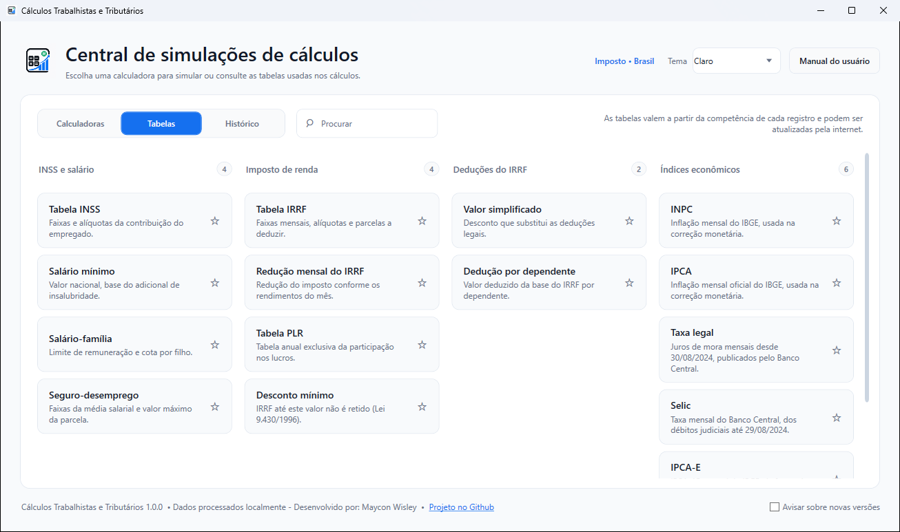

### 9.1 Conhecendo a janela de uma tabela

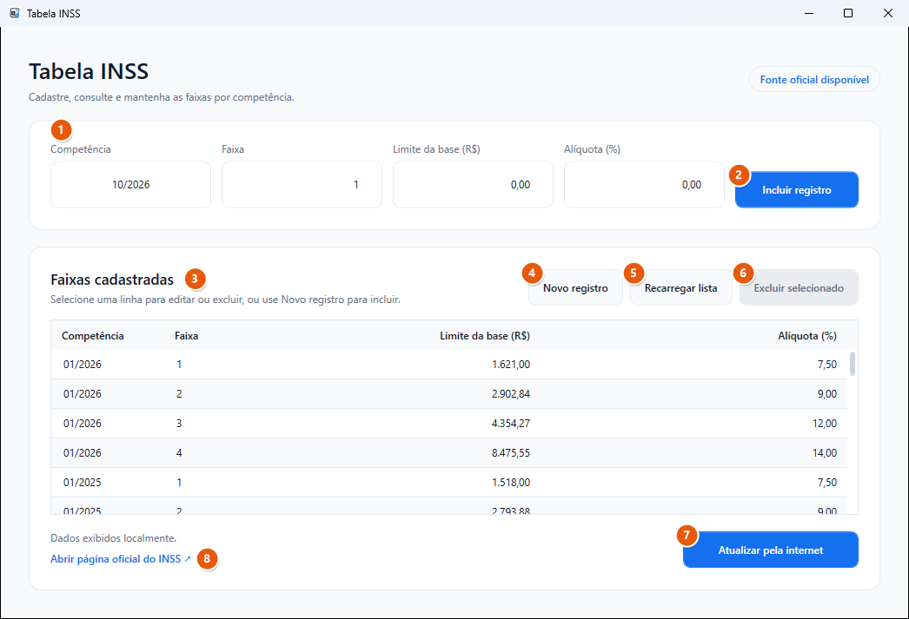

| Nº | Elemento | Função |
| --- | --- | --- |
| 1 | Formulário | Campos do registro: competência e os valores da tabela aberta. Só aparecem os campos que a tabela usa. |
| 2 | Incluir registro / Salvar alteração | Grava o formulário. O nome do botão indica o que vai acontecer: **Incluir registro** cria um registro novo; **Salvar alteração** atualiza a linha selecionada. |
| 3 | Lista de registros | Registros cadastrados, do mais recente para o mais antigo. |
| 4 | Novo registro | Limpa a seleção e o formulário para você incluir um registro. |
| 5 | Recarregar lista | Lê novamente os registros do banco, mantendo a linha selecionada. Alterações digitadas e não salvas são descartadas. |
| 6 | Excluir selecionado | Remove a linha selecionada. Fica desabilitado quando nenhuma linha está selecionada. |
| 7 | Atualizar pela internet | Busca a tabela mais recente na fonte oficial e em fontes alternativas e grava no banco local. Veja a seção 9.3. |
| 8 | Abrir página oficial | Abre no navegador a página oficial consultada na atualização. |

### 9.2 Incluindo, editando e excluindo registros

O botão de gravação muda de nome conforme a situação, para deixar claro o que será feito:

- **Incluir um registro:** clique em **Novo registro**, preencha o formulário e clique em **Incluir registro**. O registro criado aparece na lista já selecionado.
- **Editar um registro:** clique na linha desejada. Os valores são copiados para o formulário e o botão passa a se chamar **Salvar alteração**. Altere o que for necessário e clique nele; a linha continua selecionada com os valores atualizados.
- **Excluir:** selecione a linha e clique em **Excluir selecionado**. Depois da exclusão, o formulário volta ao modo de inclusão.

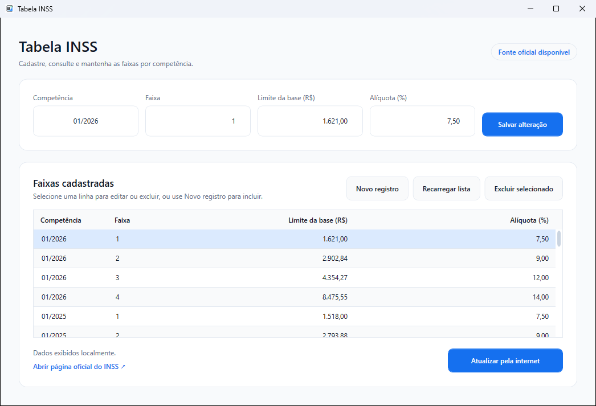

> **Dica:** se uma linha selecionada deixar de existir, por exemplo quando a atualização pela internet substitui a tabela da competência, o formulário é limpo e volta ao modo **Incluir registro**. Assim, valores antigos nunca ficam no formulário sem uma linha correspondente.

As alterações passam a valer imediatamente para os próximos cálculos.

### 9.3 Atualizando pela internet

Clique em **Atualizar pela internet** com o computador conectado à internet. O aplicativo consulta ao mesmo tempo a fonte oficial e duas fontes alternativas, valida os valores encontrados e só então grava os dados. Ao final, a mensagem abaixo da lista informa a competência importada, de onde ela veio e a quantidade de faixas:

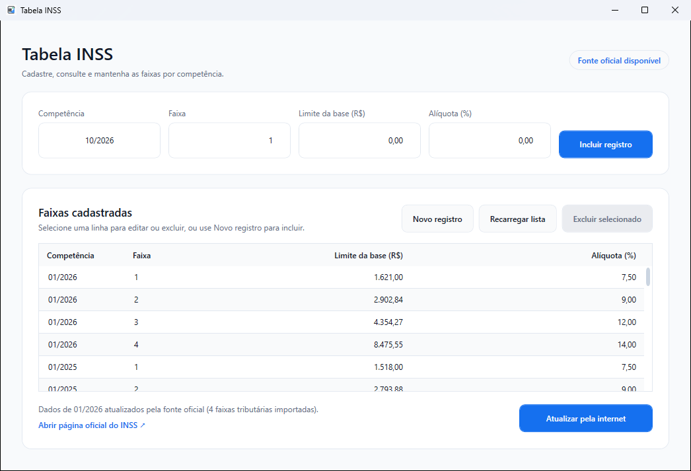

| Tabela | Fonte oficial | Fontes alternativas |
| --- | --- | --- |
| Tabela INSS | Página de contribuição mensal do INSS (gov.br) | debit.com.br e contabeis.com.br |
| Tabela IRRF, Valor simplificado, Dedução por dependente e Redução mensal do IRRF | Página de tabelas da Receita Federal | debit.com.br e contabeis.com.br |
| Tabela PLR | Página de tabelas da Receita Federal, a mesma do IRRF | Nenhuma: os sites alternativos não publicam a tabela da PLR, e a fonte oficial vale sozinha. |
| Salário-família | Página do INSS com o valor limite do salário-família (gov.br) | debit.com.br e contabeis.com.br |
| Salário mínimo | Tabela de contribuição do INSS (gov.br): desde 2020, a 1ª faixa vai até exatamente um salário mínimo | contabeis.com.br e a 1ª faixa da tabela do INSS no debit.com.br |
| INPC e IPCA | API de dados do IBGE (Sidra), que calcula os dois índices | vriconsulting.com.br |
| Taxa legal | Série 29543 do Banco Central, que calcula e publica a taxa legal de cada mês | cajud.com.br |
| IPCA-E | API de dados do IBGE (Sidra): a variação mensal do IPCA-15 | Nenhuma |
| Selic e TR | Séries 4390 (Selic acumulada no mês) e 7811 (TR do primeiro dia do mês) do Banco Central | Ipeadata (Ipea), que republica as séries do Banco Central |
| Seguro-desemprego | Página do seguro-desemprego formal do Ministério do Trabalho (gov.br) | debit.com.br e idinheiro.com.br |
| Desconto mínimo | Art. 67 da Lei 9.430/1996, no texto da lei publicado pelo Planalto | Nenhuma: o valor é fixado pela lei, e a fonte oficial vale sozinha. |

**Por que fontes alternativas?** No começo do ano, esses sites costumam publicar as novas tabelas antes das páginas do governo. Para a calculadora não ficar atrasada sem abrir mão da segurança, a atualização segue estas regras:

- A tabela da fonte oficial é usada sempre que for a mais recente.
- Uma competência mais nova que a da fonte oficial só é importada quando **as duas** fontes alternativas trazem exatamente os mesmos valores. Se apenas uma delas publicou a tabela nova, ou se as duas divergem, ela não é gravada, e a mensagem avisa qual fonte já a mostra.
- A mensagem sempre informa a origem dos dados, por exemplo: "Dados de 01/2027 atualizados por debit.com.br e contabeis.com.br, que já publicaram a tabela (4 faixas tributárias importadas). A página oficial ainda mostra a tabela de 01/2026."

**Particularidades do IRRF:** a Receita Federal publica de uma só vez as faixas, o desconto simplificado, a dedução por dependente e a redução mensal. Por isso, em qualquer uma dessas telas, a atualização importa todos esses valores da competência publicada. As fontes alternativas publicam apenas as faixas. Quando a tabela vem delas, o desconto simplificado é calculado em 25% do limite da faixa isenta, como determina a lei, e a dedução por dependente e a redução mensal continuam com os valores já cadastrados. Quando a Receita Federal publicar a tabela, atualize novamente para conferir esses valores.

**Particularidades do seguro-desemprego:** o Ministério do Trabalho reajusta a tabela todo ano em janeiro, pelo INPC, mas a página do seguro-desemprego costuma demorar a mostrar a do novo ano. Enquanto isso, a tabela nova entra quando o debit.com.br e o idinheiro.com.br trazem os mesmos valores. Antes de gravar, o aplicativo também confere se as faixas fecham entre si: o valor fixo da 2ª faixa tem de ser 80% do limite da 1ª, e o valor máximo, a parcela no limite da 2ª. Uma tabela com um número trocado, como o valor máximo de outro ano, não é importada.

**Particularidades do desconto mínimo:** o valor vem do art. 67 da Lei 9.430/1996, que vale desde 01/1997. A atualização confere os registros dessa data até o mês atual e corrige os que estiverem com outro valor; competências futuras ficam como estão. Se os valores cadastrados já são os da lei, nada é gravado, e a mensagem informa que eles foram conferidos. Se uma nova lei mudar o artigo, a página do Planalto não informa desde quando vale o novo valor: a atualização avisa, e o valor deve ser cadastrado manualmente na competência certa.

**Particularidades dos índices:** o INPC, o IPCA, o IPCA-E, a taxa legal, a Selic e a TR são séries mensais, e a atualização importa todos os meses publicados desde 2015, incluindo os que faltam e corrigindo os que estiverem diferentes da fonte oficial. Se a fonte oficial não responder, a fonte alternativa só preenche os meses que ainda faltam, sem alterar os já cadastrados, e a mensagem avisa para atualizar de novo mais tarde.

Se nenhuma tabela puder ser confirmada, por exemplo sem conexão ou com páginas fora do ar, a atualização é cancelada **sem alterar nenhum dado local**, e uma mensagem explica o que aconteceu com cada fonte.

### 9.4 As tabelas disponíveis

**Tabela INSS:** faixa, limite da base e alíquota de cada faixa por competência.

**Tabela IRRF:** faixa, limite da base, alíquota e parcela a deduzir. A última faixa usa um limite muito alto para representar "acima de".

**Redução mensal do IRRF:** faixas de rendimentos com o multiplicador e o valor-base da redução aplicada ao imposto. Nas regras vigentes a partir de 01/2026, por exemplo:

- rendimentos de até R$ 5.000,00 têm redução de até R$ 312,89;
- de R$ 5.000,01 a R$ 7.350,00, a redução é de R$ 978,62 − 0,133145 × rendimentos.

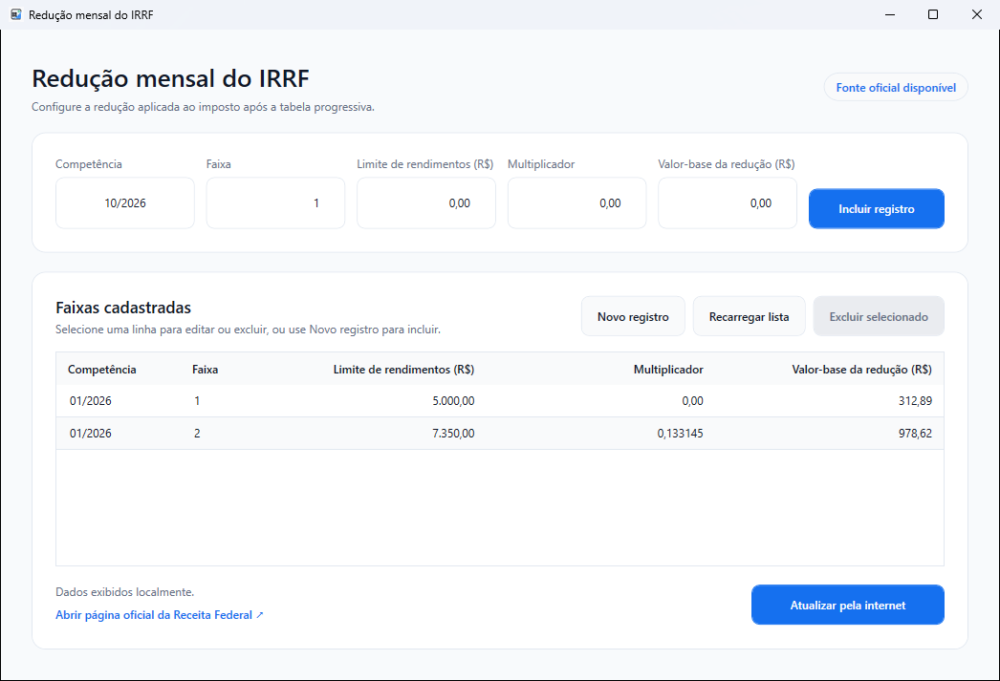

**Valor simplificado, Dedução por dependente, Desconto mínimo e Salário mínimo:** um único valor por competência. O salário mínimo é a base do adicional de insalubridade e da pensão sobre o salário mínimo, com valores desde 2015. O desconto mínimo é o limite da dispensa de retenção do IRRF: o imposto calculado de até esse valor, R$ 10,00 pela Lei 9.430/1996, não é descontado.

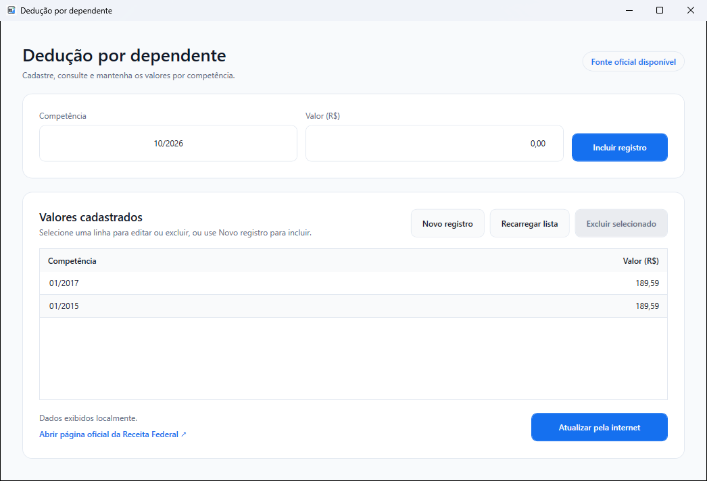

**Tabela PLR:** faixa, limite da PLR anual, alíquota e parcela a deduzir da tabela exclusiva da participação nos lucros. Vem com as tabelas publicadas pela Receita Federal desde 2017; a de 05/2025 continua vigente em 2026.

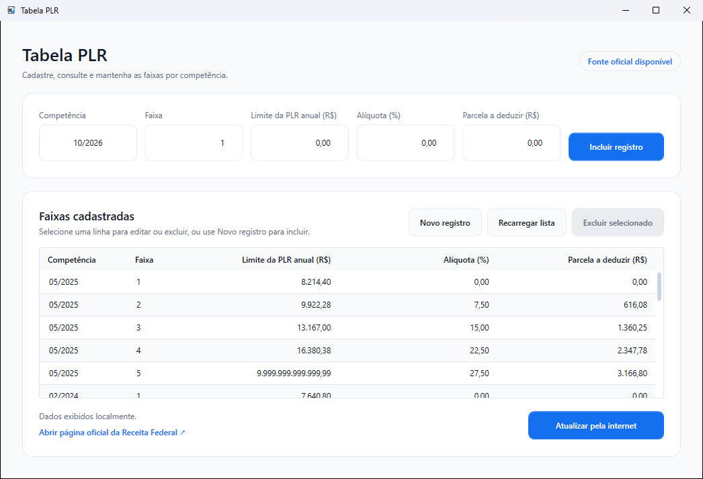

**Salário-família:** faixa, limite de remuneração e cota por filho. Desde 2020, há uma só faixa por ano; em 2026, cota de R$ 67,54 para remuneração até R$ 1.980,38.

**Seguro-desemprego:** três faixas por ano, desde 2017, com o limite da média salarial, o percentual sobre o que passa da faixa anterior e o valor fixo. A 1ª faixa tem 80% e valor fixo zero; a 2ª, 50% e o valor fixo da faixa; a 3ª, percentual zero e o valor máximo da parcela, com um limite muito alto para representar "acima de".

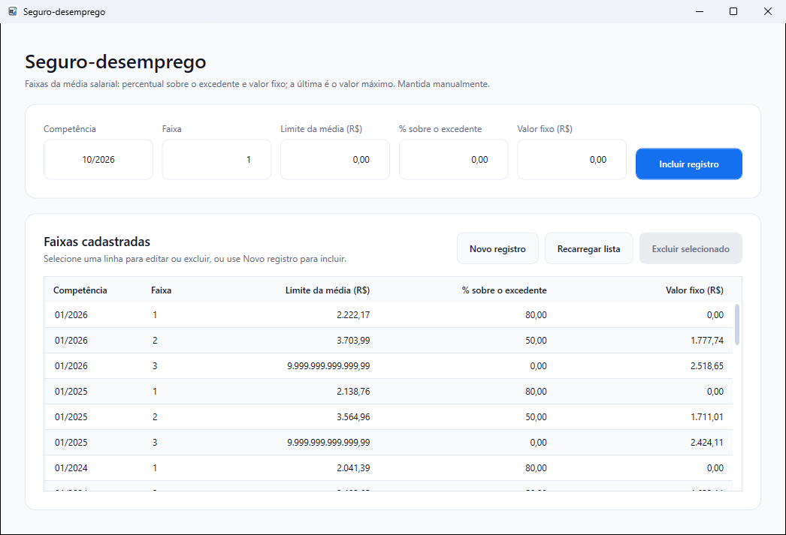

Essas três tabelas também são atualizadas pela internet com o botão **Atualizar pela internet**, nas mesmas regras das demais (seção 9.3).

**INPC, IPCA e Taxa legal:** um valor por mês, em %. O INPC e o IPCA, com o histórico desde 01/2015, são a variação mensal da inflação, que pode ser negativa, e corrigem a [pensão em atraso](#65-pensão-em-atraso). A taxa legal, desde 08/2024, é a taxa de juros de mora do Código Civil: a Selic do mês anterior descontado o IPCA-15, nunca negativa, com seis casas decimais, calculada e publicada pelo Banco Central no início de cada mês (Resolução CMN 5.171/2024).

**IPCA-E, Selic e TR:** um valor por mês, em %, desde 01/2015, para os [débitos judiciais](#66-débitos-judiciais). O IPCA-E é a variação mensal do IPCA-15, que corrige a fase pré-judicial trabalhista; a TR do primeiro dia de cada mês faz os juros dessa fase; e a Selic acumulada no mês reúne a correção e os juros até 29/08/2024. A Selic do mês em curso só é gravada quando o mês termina.

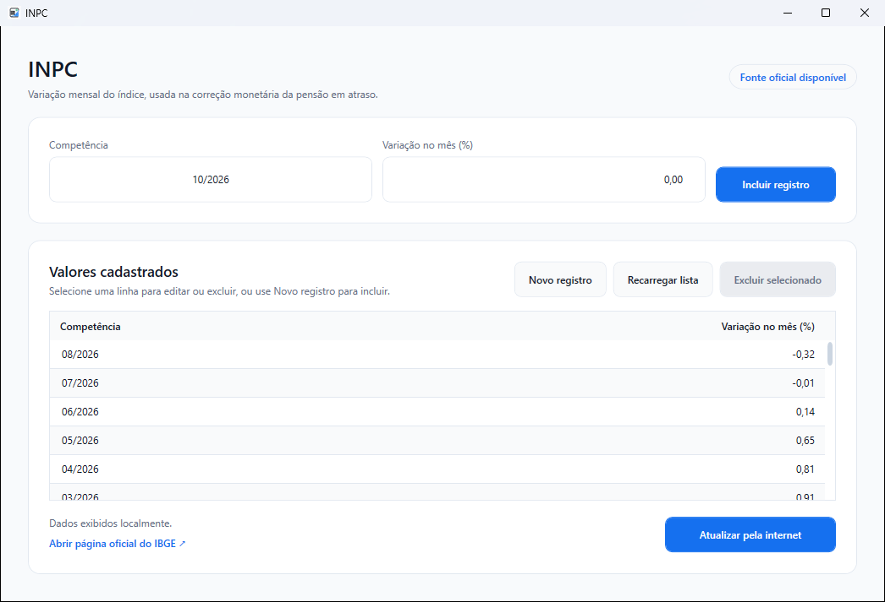

> **Dica:** antes de grandes alterações, faça uma cópia de segurança do arquivo **BancoDados\calculoIrrf.db**, que fica na pasta de instalação, com o aplicativo fechado.

## 10. Relatórios, planilhas e histórico

### 10.1 Relatórios em PDF

Todas as calculadoras possuem o botão **Gerar PDF**, que fica disponível depois do primeiro cálculo. Ao clicar, escolha a pasta e o nome do arquivo. O aplicativo sugere um nome com a competência ou a data:

| Calculadora | Nome sugerido | Conteúdo |
| --- | --- | --- |
| Simulação tributária | `relatorio-simulacao-tributaria-MM-AAAA.pdf` | Dados considerados, comparativo do IRRF, memória de cálculo e detalhamento por faixas. |
| Pensão alimentícia | `relatorio-pensao-alimenticia-MM-AAAA.pdf` | Dados considerados, com a regra da pensão, a explicação do cálculo, o IRRF de quem paga com e sem a pensão, o comparativo dos modelos e, se o último cálculo foi feito com **Detalhar**, as iterações. |
| Revisão de pensão | `revisao-pensao-MM-AAAA.pdf` | Resumo, a comparação entre a pensão atual e a proposta, a memória de cálculo de cada uma e as observações. |
| Pensão em atraso | `pensao-em-atraso-AAAA-MM-DD.pdf` | Resumo do débito, com os ritos da prisão e da penhora, os critérios, a tabela de parcelas e as observações. |
| Débitos judiciais | `debito-judicial-AAAA-MM-DD.pdf` | Resumo do débito, critérios, a tabela de parcelas e as observações. |
| Estabilidade | `demonstrativo-estabilidade-AAAA-MM-DD.pdf` | Verbas da indenização, dados considerados e total a receber. |
| Calculadoras trabalhistas | `ferias-MM-AAAA.pdf`, `rescisao-DD-MM-AAAA.pdf`, `seguro-desemprego-DD-MM-AAAA.pdf`, `clt-x-pj-MM-AAAA.pdf` e outros | Resumo, demonstrativo ou comparação, valores informativos, memória de cálculo e observações. |

O relatório sempre reflete o **último cálculo** feito na tela.

Todas as páginas dos relatórios em PDF exibem o aviso **CÁLCULO SIMULADO - VALORES ESTIMADOS**. Procure um profissional especializado para apurar e validar os valores aplicáveis ao seu caso antes de utilizá-los.

### 10.2 Planilhas do Excel

O botão **Gerar Excel**, ao lado do **Gerar PDF**, salva o mesmo conteúdo em uma planilha (.xlsx), com o nome sugerido do PDF. Os valores, os percentuais, os fatores e as datas vão como números, com o formato brasileiro, para você somar, filtrar e refazer as contas; a memória de cálculo fica em uma aba própria. A jornada pelo ponto tem só a planilha, com os dias e os totais do mês.

Se a planilha com o mesmo nome estiver aberta no Excel, o aplicativo avisa: feche-a e gere de novo, ou salve com outro nome.

### 10.3 Histórico de cálculos

Em qualquer calculadora, o botão **Salvar no histórico** guarda os valores do formulário com um nome, como o do empregado ou o número do processo. Ao salvar de novo um cálculo aberto do histórico, ele é atualizado; marque **Salvar como um cálculo novo** para manter o original.

A aba **Histórico** da tela principal lista os cálculos salvos, do alterado mais recentemente para o mais antigo. O campo **Procurar** filtra pelo nome ou pela calculadora, sem diferenciar maiúsculas e acentos.

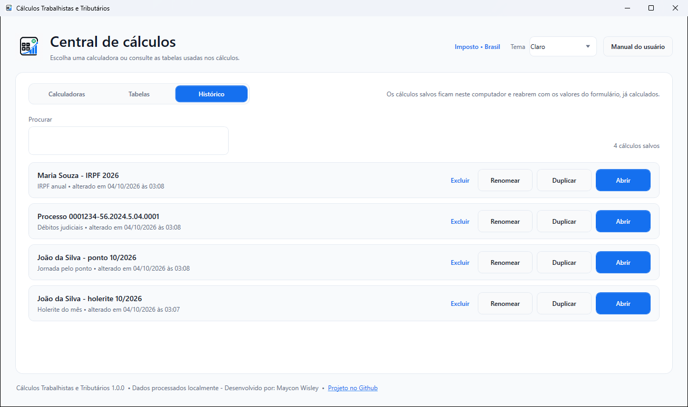

| Ação | O que faz |
| --- | --- |
| Abrir | Abre a calculadora com os valores salvos e já calculada, com as tabelas atuais. Você pode mudar o que quiser e salvar de novo. |
| Duplicar | Cria uma cópia com o nome seguido de "(cópia)", para refazer o cálculo com outros valores sem perder o original. |
| Renomear | Muda o nome do cálculo. |
| Excluir | Remove o cálculo do histórico, depois de confirmar. |

Os cálculos salvos ficam no banco do aplicativo, neste computador, e são mantidos nas atualizações. A pensão, a pensão em atraso, os débitos judiciais e a jornada guardam também as listas: os beneficiários, as parcelas com os pagamentos e as marcações de cada dia.

## 11. Tema e configurações

No canto superior direito da tela principal, escolha o **Tema**:

- **Automático:** acompanha o tema claro ou escuro configurado no Windows.
- **Claro** ou **Escuro:** mantém sempre a aparência escolhida.

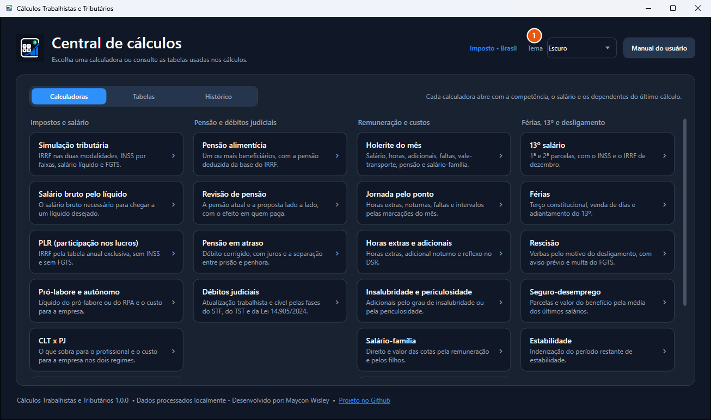

A escolha é salva automaticamente e restaurada na próxima abertura. As configurações ficam no arquivo `%LOCALAPPDATA%\CalculoIRRF\settings.json`.

**Avisar sobre novas versões:** no rodapé da tela principal. Marcada, a abertura consulta no GitHub se há uma versão mais nova, sem enviar nenhum dado dos cálculos; desmarcada, o aplicativo não acessa a internet ao abrir. O aviso das tabelas do ano não usa a internet e continua aparecendo.

Por padrão, o aplicativo desenha a interface sem usar a placa de vídeo, o que reduz bastante o consumo de memória. Se preferir a aceleração por GPU, feche o aplicativo e altere no arquivo de configurações o valor `"HardwareAcceleration": false` para `true`.

## 12. Mensagens e solução de problemas

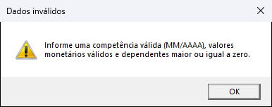

| Mensagem ou situação | O que fazer |
| --- | --- |
| "Ocorreu um erro inesperado..." ou "Não foi possível abrir o aplicativo." | O aplicativo registra os detalhes no arquivo indicado na mensagem, em `%LOCALAPPDATA%\CalculoIRRF\logs`, um por mês. Ao relatar o problema, anexe esse arquivo, que traz a mensagem técnica do erro. |
| "Falta o valor de Selic de MM/AAAA na tabela de índices." | No tributo em atraso e na correção de valores, atualize a tabela do índice pela internet ou cadastre o mês. |
| "O limite de renda do calendário de AAAA não está no aplicativo." | No abono salarial, informe o limite do calendário divulgado pelo Ministério do Trabalho. |
| "Os outros descontos não podem passar de uma remuneração mensal..." | Na rescisão, a compensação de descontos é limitada a uma remuneração (CLT, art. 477, § 5º). |
| "Informe uma competência válida (MM/AAAA), valores monetários válidos e dependentes maior ou igual a zero." | Confira o formato da competência, use vírgula nos centavos e informe dependentes como número inteiro. |
| "Informe média, dias-base, datas (dd/MM/aaaa) e complementos em formatos válidos." | Confira as datas da estabilidade e os valores digitados. |
| "O fim da estabilidade deve ser posterior à data de demissão." | Corrija a data final, que precisa ser depois da demissão. |
| "Os dias-base devem ser maiores que zero." | Informe o divisor da média, normalmente 30. |
| "O percentual da pensão deve estar entre 0 e 100." | Corrija o percentual da pensão. Sobre o salário mínimo, o limite é 1.000 (150 para 1,5 salário mínimo). |
| "A soma dos percentuais sobre os rendimentos líquidos passa de 100%." (ou brutos) | Com mais de um beneficiário na mesma base, confira os percentuais ou escolha **Cada uma após descontar as anteriores**. |
| "Outros descontos não podem ser maiores que o valor bruto." | Na pensão, reduza os outros descontos ou confira o valor bruto. |
| "A pensão informada (...) é maior que o 13º integral (...)", "... que as férias + 1/3 (...)" ou "A pensão alimentícia não pode ser maior que a PLR paga." | O valor informado da pensão não pode superar a verba sobre a qual ela é descontada. |
| "O percentual da pensão de (nome) deve estar entre 0 e 100." | Com mais de um beneficiário, a mensagem diz de quem é o percentual a corrigir. |
| "A parcela de MM/AAAA vence em ..., depois da data do cálculo." | Na pensão em atraso, mude a última parcela ou a data do cálculo: só entram parcelas já vencidas. |
| "O valor pago na parcela de MM/AAAA é maior que o valor devido." | Corrija o valor pago ou o devido dessa parcela na lista. |
| "Falta o INPC de MM/AAAA na tabela de índices." (ou o IPCA) | Atualize a tabela do índice pela internet ou cadastre o valor do mês. |
| "Não há taxa legal cadastrada para MM/AAAA." | Atualize a tabela **Taxa legal** pela internet ou cadastre o valor do mês. |
| "Não há salário mínimo cadastrado para a competência MM/AAAA." | Na pensão sobre o salário mínimo, cadastre o salário mínimo da competência ou atualize a tabela **Salário mínimo** pela internet. |
| "Não há tabela de INSS cadastrada para MM/AAAA: as tabelas começam em 01/2017." (ou de IRRF e demais tabelas) | Não existe tabela vigente para a competência. Informe uma competência a partir da data indicada ou cadastre a tabela correspondente. |
| "Informe valores válidos para competência e campos numéricos." | Na manutenção de tabelas, confira a competência (MM/AAAA), a faixa (inteiro maior que zero) e os valores. |
| "Não foi possível atualizar a tabela pela internet." | A mensagem lista o que aconteceu com cada fonte. Verifique a conexão com a internet e tente novamente mais tarde; os dados locais não foram alterados. Se uma fonte alternativa já mostra a tabela nova sem a confirmação da outra, aguarde ou cadastre os valores manualmente. Se o problema persistir, as páginas podem ter mudado de formato: cadastre os valores manualmente. |
| "O campo "..." está em formato inválido: ..." | Nas calculadoras trabalhistas, corrija o campo indicado conforme a orientação da própria mensagem: valores com vírgula nos centavos, datas no formato dd/mm/aaaa, competência no formato mm/aaaa e horas como `10:30` ou `10,5`. |
| "Os dias de descanso (...) passam dos ... dias disponíveis" | Nas férias, reduza os dias de descanso: a soma com os dias vendidos não pode passar dos dias de direito. |
| "No pedido de demissão não há aviso prévio indenizado..." | Na rescisão, escolha **Trabalhado ou dispensado** ou **Não cumprido (descontar)**. |
| "Na rescisão antecipada, informe o fim previsto do contrato a prazo, posterior ao desligamento." | Preencha **Fim previsto do contrato** com uma data depois do desligamento. |
| "As faltas no mês não podem passar dos ... dias trabalhados no mês do desligamento." | Reduza as **Faltas no mês**. |
| "A data do pagamento não pode ser anterior ao desligamento." | Corrija a **Data do pagamento** ou deixe-a em branco. |
| "Informe pelo menos o salário do último mês antes da dispensa." | No seguro-desemprego, preencha o **Salário do último mês**. |
| "Nenhum valor de PJ dentro do limite do Simples Nacional iguala o total do CLT." | No CLT x PJ, o salário é alto demais para o Simples: informe o **Valor mensal como PJ**. |
| "Os descontos (...) passam dos proventos (...)." | No holerite, reduza as faltas, o adiantamento ou os outros descontos. |
| "Os descansos perdidos (...) passam dos ... domingos e feriados do mês." | No holerite, informe no máximo um descanso por domingo ou feriado do mês. |
| "As marcações de dd/MM passam de 24 horas" ou "... começam antes do fim da jornada anterior." | Na jornada, confira a ordem das entradas e saídas do dia e as do dia anterior. |
| "Informe a data da citação, que é o início dos juros." | Nos débitos cíveis com juros desde a citação, preencha a **Data da citação**. |
| "A calculadora segue a Lei 15.270/2025, que vale desde o ano-calendário 2026." | No IRPF anual, informe o ano-calendário 2026 ou seguinte. |
| "Não foi possível salvar planilha.xlsx. Se a planilha estiver aberta no Excel, feche-a e tente de novo." | Feche a planilha no Excel e gere de novo, ou salve com outro nome. |
| O botão **Gerar PDF** ou **Gerar Excel** está desabilitado | Faça um cálculo na tela antes de gerar o relatório. |
| "Não foi possível gerar o relatório em PDF." | Escolha outra pasta, verifique se o arquivo não está aberto em outro programa e se há permissão de gravação. |
| O manual não abre pelo botão | O aplicativo tenta abrir o PDF com o leitor padrão do Windows e, se não conseguir, a versão on-line no GitHub. Instale um leitor de PDF ou verifique a conexão. |

## 13. Perguntas frequentes

**Onde ficou a simulação tributária que aparecia na tela principal?**
Ela passou a abrir em uma janela própria, pelo cartão **Simulação tributária** da aba **Calculadoras**, como as demais calculadoras. A pensão alimentícia também deixou de depender dela: tem os próprios campos de rendimentos, que já vêm preenchidos com os dados da última simulação.

**Os meus dados são enviados para a internet?**
Não. Os cálculos e as tabelas ficam no seu computador. A internet só é usada quando você clica em **Atualizar pela internet**, que apenas lê as páginas das fontes, em links para páginas oficiais e, ao abrir, para consultar no GitHub se há versão nova, o que pode ser desligado no rodapé da tela principal.

**Uso as calculadoras para quem trabalha em jornada parcial?**
Sim. Informe o salário da jornada parcial: o INSS, o IRRF, o FGTS e as verbas são calculados sobre ele. Desde 2017, as férias do tempo parcial seguem a mesma tabela de dias do tempo integral (CLT, art. 58-A, § 7º).

**Por que a soma das faixas do IRRF difere em centavos do total?**
No detalhamento por faixas, o imposto de cada faixa é arredondado separadamente. O total do quadro e o IRRF final são calculados pela fórmula da tabela progressiva (base × alíquota − parcela a deduzir). Por isso pode haver diferença de alguns centavos entre a soma das linhas e o total.

**Por que o INSS difere em 1 ou 2 centavos de outras calculadoras?**
Não há regra legal de arredondamento para o INSS por faixas. O aplicativo segue o eSocial, que trunca o valor de cada faixa nos centavos (Manual de Orientação do eSocial, evento S-5001). É o valor que o eSocial calcula e leva para a DCTFWeb. Outras calculadoras arredondam cada faixa ou só o total e chegam a 1 ou 2 centavos a mais: em 2026, o teto dá R$ 988,07 no eSocial e R$ 988,09 ou R$ 988,10 nelas.

**Por que um IRRF de poucos reais não foi descontado?**
O IRRF calculado de até R$ 10,00 não é retido (Lei 9.430/1996, art. 67), e o valor não passa para o mês seguinte. A memória de cálculo mostra o imposto calculado e a dispensa. No 13º e na PLR, que têm tributação exclusiva, o imposto é descontado mesmo abaixo desse valor.

**Por que o desconto simplificado não aparece em competências antigas?**
O desconto simplificado mensal passou a valer a partir de 05/2023. Em competências anteriores, apenas a modalidade normal é aplicável, e o aplicativo mostra **Não se aplica** no lugar do simplificado.

**A base de INSS mostrada é menor que a que eu informei. Está errado?**
Não. Quando a base ultrapassa o teto da tabela do INSS, o cálculo do INSS é limitado ao teto, e o cartão do INSS mostra a base efetivamente considerada. O FGTS não tem teto e continua sendo calculado sobre a base informada: com R$ 8.500,00, por exemplo, o INSS considera R$ 8.475,55 (teto de 2026), mas o FGTS de 8% é de R$ 680,00.

**Os valores das calculadoras trabalhistas podem ser usados diretamente na folha?**
Eles servem para conferência e planejamento. A folha de pagamento considera outras verbas e regras do contrato e da convenção coletiva; confira sempre as premissas listadas em **Observações** no resultado de cada cálculo.

**Por que o INSS das férias parece diferente do que vem no holerite do mês?**
A calculadora de férias calcula o INSS só sobre as férias + 1/3. Na folha, ele é somado ao INSS do salário do mês e recalculado sobre o total, respeitando o teto.

**Ao instalar uma nova versão, perco as tabelas que alterei?**
Não. O instalador só copia o banco de dados na primeira instalação; nas atualizações, o seu banco é mantido como está.

**Alterei uma tabela. Preciso reiniciar o aplicativo?**
Não. A alteração vale para o próximo cálculo.

**Como volto aos valores originais de uma tabela?**
Use **Atualizar pela internet**, quando disponível, ou corrija os valores manualmente. Ter uma cópia de segurança do arquivo `BancoDados\calculoIrrf.db` permite restaurar o estado anterior.

## 14. Atalhos de teclado

| Tecla | Ação |
| --- | --- |
| **F1** | Abre este manual, em qualquer janela do aplicativo. |
| **Tab** / **Shift + Tab** | Avança ou volta entre os campos e, na tela principal, entre os cartões. |
| **Espaço** ou **Enter** com um botão ou cartão selecionado | Aciona o botão ou abre a calculadora do cartão. |
| **Enter** na simulação tributária e nas calculadoras trabalhistas | Calcula, a partir de qualquer campo do formulário. |
| **Enter** na pensão alimentícia | Calcula com a memória de cálculo (**Detalhar**). |
| **Alt + F4** | Fecha a janela atual. |

---

*Cálculos Trabalhistas e Tributários — processamento local. Projeto no GitHub: [mayconwisley/CalculosTrabalhistasTributarios](https://github.com/mayconwisley/CalculosTrabalhistasTributarios).*
